# lijinghai.github.io

Jinghai Li 的个人主页，保留原有白色横线纸背景、蓝橙配色、人物照片、研究卡片和大图项目列表，用真实机器人项目说明从 AMR 工程到 VLN / VLA 研究的连续路径。

## 最近更新

### 2026-08-20 - OmniHand 产品参数区说明精简

本次移除 OmniHand 详情页 `Product Facts` 标题下方的说明性句子，保留四行产品参数表和后续研究内容，让页面从标题直接进入可核对的结构、触觉、动作配置与通信事实。

| 内容 | 修改后状态 |
| --- | --- |
| 删除范围 | 仅删除 `以下硬件参数来自智元 OmniHand 灵动款 2025 产品使用说明书……` 这一段说明 |
| 保留内容 | `Product Facts` 标题、4 行参数表、控制链和操作研究线全部保留 |
| 页面验证 | 本地浏览器确认目标句不存在、表格仍有 4 行、横向溢出为 false、控制台 error/warning 为空 |

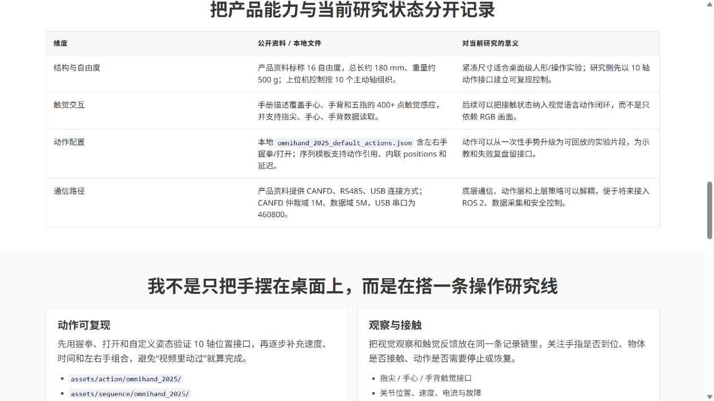

### 2026-08-20 - OmniHand 首页技术文案强化

本次将首页 OmniHand 卡片的过程描述改为更明确的系统技术叙述：从 10 轴主动关节控制、USB / CANFD 动作链，到姿态序列回放、视觉观测、关节状态和 400+ 触觉点，突出当前研究如何从硬件 bring-up 走向可复现的 VLA 操作评测；没有把尚未完成的闭环评测写成既成结果。

| 内容 | 修改后状态 |
| --- | --- |
| 首页项目说明 | `围绕 10 轴主动关节控制建立 USB / CANFD 动作链，记录双手姿态与序列回放；下一步融合视觉观测、关节状态和 400+ 触觉点，形成可复现的 VLA 操作评测。` |
| 响应式显示 | 桌面端显示两行技术说明；手机端仅对 OmniHand 恢复两行，其余项目仍保持紧凑卡片 |
| 验证结果 | 本地浏览器确认文案、项目顺序和 390px 布局，横向溢出为 false，控制台 error/warning 为空 |

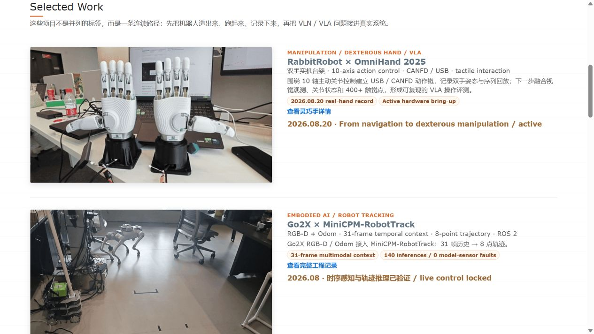

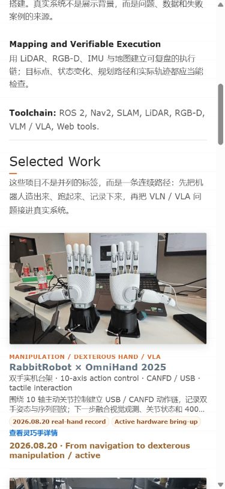

### 2026-08-20 - OmniHand 新视频 GIF 与详情页原视频播放

本次接入用户提供的 `飞书20260820-132116.mp4`：主页继续使用轻量 GIF 展示双手动作，OmniHand 详情页改为嵌入原始 MP4，加载后静音自动播放、循环播放并保留控件，兼顾首屏展示和完整动作查看。

| 内容 | 实际改动与证据 |
| --- | --- |
| 视频素材 | `RabbitRobot/videos/omnihand_2025_demo.mp4`，原始 `1280×720`、约 `13.63s`、H.264/AAC |
| 首页 GIF | `RabbitRobot/images/rabbitrobot/omnihand_2025_demo.gif`，由新视频生成 `480×270`、4 fps、约 `3.83 MB` 动态封面 |
| 详情页播放 | `<video autoplay muted loop playsinline controls preload="metadata">`，使用静态 poster，手机端保持 16:9 比例 |
| 真实验证 | 本地浏览器确认 `readyState=4`、`paused=false`、`muted=true`、`loop=true`；桌面/390px 手机端无横向溢出，控制台无 error/warning |

首页 GIF 效果：

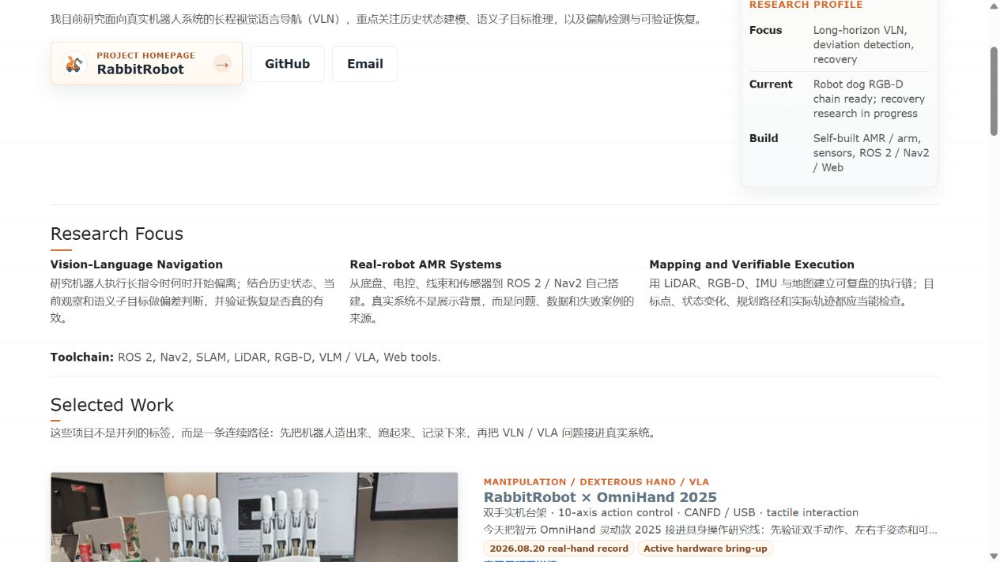

详情页原视频桌面端：

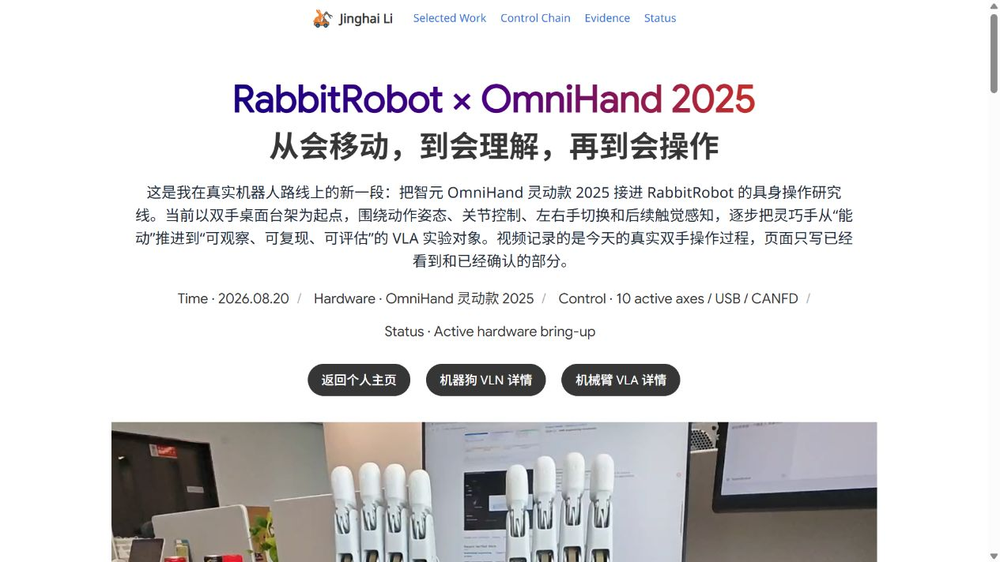

详情页原视频手机端：

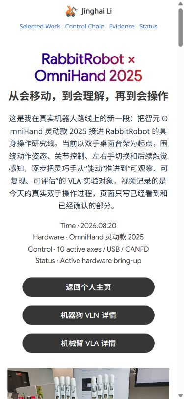

### 2026-08-20 - Selected Work 研究路线顺序调整

本次按研究叙事调整主页项目顺序：将当前正在推进的 `RabbitRobot × OmniHand 2025` 放到 `Go2X × MiniCPM-RobotTrack` 之前，让访问者先看到最新的灵巧操作方向，再回看机器狗的 VLN / 时序推理验证；其余项目内容、详情页和视觉系统保持不变。

| 内容 | 修改后状态 |
| --- | --- |
| 首屏项目顺序 | `OmniHand 2025` → `Go2X × MiniCPM-RobotTrack` → `RabbitRobot Platform` → `EDULITE A3` |
| 修改范围 | 仅调整 `index.html` 中两个 `Selected Work` 项目的 DOM 顺序 |
| 响应式验证 | 桌面端 1280px、手机端 390×844 均无横向溢出，前四项顺序通过 DOM 检查 |
| 控制台验证 | 浏览器 error / warning 均为空 |

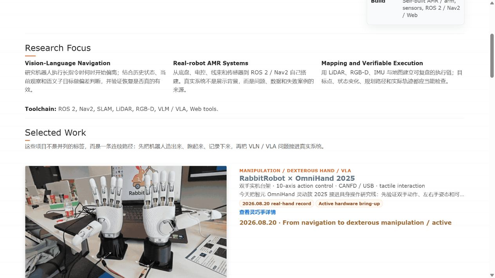

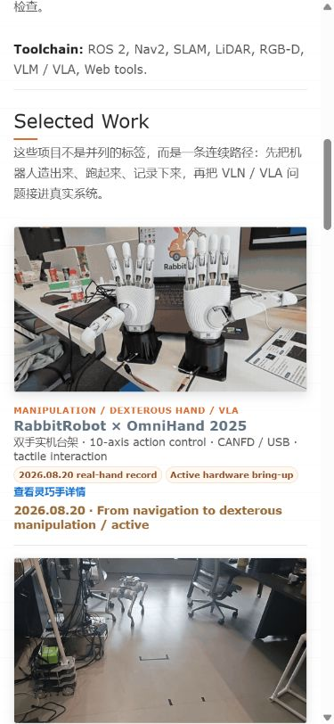

### 2026-08-20 - OmniHand 2025 双手灵巧操作研究线

本次在主页 `Selected Work` 中新增 `RabbitRobot × OmniHand 2025`，并新增对应详情页。页面使用 2026.08.20 真实双手操作视频生成封面 GIF，同时根据 OmniHand 灵动款 2025 产品手册和本地动作配置，区分产品能力、当前实机 bring-up 证据与尚未完成的 VLA 闭环，保持主页从 VLN / AMR 向具身操作延伸的路线。

| 内容 | 实际改动与证据 |
| --- | --- |
| 首页卡片 | `index.html` 将灵巧手项目置于机器狗之前，显示 2026.08.20、10 轴动作控制、CANFD / USB 与 Active 状态 |
| 详情页 | 新增 `RabbitRobot/projects/rabbitrobot-omnihand-2025.html`，包含产品事实、控制链、视觉证据、研究定位和诚实状态表 |
| 动态素材 | `RabbitRobot/images/rabbitrobot/omnihand_2025_demo.gif` 由用户提供的 13.63 秒、1280×720 新实拍视频压缩生成；原始视频保存在 `RabbitRobot/videos/omnihand_2025_demo.mp4`，静态封面为 `omnihand_2025_cover.jpg` |
| 技术事实 | 产品手册核对 16 自由度、约 180 mm、约 500 g、400+ 触觉点、CANFD / RS485 / USB；动作配置核对左右手握拳/打开和 10 轴序列模板 |
| 页面验证 | 本地浏览器实际打开主页与详情页；桌面端、390×844 手机端均无横向溢出；控制台 error/warning 均为空；本地图片/GIF/CSS 引用存在 |

主页 Selected Work 实际效果：

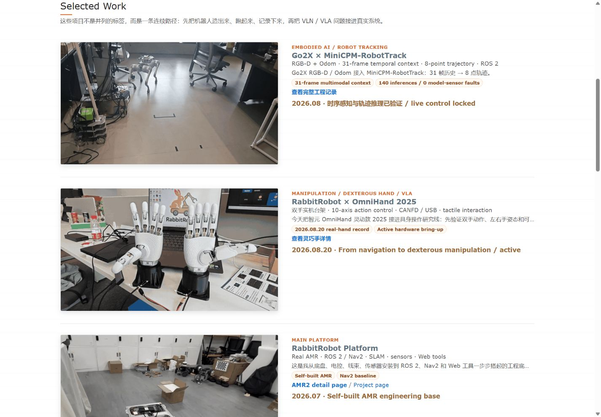

灵巧手详情页桌面端：

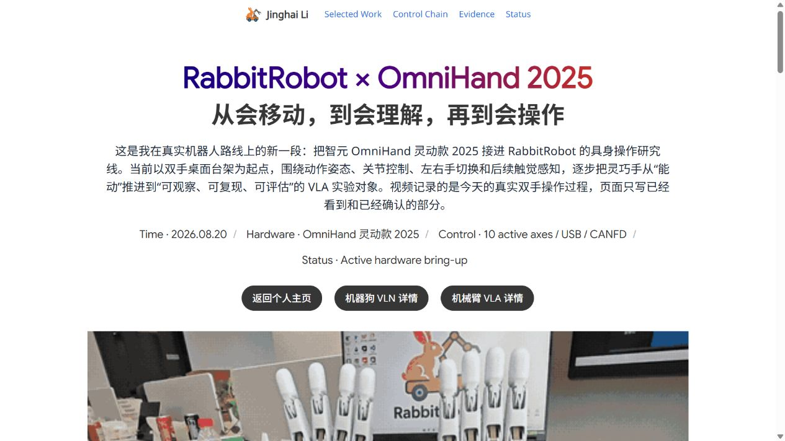

灵巧手详情页手机端：

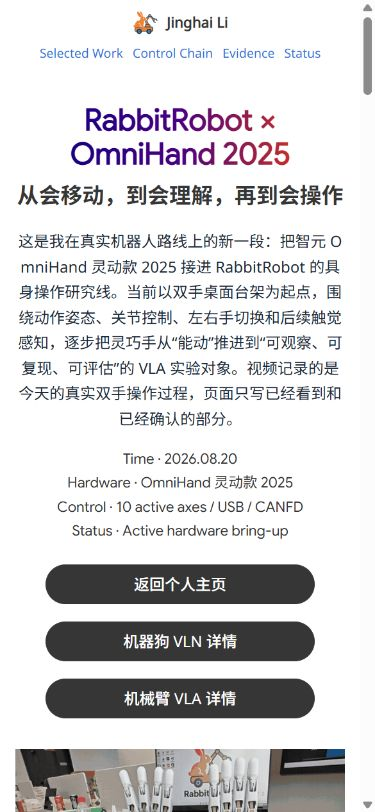

### 2026-08-17 - Go2X × MiniCPM-RobotTrack 项目强化

本次只修改主页 `Selected Work` 中的第一张机器狗卡片，以及对应的机器狗详情页。页面延续原有白底、蓝橙链接和渐变标题风格，将叙事中心从一般的 RGB-D 接入提升为 `Go2X × MiniCPM-RobotTrack`：突出时序多模态输入、机器人适配器、跨机服务化、8 点轨迹推理和安全控制边界；同时移除私有 Go2X 仓库的公开入口，其他项目卡片与详情页不变。

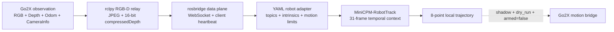

| 内容 | 实际改动与证据 |
| --- | --- |
| 首页第一卡片 | 主标题改为 `Go2X × MiniCPM-RobotTrack`，直接展示 RGB-D + Odom、31 帧时序上下文、8 点轨迹和 140 次推理结果 |
| 模型技术栈 | 增加 MiniCPM-RobotTrack 核心架构：多模态输入、时序上下文、YAML 机器人适配器、轨迹接口与控制安全门 |
| 数据工程 | 写明 RGB 的 JPEG / INTER_AREA 路径，以及 16UC1 compressedDepth 的 PNG 解析、最近邻缩放和几何语义保持 |
| 跨机服务化 | 展示 rclpy relay、rosbridge WebSocket、客户端心跳、QoS depth=1、PID / 日志 / 进程组生命周期管理 |
| 真实结果 | RGB 9.67 Hz、深度 4.84 Hz、Odom 19.67 Hz；18 秒 140 次推理；8 点轨迹；0 模型错误、0 传感器故障 |
| 安全边界 | 明确 Official Shadow、dry-run、`armed=false`，没有把尚未完成的实机自主跟随或长程 VLN 恢复写成既成结果 |
| 公开边界 | 首页首卡与详情页不再链接私有 Go2X 仓库，只公开经过整理的工程说明、技术证据和项目状态 |
| 新增素材 | Gemini 335 RGB、对齐深度、MiniCPM 中继帧，以及桌面 / 手机端页面实测截图 |
| 关键文件 | `index.html`、`RabbitRobot/projects/rabbitrobot-robotdog-vln.html`、`RabbitRobot/images/rabbitrobot/go2x_*` |
| 页面验证 | 桌面端与 390×844 手机端均无横向溢出、坏图或浏览器警告；所有本地引用存在 |

首页第一张机器狗卡片：

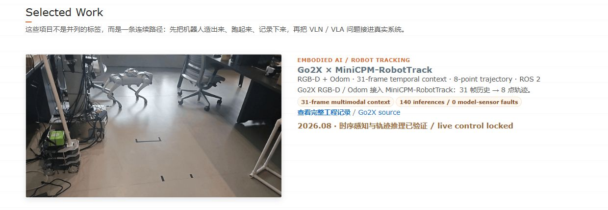

机器狗详情页桌面端与手机端：

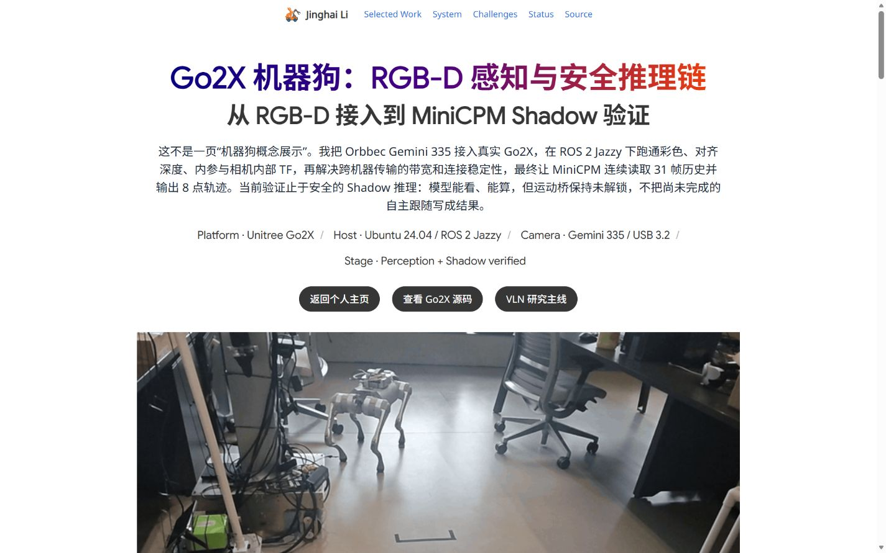

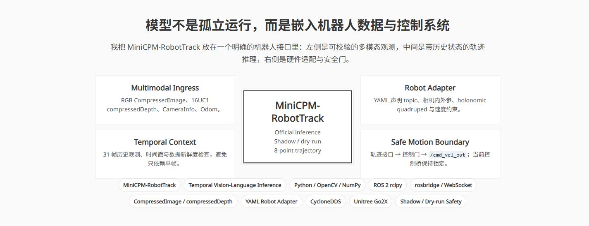

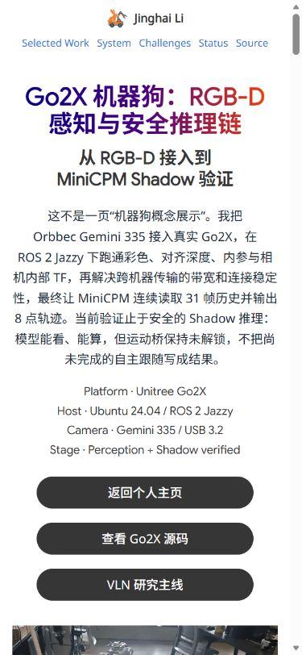

### 2026-08-17 - 主页内容重写

本次更新只调整主页文字，不改视觉风格、布局、配色、图片和入口结构。重点去掉模板化自述，改为从自建机器人出发，清楚说明长程 VLN 偏航检测、历史状态、语义子目标与可验证恢复这条研究线。

| 内容 | 说明 |
| --- | --- |
| 首页自述 | 写清从底盘、电控、传感器和 ROS 2 / Nav2 工程走向真实机器人 VLN 的个人路径 |
| 研究重点 | 首屏以一句简洁中文说明真实机器人长程 VLN 方向，突出历史状态建模、语义子目标推理、偏航检测与可验证恢复 |
| 项目顺序 | 保持机器狗、RabbitRobot AMR、EDULITE A3、2025 工程档案、AMR2 覆盖规划的原顺序 |
| 项目状态 | 区分已完成的 Gemini 335 RGB-D 链路、工程基线与仍在推进的恢复研究 |
| 关键文件 | `index.html` |
| 验证方式 | `git diff --check`、本地引用检查、桌面与 390×844 手机端浏览器测试 |
| 验证结果 | 19 个本地引用全部存在；两种视口均无横向溢出、坏图或浏览器警告 |

桌面端实际效果：

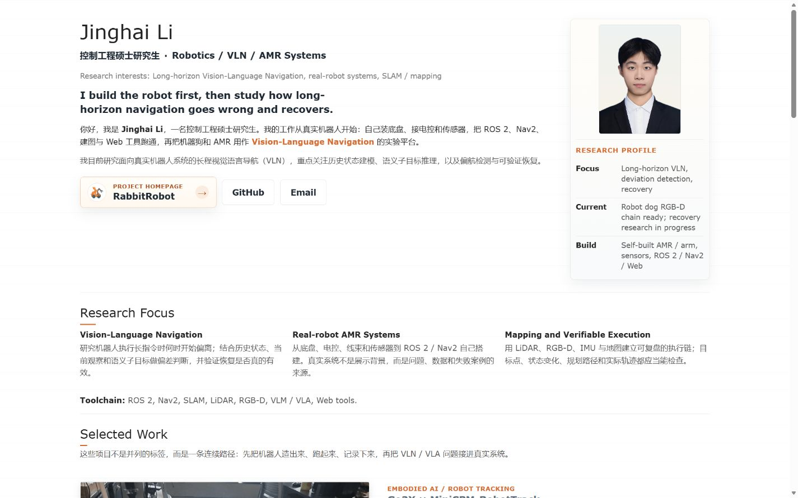

手机端实际效果：

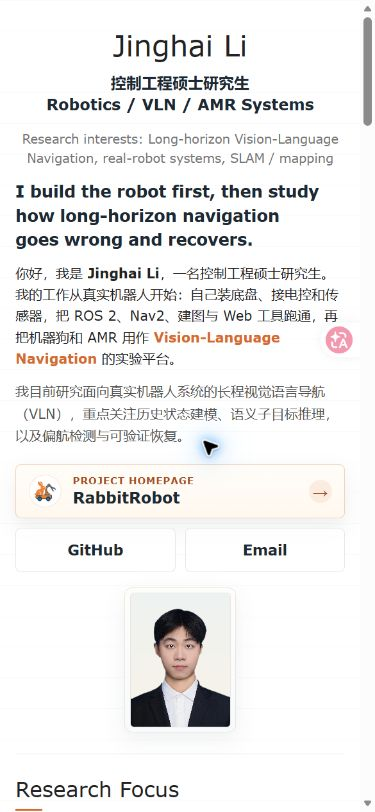
