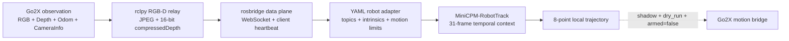

# lijinghai.github.io

Jinghai Li 的个人主页，保留原有白色横线纸背景、蓝橙配色、人物照片、研究卡片和大图项目列表，用真实机器人项目说明从 AMR 工程到 VLN / VLA 研究的连续路径。

## 最近更新

### 2026-08-17 - Go2X × MiniCPM-RobotTrack 项目强化

本次只修改主页 `Selected Work` 中的第一张机器狗卡片，以及对应的机器狗详情页。页面延续原有白底、蓝橙链接和渐变标题风格，将叙事中心从一般的 RGB-D 接入提升为 `Go2X × MiniCPM-RobotTrack`：突出时序多模态输入、机器人适配器、跨机服务化、8 点轨迹推理和安全控制边界；同时移除私有 Go2X 仓库的公开入口，其他项目卡片与详情页不变。

| 内容 | 实际改动与证据 |
| --- | --- |
| 首页第一卡片 | 主标题改为 `Go2X × MiniCPM-RobotTrack`，直接展示 RGB-D + Odom、31 帧时序上下文、8 点轨迹和 140 次推理结果 |
| 模型技术栈 | 增加 MiniCPM-RobotTrack 核心架构：多模态输入、时序上下文、YAML 机器人适配器、轨迹接口与控制安全门 |
| 数据工程 | 写明 RGB 的 JPEG / INTER_AREA 路径，以及 16UC1 compressedDepth 的 PNG 解析、最近邻缩放和几何语义保持 |
| 跨机服务化 | 展示 rclpy relay、rosbridge WebSocket、客户端心跳、QoS depth=1、PID / 日志 / 进程组生命周期管理 |
| 真实结果 | RGB 9.67 Hz、深度 4.84 Hz、Odom 19.67 Hz；18 秒 140 次推理；8 点轨迹；0 模型错误、0 传感器故障 |
| 安全边界 | 明确 Official Shadow、dry-run、`armed=false`，没有把尚未完成的实机自主跟随或长程 VLN 恢复写成既成结果 |
| 公开边界 | 首页首卡与详情页不再链接私有 Go2X 仓库，只公开经过整理的工程说明、技术证据和项目状态 |
| 新增素材 | Gemini 335 RGB、对齐深度、MiniCPM 中继帧，以及桌面 / 手机端页面实测截图 |
| 关键文件 | `index.html`、`RabbitRobot/projects/rabbitrobot-robotdog-vln.html`、`RabbitRobot/images/rabbitrobot/go2x_*` |
| 页面验证 | 桌面端与 390×844 手机端均无横向溢出、坏图或浏览器警告；所有本地引用存在 |

首页第一张机器狗卡片：

机器狗详情页桌面端与手机端：

### 2026-08-17 - 主页内容重写

本次更新只调整主页文字，不改视觉风格、布局、配色、图片和入口结构。重点去掉模板化自述，改为从自建机器人出发，清楚说明长程 VLN 偏航检测、历史状态、语义子目标与可验证恢复这条研究线。

| 内容 | 说明 |
| --- | --- |
| 首页自述 | 写清从底盘、电控、传感器和 ROS 2 / Nav2 工程走向真实机器人 VLN 的个人路径 |
| 研究重点 | 首屏以一句简洁中文说明真实机器人长程 VLN 方向，突出历史状态建模、语义子目标推理、偏航检测与可验证恢复 |
| 项目顺序 | 保持机器狗、RabbitRobot AMR、EDULITE A3、2025 工程档案、AMR2 覆盖规划的原顺序 |
| 项目状态 | 区分已完成的 Gemini 335 RGB-D 链路、工程基线与仍在推进的恢复研究 |
| 关键文件 | `index.html` |
| 验证方式 | `git diff --check`、本地引用检查、桌面与 390×844 手机端浏览器测试 |
| 验证结果 | 19 个本地引用全部存在；两种视口均无横向溢出、坏图或浏览器警告 |

桌面端实际效果：

手机端实际效果：

