# lijinghai.github.io

Jinghai Li 的个人主页，按 Lain 主页的灰白／深灰配色、蓝色强调色、居中圆形头像和项目卡片排版，用真实机器人项目说明从 AMR 工程到 VLN / VLA 研究的连续路径。

## 最近更新

### 2026-10-09 - 首页改用 Lain 模板

用户将参考页面改为 [Lain 主页](https://lain-ego0.github.io/)。本次替换下方历史记录中的窄栏橙色方案，按新参考页面的实际外观和交互重排首页：1024px 内容容器、终端样式标识、固定顶栏、居中圆形头像、灰白底与蓝色下划线、左图右文项目卡片、文章、时间线及技术栈。手机端使用两行导航和单列卡片；提供中英文、明暗模式切换与本地偏好记忆，默认英文浅色。

- **改动范围：** 根 `index.html`、`homepage.css`、新增 `homepage.js`，以及本 README 和本次交付证据。原有 7 个项目的中文正文逐项一致，照片、图片、视频和所有原链接保留；原项目时间与阶段状态整理为时间线，技术补充收在原生展开区。`RabbitRobot/`、`RabbitRobotNav/`、`YAVIS` 和其他项目子页没有改动。
- **内容边界：** 所有履历、项目与研究信息均来自本站原内容；没有使用参考作者的履历。Rabbit-RobotNav 仍标注尚未发表、移动闭环恢复仍在验证中。Contact 的三张二维码仍默认展开。
- **静态核验：** 7 个项目正文全部保留，原链接删除数、失效锚点和缺失本地资源均为 0；31 个本地资源／页面范围请求全部返回 HTTP 206，原图片与视频集合保持一致。`node --check homepage.js`、`git diff --check` 通过。[静态检查记录](docs/images/updates/2026-10-09-lain-homepage/static-check.json)。
- **真实浏览器核验：** 1440×900 桌面及 390×844、320×844 手机视口无横向溢出；手机中英文均通过。语言和深色选择刷新后保留，项目详情可展开，时间线导航定位正常，联系方式可收起再展开，三张二维码均解码。可见项目视频实际播放；减少动画偏好下视频暂停且内容可见；禁用脚本时全部 7 个项目可见、不可用切换控件隐藏。控制台 warning/error 为空。[浏览器检查记录](docs/images/updates/2026-10-09-lain-homepage/browser-check.json)。
- **未验证项：** 本轮验收针对网页呈现与交互，没有重跑机器人实验，也没有验证新的研究结果。

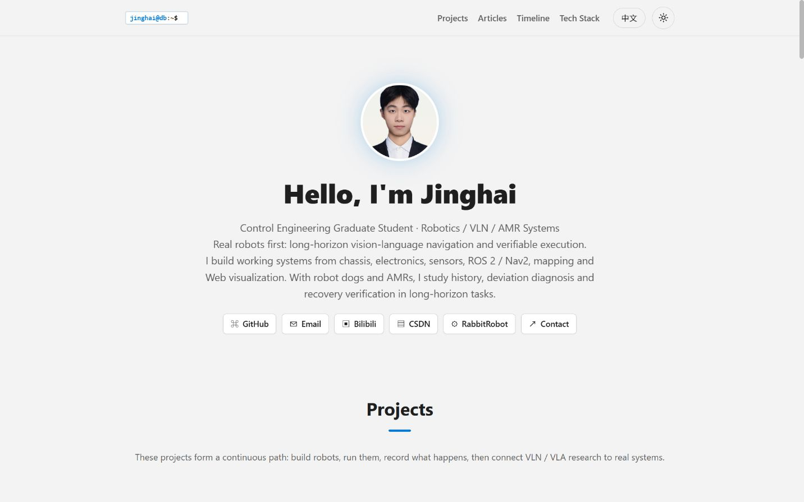

[项目卡片](docs/images/updates/2026-10-09-lain-homepage/projects.png) · [深色模式](docs/images/updates/2026-10-09-lain-homepage/desktop-dark.png) · [手机英文](docs/images/updates/2026-10-09-lain-homepage/mobile.png) · [手机中文](docs/images/updates/2026-10-09-lain-homepage/mobile-zh.png) · [时间线](docs/images/updates/2026-10-09-lain-homepage/timeline.png) · [改版前](docs/images/updates/2026-10-09-lain-homepage/before.png)

以下使用 Axton `mermaid-visualizer` 生成 Obsidian／GitHub 兼容 Mermaid，以最小流程图说明模板与本站原内容的组合范围；此图不是运行截图或实验结果。

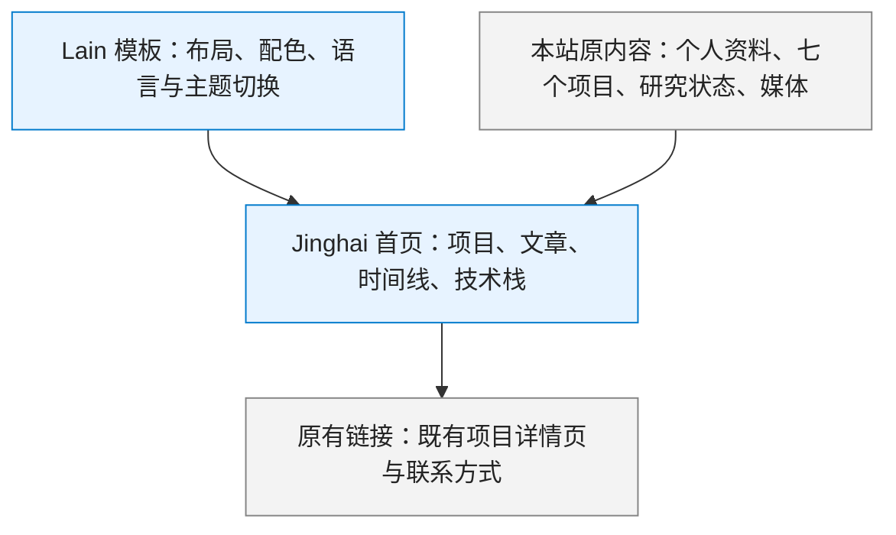
```mermaid
flowchart TB
  A["Lain 模板：布局、配色、语言与主题切换"] --> C["Jinghai 首页：项目、文章、时间线、技术栈"]
  B["本站原内容：个人资料、七个项目、研究状态、媒体"] --> C
  C --> D["原有链接：既有项目详情页与联系方式"]
  classDef homepage fill:#e7f3ff,stroke:#007acc,color:#242424;
  classDef existing fill:#f3f3f3,stroke:#858585,color:#242424;
  class A,C homepage;
  class B,D existing;
```

### 2026-10-09 - 首页参考学术模板调整排版

按用户指定的 [academic-homepage-template](https://w-r-s.github.io/academic-homepage-template/) 调整个人首页。原来的横线纸背景、大型按钮与卡片布局改为 800px 居中白底页面：简介左文右图、橙色标题下划线、行内个人链接、浅黄色研究条目，以及左图右文的紧凑项目列表。宽屏右侧提供章节导航，手机端改为顶部导航和单列内容。人物与项目资料沿用本站既有内容，不引入模板中的示例论文、履历或奖项。

- **范围与文件：** 仅调整根 `index.html`，新增仅被该首页引用的 `homepage.css`；本记录和截图属于交付证据。`RabbitRobot/`、`RabbitRobotNav/` 及其他项目页面、图片和视频源文件均未修改。照片下的 Research Profile 收为原生展开区；Contact 的三张联系方式仍默认展开。
- **交互：** Selected Work 加入 All / Navigation / Manipulation / Tools 筛选，对应 7 / 3 / 3 / 1 项。支持键盘操作、选中状态和读屏结果提示；隐藏项目的视频暂停。减少动画偏好下四段视频暂停，但筛选仍可用；禁用 JavaScript 时保留全部项目并隐藏不可用的筛选控件。
- **内容与资源验证：** 与改版前版本逐项对比，7 个项目条目正文完全一致，原有链接没有删除，页面锚点均存在；30 个本地链接或资源均通过范围请求，返回 HTTP 206。脚本语法检查通过。[静态核验记录](docs/images/updates/2026-10-09-homepage-template/static-check.json)。
- **真实浏览器验证：** 1440×900、390×844、320×844 的页面滚动宽度与可用客户区宽度一致，分别为 1425、375、305px（均含 15px 纵向滚动条占位），无横向溢出。桌面 9 张图片均解码，4 段视频在交互后均播放推进、无媒体错误；全部分类、键盘筛选、桌面及手机二维码收起再展开通过。减少动画与禁用脚本回退通过，控制台 warning/error 为空。[浏览器核验记录](docs/images/updates/2026-10-09-homepage-template/browser-check.json)。
- **验证边界：** 本轮只验证网页排版、链接资源和交互；没有重跑机器人实验或修改研究结论。移动闭环恢复仍保留原有待验证表述。

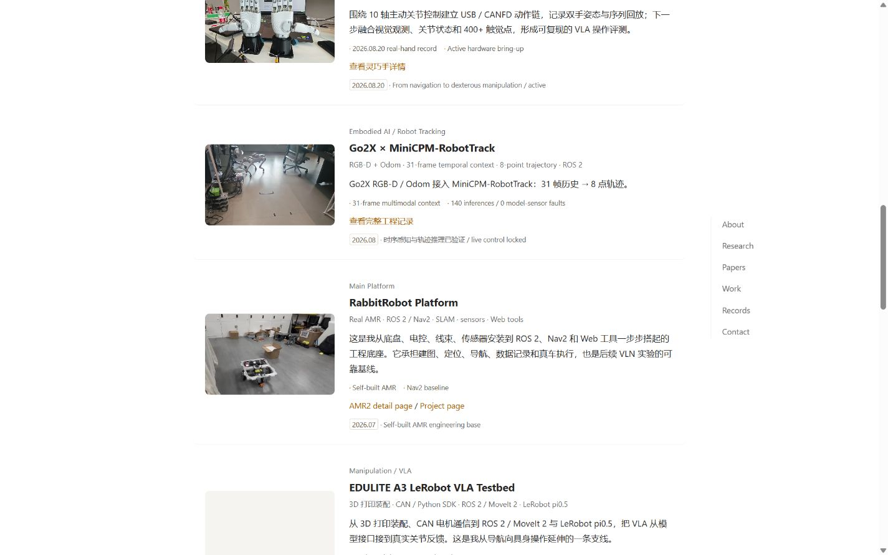

[手机首页截图](docs/images/updates/2026-10-09-homepage-template/mobile.png) · [项目列表截图](docs/images/updates/2026-10-09-homepage-template/projects-desktop.png) · [联系方式截图](docs/images/updates/2026-10-09-homepage-template/contact-desktop.png) · [改版前截图](docs/images/updates/2026-10-09-homepage-template/before-desktop.png)

以下交付范围图使用 Axton `mermaid-visualizer` 生成 Obsidian / GitHub 兼容 Mermaid，以最小关系图说明首页改版与项目入口之间的关系；它不是运行测量结果。

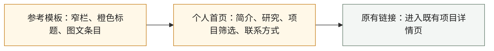
```mermaid
flowchart LR
  A["参考模板：窄栏、橙色标题、图文条目"] --> B["个人首页：简介、研究、项目筛选、联系方式"]
  B --> C["原有链接：进入既有项目详情页"]
  classDef home fill:#fff8e8,stroke:#c88322,color:#242424;
  classDef preserved fill:#f3f6f4,stroke:#6b8273,color:#242424;
  class A,B home;
  class C preserved;
```

### 2026-10-08 - Rabbit-RobotNav 真实历史与房间预检证据更新

按指定研究任务“语义地图构建（2）”的已完成进度及真机分支快照 `9433e164151164ed1801a174255ef73453149b15` 更新论文项目页。此前页面的实验叙述停留在旧真机排障，重复视频和展开的细节分散主线；现在保留橙色／深蓝英文论文排版，将正文收敛为方法、真实历史、房间预检和实验结果。主页面只嵌入一个代表性视频，额外视频、同椅失败案例和研究思维图放入原生可展开补充材料；未删除旧证据文件或改动个人首页、其他项目及原有未跟踪 `work/`。

- **真实图与来源：** 新增历史重放原图、只读诊断审计图入口、房间 RGB 原始实拍。三张图片与研究仓库源文件的 SHA-256 完全一致；[来源与论断边界](RabbitRobotNav/evidence-2026-10-08.md)固定到研究提交，防止后续分支变化导致图文无法追溯。
- **证据边界：** 1,149 个 raw states、3,477 条重复语义观察不是可信地图；全部历史状态一致性证据不足，可靠锚点为 0。独立静止预检获得 179 条激光扫描、31.72% 有效光束，但无占据栅格，人工房间巡检待执行。保留 MP3D 漏检、CMA 无指标增益和同椅身份失败，不将其包装成导航成功或闭环恢复。
- **关键文件：** `RabbitRobotNav/index.html`、`style.css`、`evidence-2026-10-08.md`、三张新 PNG、`research-mindmap.mmd` 及预渲染 SVG。思维图使用 Axton `mermaid-visualizer` 工作流和现有橙蓝配置，以 Mermaid CLI 11.9.0 渲染；源文件可继续编辑，页面无需运行 Mermaid 脚本。
- **本地真实验证：** Chrome 在 1440×900、390×844、320×844 视口下，页面滚动宽度分别为 1440、390、320px，无整页横向溢出；手机表格只在自身容器内横向滚动。每个视口的 6 张页面图片均解码，2 个补充区均验证关闭→展开→关闭。17 个本地资源 HTTP 200；5.6 秒视频实际播放推进且解码宽度 1920px；Google Sans 与 Noto Sans 加载完成，页脚与正文均使用 Noto Sans；浏览器控制台／页面错误 0，`git diff --check` 通过。[浏览器检查记录](docs/images/updates/2026-10-08-rabbitrobotnav-research/browser-check.json)。
- **未验证项：** 本轮没有重跑研究实验、控制机器人、启动 SLAM 或执行恢复；房间地图、可信地标和移动闭环仍以研究记录中的待验证状态为准。网页验证不等于实验验证。

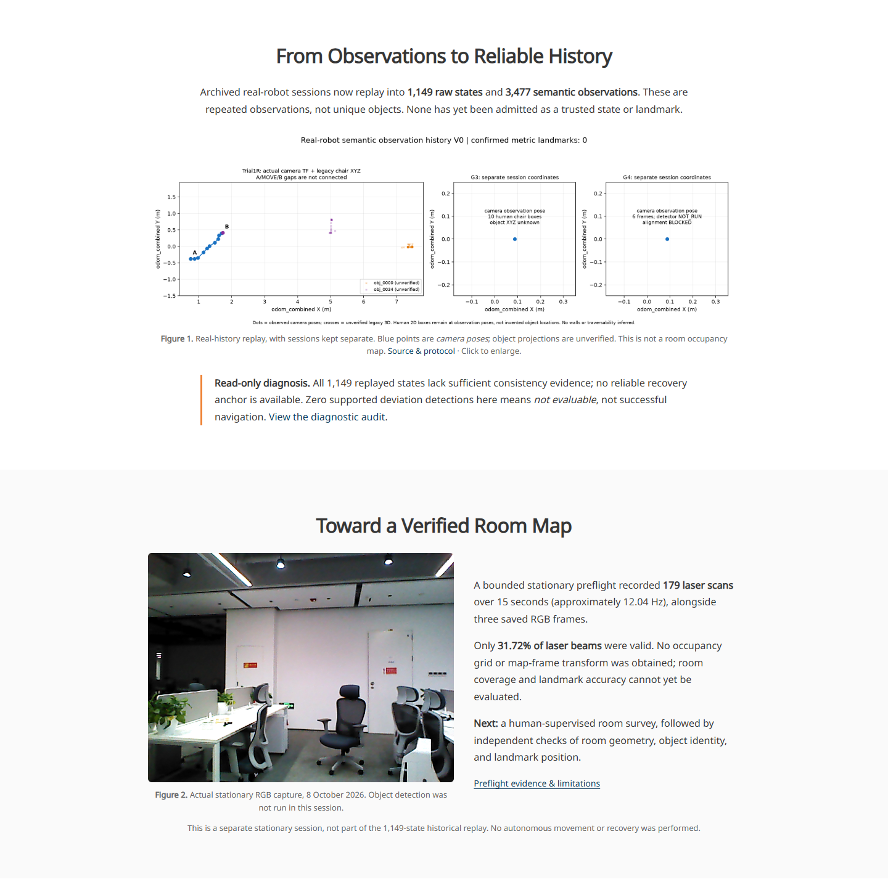

[桌面完整截图](docs/images/updates/2026-10-08-rabbitrobotnav-research/desktop.png) · [390px 手机完整截图](docs/images/updates/2026-10-08-rabbitrobotnav-research/mobile.png) · [Axton 研究思维图 SVG](RabbitRobotNav/assets/research-mindmap-2026-10-08.svg)（研究提纲，不是测量结果）。

### 2026-10-03 - 联系方式二维码默认展开

首页 `Contact` 中的“社交平台与二维码”原先默认折叠，需要额外点击才能看到小红书、B站和微信卡片。现在只给原生 `
` 增加 `open` 属性：首次打开页面即可看到三张二维码图片，标题仍能手动收起、再次展开；卡片内容、图片原文件、懒加载属性和页面样式均未改动。关键文件仅为 `index.html`。

本地 Chrome 实测 1440×900 桌面与 390×844 手机视口：两端初始 `details.open=true`，点击后可收起并重新展开；三张图片均成功解码，原图自然宽度分别为 987、1185、1094px；页面滚动宽度分别为 1440、390px，均无横向溢出，浏览器控制台无错误。验证只涉及网页呈现和交互，不涉及机器人系统运行。

[390px 手机端真实浏览器截图](docs/images/updates/2026-10-03-contact-open-default/mobile.png)

下图使用 Axton `mermaid-visualizer` 的 Obsidian／GitHub 兼容 Mermaid 格式说明原生折叠状态；它只描述页面交互，不代表新的项目成果：

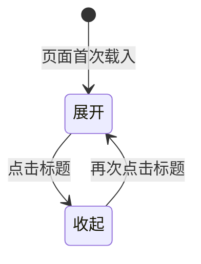
```mermaid
stateDiagram-v2
  [*] --> 展开: 页面首次载入
  展开 --> 收起: 点击标题
  收起 --> 展开: 再次点击标题
```

### 2026-10-03 - 首页论文与工程双线入口 v2

首页原来集中展示 7 个机器人工程项目，论文研究没有独立位置，读者难以从真实系统工作继续看到方法与实验。此次在 `Research Focus` 与原有 `Selected Work` 之间加入可扩展的 `Research Papers` 列表：首张卡片使用 Rabbit-RobotNav 自有方法图、完整研究题目、简明问题与证据边界，以及直达[论文研究主页](https://lijinghai.github.io/RabbitRobotNav/)的入口。状态明确为“硕士论文项目进行中 · 尚未发表”；MP3D 受控回放与真机感知检查已有记录，移动机器人闭环恢复仍在验证中。没有声称录用、发表或获得未验证的导航增益。

| 项目 | 修改前 | 修改后与核验 |
| --- | --- | --- |
| 首页组织 | Research Focus 后直接进入 7 个工程项目 | 新增 Papers 锚点和独立论文区，再进入 Work；原有 7 张工程卡片的 HTML 内容经逐字比较完全一致 |
| 学术证据 | 首屏只有当前研究的文字链接 | 方法图、论文题目、研究状态、研究主页与实验记录集中呈现；本地方法图和目标页面均存在 |
| 浏览器呈现 | 无首页论文卡片 | 本地 Chrome 实际渲染桌面和 390px 手机截图；手机论文卡片单列，图文未见裁切；`git diff --check` 通过 |
| 修改范围 | — | 仅 `index.html`、本 README 和本次真实截图；不改论文详情页、工程项目文案及用户未跟踪的 `work/` |

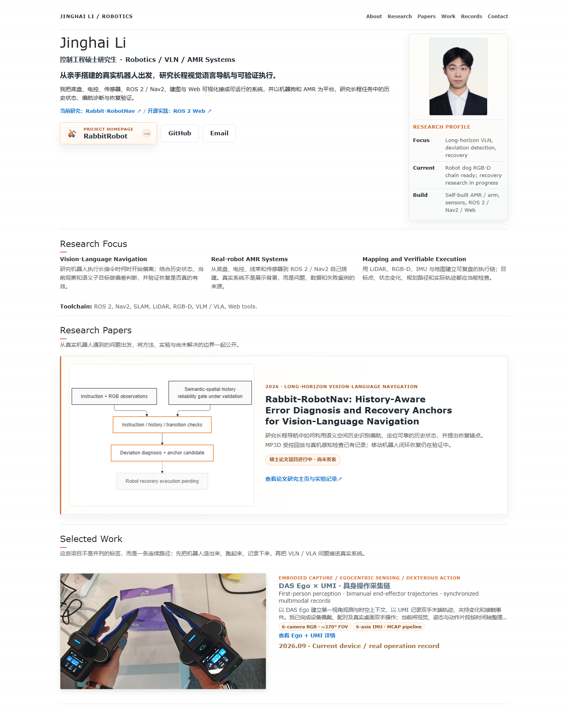

[390px 手机端真实浏览器截图](docs/images/updates/2026-10-03-homepage-research-papers/mobile-cdp.png)。截图只验证网页呈现，本次未重跑 MP3D、ROS 2 或真机实验，也未验证任何新的论文发表状态。

下面使用 Axton `mermaid-visualizer` 的 GitHub／Obsidian 兼容格式记录新信息路径；它是导航结构图，不是科研结果图：

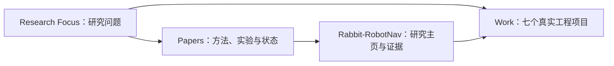
```mermaid
flowchart LR
  A["Research Focus：研究问题"] --> B["Papers：方法、实验与状态"]
  B --> C["Rabbit-RobotNav：研究主页与证据"]
  A --> D["Work：七个真实工程项目"]
  C --> D
```

### 2026-10-03 - 个人主页首屏与证据入口精修 v1

保留横线纸背景、橙蓝配色、肖像、七个项目的大图与原有顺序，只优化 [`/`](https://lijinghai.github.io/) 的信息层级。此前首屏用多段中英文字反复解释研究方向，当前研究主页与 ROS 2 Web 开源实践也不在首屏；手机端多数项目摘要被隐藏，二维码直接占据页面后段。现在用一句定位、简短系统经历和两个可核查入口组织首屏，增加 About / Research / Work / Records / Contact 锚点，手机端显示两行项目摘要，社交二维码改为按需展开与懒加载。没有新增实验成绩或把进行中的恢复研究写成已验证成果。

| 对比与核验 | 本次结果 |
| --- | --- |
| 修改范围 | `index.html` 的首屏文案、页内导航、移动端项目摘要和联系区呈现；未修改项目详情页及原始视频/图片，也未触及原有未跟踪 `work/`。 |
| 静态检查 | 保留 7 个项目卡片；页内导航锚点 0 个缺失、本地相对链接 0 个缺失、`details` 标签配对正确，页面正文未出现“面向招聘”等直白用语；`git diff --check` 无空白错误。 |
| 线上核验 | `fd07134842f54f4a8acf8e1d00e9cacc69f9a1d0` 已推送并由公开主页返回新版内容（HTTP 200）；真实浏览器查看桌面首屏与 390 × 844 手机首屏，手机 `scrollWidth=375 < viewportWidth=390`，无横向溢出。|
| 交互与运行状态 | 7 个项目仍在原顺序；Contact 锚点到达对应区块；社交二维码默认折叠，点击后显示 3 张卡片，图片均为懒加载；浏览器警告/错误日志为空。桌面真实运行截图已归档；390 × 844 手机端已在浏览器目视与 DOM 测量，但未归档可靠的手机截图。 |

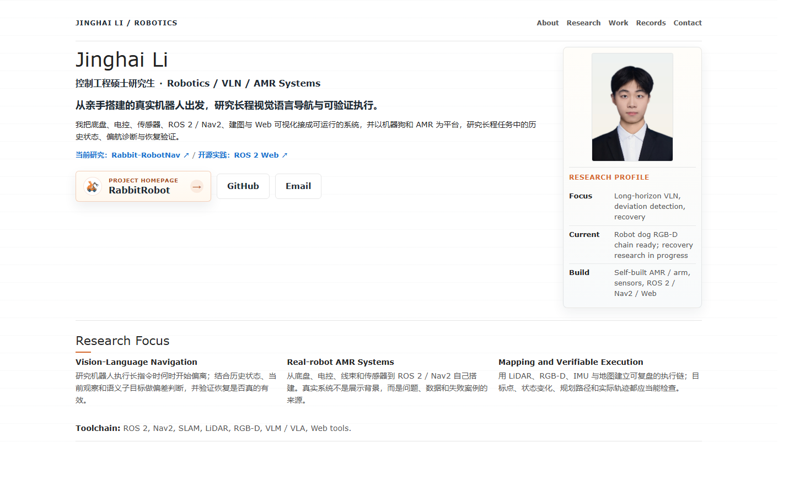

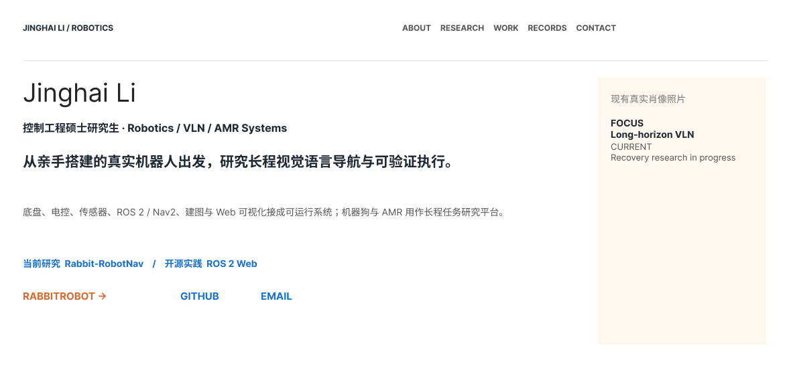

[Figma 可编辑首屏参考](https://www.figma.com/design/uP11nWVMOWbR9uYhx4reNd?node-id=1-2) · [改动前的主页桌面截图](docs/images/updates/2026-08-17-homepage-content/desktop.png)。Figma 图只用于确认信息层级；最终效果以线上真实浏览器核验为准。

访问路径采用 Axton `mermaid-visualizer` 生成的 GitHub / Obsidian 兼容流程图（只用于说明，不嵌入主页）：

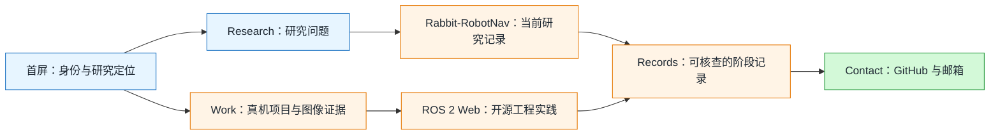
```mermaid
flowchart LR
  A["首屏：身份与研究定位"] --> B["Research：研究问题"]
  A --> C["Work：真机项目与图像证据"]
  B --> D["Rabbit-RobotNav：当前研究记录"]
  C --> E["ROS 2 Web：开源工程实践"]
  D --> F["Records：可核查的阶段记录"]
  E --> F
  F --> G["Contact：GitHub 与邮箱"]
  classDef entry fill:#e7f5ff,stroke:#1971c2,color:#1f2933
  classDef evidence fill:#fff4e6,stroke:#e67700,color:#1f2933
  classDef contact fill:#d3f9d8,stroke:#2f9e44,color:#1f2933
  class A,B entry
  class C,D,E,F evidence
  class G contact
```

### 2026-10-03 - Rabbit-RobotNav 学术版式细节优化 v15

对照 [TagaVLM 学术项目页](https://apex-bjut.github.io/Taga-VLM/)的真实浏览器版式，继续收紧 [`/RabbitRobotNav/`](https://lijinghai.github.io/RabbitRobotNav/) 的视觉层级，同时保留 RabbitRobot 的橙色／深蓝品牌配色。原先首屏“进行中”状态字样偏大、三个资源按钮图标风格不一，正文行宽较长，研究方向列表的大号圆形序号也显得更像产品介绍；本次分别缩小状态字、改用一致的线框 SVG 图标、收窄正文并增加行距、用细小橙点标出研究方向。页面的研究表述、实验数字、方法图、五张图片及三段视频均未改动；自动恢复仍明确标为尚未验证。

| 核验项 | 本次实际结果 |
| --- | --- |
| 范围 | 仅修改 `RabbitRobotNav/index.html` 和 `RabbitRobotNav/style.css`，并新增本条 README 记录及真实浏览器截图；原有未跟踪的 `work/` 保留、不纳入提交。页尾维护日期更新为 2026-10-03。 |
| 桌面与手机 | 本地 Chrome 在 1440×900 和 390×844 视口实测：页面滚动宽度分别等于 1440 和 390，无横向溢出；五张图片全部可解码，三个视频元素存在，站内锚点均可找到。 |
| 字体与可读性 | 浏览器计算样式确认桌面／手机首屏状态字为 15／13px；正文最大宽度 790px，桌面行高约 27.5px。此项只验证页面呈现，未重跑 MP3D、ROS 2 或真机恢复实验。 |

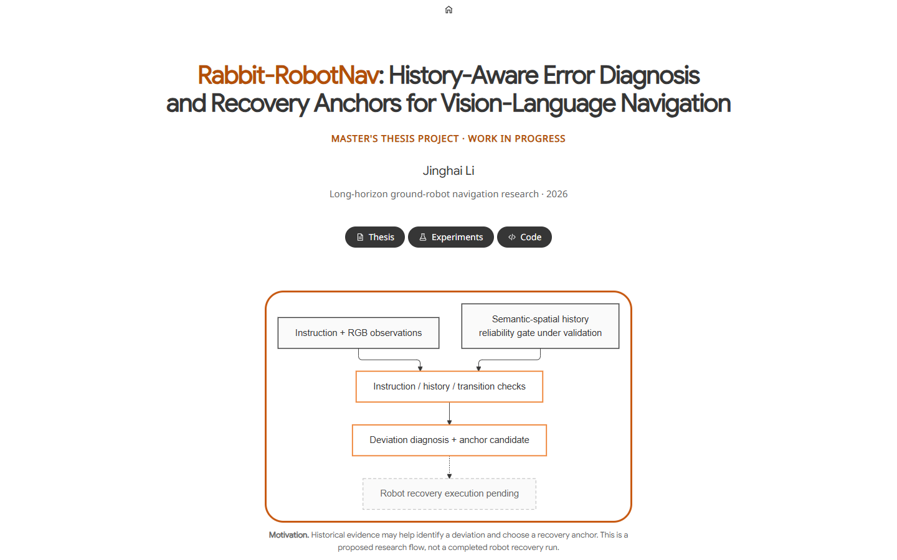

[手机首屏](docs/images/updates/2026-10-03-rabbit-robotnav-academic-v15/mobile.top.png) · [研究方向与方法段](docs/images/updates/2026-10-03-rabbit-robotnav-academic-v15/desktop.contributions.png) · [真实案例视频段](docs/images/updates/2026-10-03-rabbit-robotnav-academic-v15/desktop.robot.png)。下图使用 Axton `mermaid-visualizer` 的 Mermaid 源格式记录本次页面层级；它只说明页面结构，不表示新的科研结论：

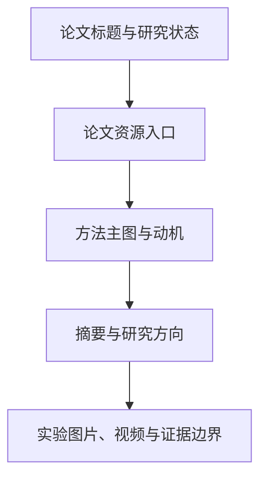
```mermaid
flowchart TB
  A["论文标题与研究状态"] --> B["论文资源入口"]
  B --> C["方法主图与动机"]
  C --> D["摘要与研究方向"]
  D --> E["实验图片、视频与证据边界"]
```

### 2026-10-02 - Rabbit-RobotNav 学术页恢复橙蓝品牌配色 v14

用户明确要求不要参考论文页的红色，改用 RabbitRobot 标志的橙色。此次只给 [`/RabbitRobotNav/`](https://lijinghai.github.io/RabbitRobotNav/) 换色，不改变 v13 已确立的居中英文论文标题、白色／浅灰分节、真实实验图片、视频、BibTeX 和未验证结论边界。原来的红色标题强调、贡献序号及方法图节点描边，改为橙色系；普通资源链接使用标志中的深蓝色。正文小字和白字序号采用较深的橙色，避免亮橙直接承载细字时对比不足。

| 核验项 | 本次实际结果 |
| --- | --- |
| 改动文件 | `RabbitRobotNav/style.css` 的强调色、链接和表格淡色行；Axton `mermaid-visualizer` 源文件 `paper-method-v12.mmd`、`paper-method-v12-mobile.mmd` 的核心节点描边；两张重新渲染的同名 SVG。未改论文表述、数字、照片或视频。 |
| 浏览器核验 | 本地 Chrome 在 1440×900、390×900 两种视口的页面滚动宽度分别为 1440、390，无横向溢出；两端均有 5/5 张图片解码、3 个视频元素，桌面加载横向方法图，手机加载纵向方法图；计算样式读取的亮橙为 `#ee8234`、深橙文字为 `#b34f09`。 |
| 对比度与边界 | 深橙文字对白底的计算对比度为 5.20:1，贡献编号的白字改用深橙底；本次验证仅覆盖网页呈现，没有重跑 MP3D、ROS 2 或真机恢复实验，仓库原有未跟踪 `work/` 未动。 |

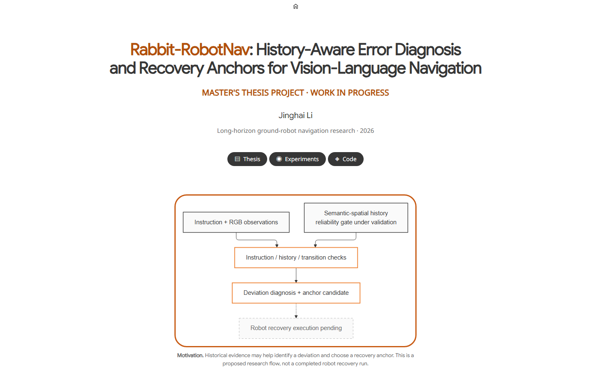

[手机首屏](docs/images/updates/2026-10-02-rabbit-robotnav-orange-v14/mobile.top.png) · [桌面 BibTeX 与页脚](docs/images/updates/2026-10-02-rabbit-robotnav-orange-v14/desktop.footer.png)。方法图仍采用 Axton 的 Mermaid 源格式以精确维护研究流程和待验证边界，网页展示预渲染 SVG。

### 2026-10-02 - Rabbit-RobotNav 学术项目页版式与配色 v13

参照 [TagaVLM 论文主页](https://apex-bjut.github.io/Taga-VLM/)的实际桌面页面，重新整理 [`/RabbitRobotNav/`](https://lijinghai.github.io/RabbitRobotNav/) 的视觉层级：保留居中英文论文标题、作者、资源入口、方法图、真实实验图和三段案例视频，把原有橙蓝正文主题改为深灰文字、论文红强调、深灰胶囊按钮以及白色／浅灰交替章节。此版本只调整表达方式，不改摘要、实验数字、图注的证据边界，也不借用参考论文的研究素材。图框沿用参考页的暖色细边，使主图与黑红正文有所区分。

| 对照项 | 改动和实际验证 |
| --- | --- |
| 首屏与章节 | 调整顶部留白、标题下方状态／作者／按钮的节奏和主图宽度；Abstract 为白底，Research Directions 为浅灰底，后续章节交替，避免旧版大面积橙蓝色干扰论文阅读 |
| 方法图 | Axton `mermaid-visualizer` 维护 `paper-method-v12.mmd` 与新增的 `paper-method-v12-mobile.mmd`，预渲染为平面线条 SVG；桌面保留并列输入，手机改为纵向图，继续明确“历史可靠性门禁待验证、机器人恢复执行未完成” |
| 字体与页尾 | 保留已核对的 Google Sans 标题和 Noto Sans 正文字体分工，BibTeX 仍为等宽字体；资源区与 BibTeX／GitHub 页脚保持论文项目页结构 |
| 浏览器实测 | 本地 Chrome 分别以 1440×900 和 390×900 视口检查：页面宽度等于视口宽度、5/5 图片可解码、3 个视频元素存在、站内锚点无失效；桌面加载横向图，手机加载纵向图；Abstract 计算背景为白色，下一节为 `rgb(250,250,250)` |
| 边界 | 本次未重跑 MP3D、ROS 2 或真机实验，也未将未验证的恢复执行写成完成；原有未跟踪 `work/` 未动、未提交 |

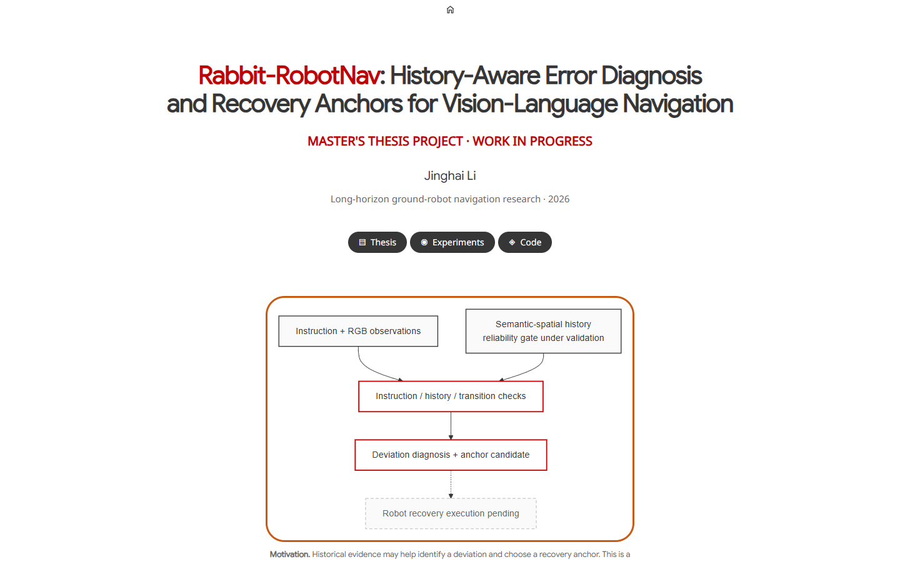

[手机首屏](docs/images/updates/2026-10-02-rabbit-robotnav-academic-v13/mobile.top.png) · [桌面 BibTeX 与页尾](docs/images/updates/2026-10-02-rabbit-robotnav-academic-v13/desktop.footer.png)。方法图采用 Axton Mermaid 源格式，是因为这张图表达精确的数据流和待验证边界；网页只加载其静态 SVG，避免读者依赖在线图形脚本。

### 2026-10-02 - Rabbit-RobotNav 最新实验依据与真机图片 v12

依据[实验台账](https://fcn2t7zlog3v.feishu.cn/wiki/QkqMw3ElIi5VzUkA0FqcQfuEnHg)、[论文框架](https://fcn2t7zlog3v.feishu.cn/wiki/OuK8w5wBGiOkwhkkAQxcRO1Un5e)和研究仓库 `real-robot-integration` 已推送的 [`b89caa6`](https://github.com/lijinghai/history-aware-mp3d-vln/tree/b89caa6a868852ae62fe0426f35c688242f1bffa)，更新 `/RabbitRobotNav/` 的研究状态与图像。原页侧重静止 Trial 0，容易让读者漏看 9 月 28 日移动实验的身份保持失败；本版将真机图换为 Trial 1R 同一把椅子移动前后的检测帧和选中深度时间曲线。曲线只是定位线索，缺少分裂瞬间的同步帧与三维真值，不能据此断定故障原因。原有 MP3D 案例视频与橙蓝论文式排版保留。

| 项目 | 本次修改与实际依据 |
| --- | --- |
| 方法图与文字 | `RabbitRobotNav/paper-method-v12.mmd` 由 Axton `mermaid-visualizer` 生成精确研究流程，并预渲染为 `assets/paper-method-v12.svg`；把历史可靠性门禁标为待验证，把机器人恢复执行标为未完成。摘要、方法、结果和资源区不再暗示已获得导航增益或自动纠错成功 |
| 真机图片 | `trial1r-chair-before-2026-09-28.png`、`trial1r-chair-after-2026-09-28.png`、`trial1r-selected-depth-2026-09-28.png` 来自研究仓库 Trial 1R 证据目录；同一椅子的轨迹编号 `obj_0000 → obj_0034` 是失败观察，因果解释仍未定 |
| 最新门禁 | 10 月 2 日静止尝试因 RGB 时间戳间隔 0.843 s 超过原有 0.50 s 连续性门禁，在 1.10 s、两帧后停止，不是新的 `TARGET_LOST` 复现；热身与计时代码通过离线检查，但刷新图像零检测后未再启动正式运行 |
| 网页验证 | Axton 图成功渲染为 SVG；本地 Chrome/Playwright 分别截取 1440×900 桌面首屏、390×844 手机首屏和桌面真机段，人工检查标题、图片、图注与响应式排列；站内媒体引用另做存在性检查。此验证不等于重跑 MP3D、ROS 2 或真机实验 |
| 范围与保留 | 只改 `RabbitRobotNav/`、根 README 和本次截图；已有未跟踪 `work/` 不纳入提交。移动语义地图稳定性、可靠历史写入门禁、正式复测和自动恢复仍待验证 |

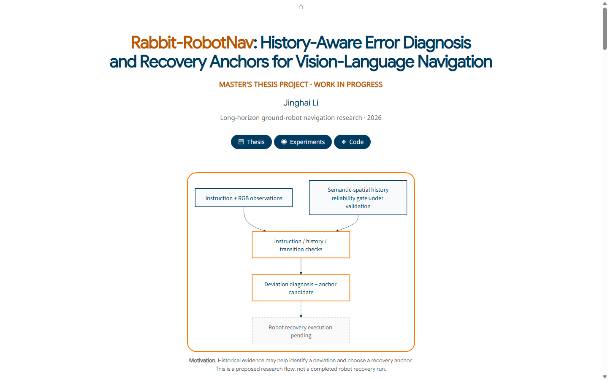

[手机首屏](docs/images/updates/2026-10-02-rabbit-robotnav-evidence-v12/mobile.playwright.png) · [真机前后对照与深度曲线](docs/images/updates/2026-10-02-rabbit-robotnav-evidence-v12/desktop.robot.playwright.png)。方法图采用 Axton 的 Mermaid 源格式，因为这里要准确表达证据进入诊断、锚点候选与尚未执行恢复之间的流程；网页使用预渲染 SVG，不要求读者浏览器在线运行 Mermaid。

### 2026-09-27 - Rabbit-RobotNav 论文字体层级校正 v11

只针对 [`/RabbitRobotNav/`](https://lijinghai.github.io/RabbitRobotNav/) 的字体与字距进行校正，不改论文表述、图像、视频、实验数字或橙蓝配色。修改前全站默认 `Google Sans`，导致 Abstract、各节标题和页脚都偏离参考页的排版；BibTeX 外层还设置了 `Castoro` 与 17px 字号，呈现得过大。浏览器实测 [TagaVLM 项目页](https://apex-bjut.github.io/Taga-VLM/) 的字体分工后，修改 `RabbitRobotNav/style.css`：页面正文、章节标题、BibTeX 标题与页脚统一为 `Noto Sans`，项目标题、作者行及首图说明保留 `Google Sans`，BibTeX 代码改为 14px/21px 等宽字体；`RabbitRobotNav/index.html` 移除不再使用的 `Castoro` 字体请求。

| 核验项 | 实际结果 |
| --- | --- |
| 字体实测 | Chrome 计算样式与实际字体覆盖均确认：论文标题 `Google Sans` 40px/600，正文 `Noto Sans` 16px/24px，章节标题 `Noto Sans` 32px/600，BibTeX 标题 `Noto Sans` 28px/600，代码 `monospace` 14px/21px，页脚 `Noto Sans` 16px/24px；这些角色与参考页一致，颜色仍为 RabbitRobot 橙蓝主题 |
| 页面运行 | 本地 Chrome 的 1440×900 与 390×844 视口无横向溢出，4/4 图片完成解码，站内锚点无失效；三段 H.264 视频均可起播并推进约 0.39 秒，未发现解码错误 |
| 证据边界 | 此次验证的是网站排版与媒体加载，不代表重新执行 MP3D、ROS 2 或真机恢复实验；仓库原有未跟踪的 `work/` 未动、未提交 |

字体角色图采用 Axton `mermaid-visualizer` 的 Mermaid 源格式，准确对应本次实际核对的页面区域和字体：

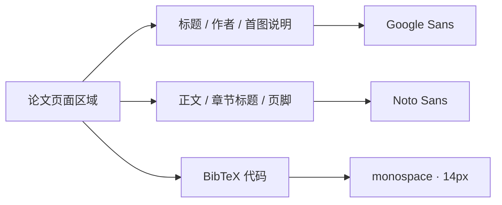
```mermaid
flowchart LR
  A["论文页面区域"] --> B["标题 / 作者 / 首图说明"]
  A --> C["正文 / 章节标题 / 页脚"]
  A --> D["BibTeX 代码"]
  B --> E["Google Sans"]
  C --> F["Noto Sans"]
  D --> G["monospace · 14px"]
```

桌面和手机的实际浏览器页尾截图：

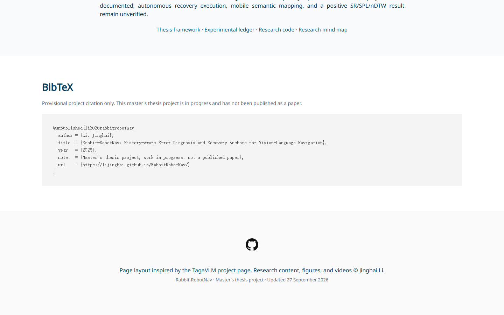

[手机页尾](docs/images/updates/2026-09-27-rabbit-robotnav-typography-v11/mobile.footer.png) · [桌面首屏](docs/images/updates/2026-09-27-rabbit-robotnav-typography-v11/desktop.top.png) · [手机首屏](docs/images/updates/2026-09-27-rabbit-robotnav-typography-v11/mobile.top.png) · [桌面整页](docs/images/updates/2026-09-27-rabbit-robotnav-typography-v11/desktop.png) · [手机整页](docs/images/updates/2026-09-27-rabbit-robotnav-typography-v11/mobile.png)。

### 2026-09-27 - Rabbit-RobotNav 品牌配色与论文式页尾 v10

本次只调整 [`/RabbitRobotNav/`](https://lijinghai.github.io/RabbitRobotNav/) 的视觉主题和底部结构：把 v9 的红色强调换成用户 RabbitRobot 标志中的橙色与深蓝色，沿用现有的英文论文式正文、实验数值、四张页面图片和三段真实案例视频。底部改为参考论文主页的左对齐 BibTeX 标题、浅灰代码块、浅灰页脚与居中 GitHub 图标。引用条目明确使用 `@unpublished` 并注明“硕士论文项目进行中、非已发表论文”，避免把研究预览误写成正式发表成果。页面只说明版式参考 TagaVLM，没有套用未使用的 Nerfies 模板署名。

| 对比与交付 | 实际内容 |
| --- | --- |
| 修改前 | 标题、研究状态、贡献序号及首屏方法图仍带参考论文的红色强调；页尾只有两行文字 |
| 修改后 | `RabbitRobotNav/style.css` 统一橙色／深蓝色，并给较小橙色文字使用更深的同色系以维持对比度；`paper-method-v9.mmd` 由 Axton `mermaid-visualizer` 规则维护并重新渲染 `assets/paper-method-v9.svg`；`index.html` 增加不冒充发表论文的 BibTeX 与 GitHub 页脚 |
| 真正核验 | 本地 Chrome 在 1440×900 和 390×844 视口分别确认滚动宽度等于视口宽度、4/4 页面图像解码、站内锚点无失效；三段 1920×1080 H.264 视频均 `readyState=4` 且实际起播推进约 0.39–0.40 秒。手机 BibTeX 长行自动换行；桌面和手机页尾截图均人工检查 |
| 证据边界 | 这只是网站呈现与媒体播放核验；未重跑 MP3D、ROS 2，也未改变真机移动建图或自动恢复的待验证状态；已有未跟踪的 `work/` 目录没有纳入提交 |

品牌首屏与底部的真实浏览器截图：

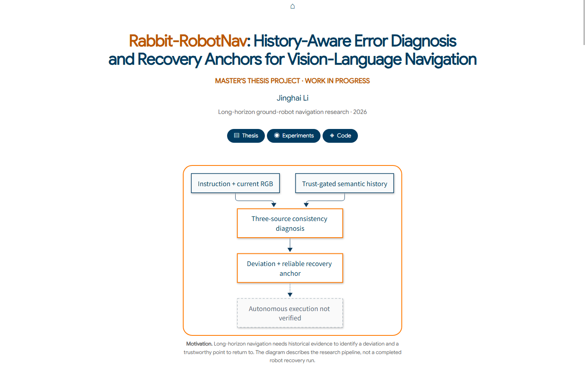

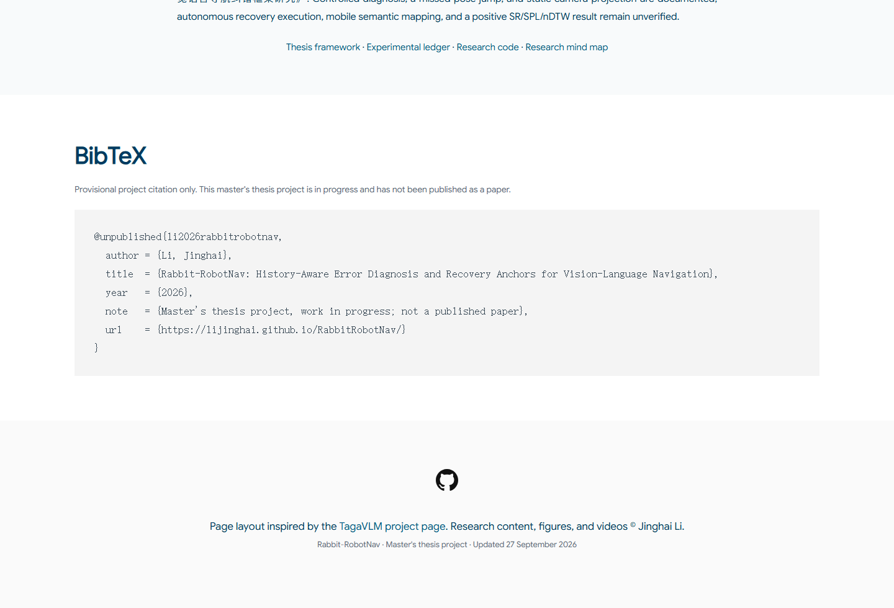

[手机首屏](docs/images/updates/2026-09-27-rabbit-robotnav-brand-footer-v10/mobile.top.png) · [手机页尾](docs/images/updates/2026-09-27-rabbit-robotnav-brand-footer-v10/mobile.footer.png) · [桌面整页](docs/images/updates/2026-09-27-rabbit-robotnav-brand-footer-v10/desktop.png) · [手机整页](docs/images/updates/2026-09-27-rabbit-robotnav-brand-footer-v10/mobile.png)。Axton `mermaid-visualizer` 选择 Mermaid 源格式，是因为首屏方法图属于精确的数据流图；页面加载的是其预渲染 SVG，以便 GitHub Pages 无脚本也能显示。

### 2026-09-27 - Rabbit-RobotNav 英文学术项目页与真实实验视频 v9

对照 [TagaVLM 论文主页](https://apex-bjut.github.io/Taga-VLM/)的实际页面与用户提供的首屏截图，重写 [`/RabbitRobotNav/`](https://lijinghai.github.io/RabbitRobotNav/) 的信息层级：顶部居中英文论文式题目、研究状态、作者和深色资源按钮，随后是窄幅动机图、Abstract、Contributions、Method、视频案例、结果表、真机图与资源。只借鉴版式，不复制对方论文内容或素材；没有本项目已发表论文、arXiv 链接或端到端真机演示的证据，因此不伪造这些入口。旧版首屏的大兔子标志、中文标题和横向小流程图与参考页明显不同；新版以论文式首屏和纵向方法图替换，并让视频区真正播放视频、图像区展示实际实验图。

| 范围 | 本次实施和可复核证据 |
| --- | --- |
| 研究依据 | 核对[论文框架](https://fcn2t7zlog3v.feishu.cn/wiki/OuK8w5wBGiOkwhkkAQxcRO1Un5e)、[实验台账](https://fcn2t7zlog3v.feishu.cn/wiki/QkqMw3ElIi5VzUkA0FqcQfuEnHg)与研究代码 `real-robot-integration` 的 [`9c0406`](https://github.com/lijinghai/history-aware-mp3d-vln/tree/9c0406add2aec1a26946a22582fe179d2e13e225)；网站只陈述这些材料支持的结论 |
| 页面与图片 | `RabbitRobotNav/index.html`、`style.css` 改为白底/浅灰分节、红色强调的英语论文主页；Axton `mermaid-visualizer` 的 `paper-method-v9.mmd` 预渲染为首屏 SVG；正文保留真实 MP3D G1 图和 2026-09-24 WheelTec 静止 Trial 0 两张原图 |
| 视频 | 从飞书实验记录提取 G1 指令顺序、G2 2.44 m 位姿跳变漏检、G5 空间关系冲突的三段原始案例视频，并转为浏览器可播 H.264 MP4；视频图注标明这是稀疏参考航点回放，不是连续里程计或机器人自动恢复 |
| 证据边界 | 五场景受控回放中四类偏差检出三类、34 个正常稀疏参考点未触发告警；110 episode 配对 A/B 的 SR 持平且 SPL/nDTW 未提升；真机仅通过当前 mapper 投影契约与静止 Trial 0 的 413/388 帧检查，移动建图和闭环恢复未验证 |
| 网页核验 | 本地 Chrome 1440×900、390×844 两种视口均无横向溢出；4/4 图像解码、站内锚点无失效；三段 1920×1080 H.264 视频均 `readyState=4`、无解码错误，逐段实际起播且播放时间推进约 0.39 秒。未将网页播放测试当成科研实验复现 |

真实浏览器桌面首屏：

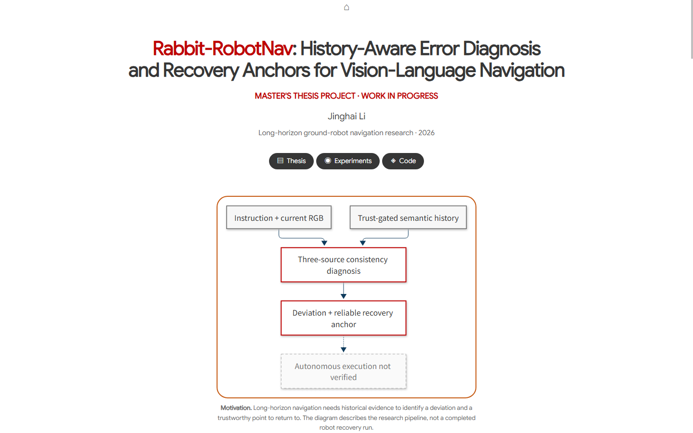

[桌面整页](docs/images/updates/2026-09-27-rabbit-robotnav-taga-v9/desktop.png) · [手机首屏](docs/images/updates/2026-09-27-rabbit-robotnav-taga-v9/mobile.top.png) · [手机整页](docs/images/updates/2026-09-27-rabbit-robotnav-taga-v9/mobile.png)。现有未跟踪的 `work/` 目录属于用户现场，未纳入此次改动。源视频、图像和数值来自上述项目材料；未新跑 MP3D 或 ROS 2 实验。

### 2026-09-27 - Rabbit-RobotNav 硕士论文主页精简与品牌配色 v8

依据[论文框架](https://fcn2t7zlog3v.feishu.cn/wiki/OuK8w5wBGiOkwhkkAQxcRO1Un5e)、[实验台账](https://fcn2t7zlog3v.feishu.cn/wiki/QkqMw3ElIi5VzUkA0FqcQfuEnHg)和研究代码 `real-robot-integration` 的已推送 [`9c0406`](https://github.com/lijinghai/history-aware-mp3d-vln/tree/9c0406add2aec1a26946a22582fe179d2e13e225)，将 `/RabbitRobotNav/` 从九段、21 图的资料型页面收敛为四段、五图的硕士论文项目页。沿用 [TagaVLM 项目页](https://apex-bjut.github.io/Taga-VLM/)的居中题目、摘要、方法、结果和资源层级，采用用户 RabbitRobot 标志中的橙色与深蓝色，不复制参考页的源代码、文字或图片。修改前的长页面把概念图、实验图和真机图连续铺开，且上版红色强调与品牌不符；修改后首屏突出论文题目和一张新的精简方法图，结果区只保留最能说明研究状态的 MP3D 漏检原图与两张 9 月 24 日真机原图。

| 项目 | 本次实施与可复核证据 |
| --- | --- |
| 主线 | 历史感知语义地图 → 指令/历史/状态转移一致性 → 偏航诊断 → 可信恢复锚点；完整思维图继续通过链接提供，避免主页面再次堆满节点 |
| 关键文件 | `RabbitRobotNav/index.html` 缩减正文；`RabbitRobotNav/style.css` 重做橙/深蓝响应式论文版式；`paper-method.mmd`、`paper-method-mobile.mmd` 及对应 SVG 提供可维护的桌面/手机方法图 |
| 图片来源 | Figure 2 保留 MP3D 2.44 m 跳变漏检原图；Figures 3–4 保留真实 RGB-D 投影叠加和 Trial 0 候选检测帧；新 Figure 1 为方法解释图，不充当实验截图 |
| 证据边界 | 五场景受控偏差为 3/4 检出；110 episode 配对 A/B 未见导航提升；真机只确认当前 mapper 的投影契约与静止 Trial 0，Trial 1–3、运动建图和自动纠偏仍待验证 |
| 网页实测 | 本地 Chrome 以 1440×900 和 390×844 视口渲染：两端页面滚动宽度分别等于 1440/390，五张图片均解码、锚点无失效、正文均为四段；这不代表重跑了 MP3D 或 ROS 2 |

Axton `mermaid-visualizer` 生成的[桌面方法图源](RabbitRobotNav/paper-method.mmd)与[手机纵向图源](RabbitRobotNav/paper-method-mobile.mmd)用于说明研究流程，网页使用预渲染 SVG，避免依赖在线脚本。实际浏览器渲染如下：

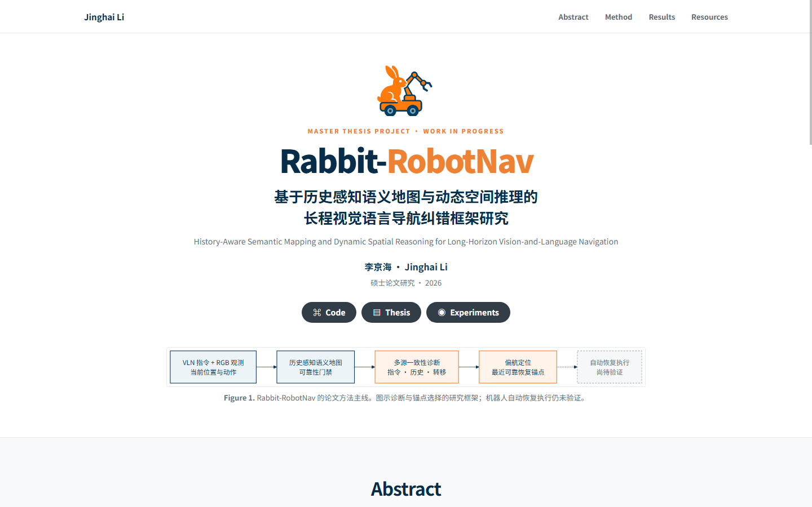

完整核验：[桌面长图](docs/images/updates/2026-09-27-rabbit-robotnav-paper-v8/desktop.png) · [手机首屏](docs/images/updates/2026-09-27-rabbit-robotnav-paper-v8/mobile.top.png) · [手机长图](docs/images/updates/2026-09-27-rabbit-robotnav-paper-v8/mobile.png)。仅本项目页及根 README、对应实测截图发生变化；`work/` 是已有未跟踪目录，未纳入本次交付。

### 2026-09-27 - Rabbit-RobotNav 硕士论文主页视觉改版 v7

以 [TagaVLM 论文项目页](https://apex-bjut.github.io/Taga-VLM/)的学术网页层级作为**视觉参考**，只改 [/RabbitRobotNav/](https://lijinghai.github.io/RabbitRobotNav/) 的呈现，不复制对方的文字、图片或代码。修改前是橙蓝品牌色、带阴影的卡片和图框，首张总体框架图排在 Abstract 之后；修改后采用白底与浅灰分区、居中题目与作者、深灰圆角资源按钮、少量论文红强调、简洁图注和无阴影结果展示，并将原有 Figure 1 上移为标题下的 teaser。为使引导语与新图序相符，仅把“以下三张”改为“本页三张”；研究论述、21 张图片的来源与图注、实验数值及“静止通过／运动未验证”的证据边界均未改变。

| 项目 | 本次交付及核验 |
| --- | --- |
| 范围 | RabbitRobotNav/index.html 只调整主题色元信息、标题强调标记和 Figure 1 位置；RabbitRobotNav/style.css 重写论文型版式。根首页及其他项目页未修改 |
| 图片 | 21 张原有图片全部保留且未修改源文件；概念框架图仍明确标注“概念图”，真实机器人图与 MP3D 结果仍在各自证据区 |
| 桌面实测 | 本地 Chrome 以 1440×1400 视口渲染，文档宽度/滚动宽度均为 1440，21/21 图片可解码，9 个正文章节保留 |
| 手机实测 | Chrome 设备视口模拟 390×844，文档宽度/滚动宽度均为 390，21/21 图片可解码；标题和资源按钮换行，无横向溢出 |
| 证据边界 | 这次只验证网页外观、图片载入与响应式排版；未重跑 MP3D、ROS 2、Trial 1–3 或机器人运动，既有科研结论不因换肤而升级 |

用 Axton mermaid-visualizer 记录视觉层级（Mermaid 源，GitHub 与 Obsidian 可渲染）；这张说明图不代表新增实验结果：

~~~mermaid
flowchart LR
    ref["TagaVLM 视觉参考"] --> hero["居中题目 · 作者 · 深色按钮"]
    hero --> teaser["原 Figure 1 首屏展示"]
    teaser --> sections["摘要 · 方法 · 结果 · 真机"]
    sections --> boundary["原研究内容与证据边界"]
    classDef neutral fill:#f8f9fa,stroke:#868e96,color:#303030;
    classDef focus fill:#fff7f7,stroke:#bf0303,color:#303030;
    class ref,boundary neutral;
    class hero,teaser,sections focus;
~~~

桌面首屏与 Figure 1 的真实浏览器截图：

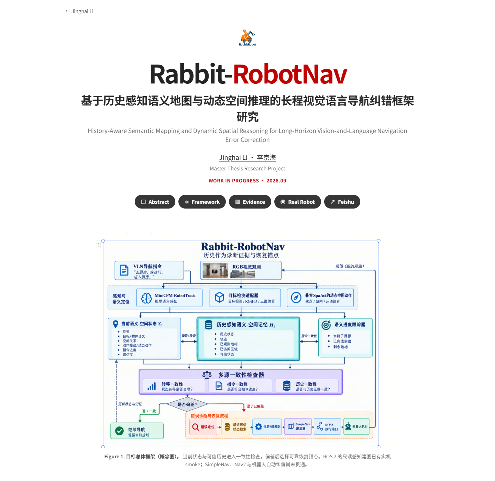

完整页面实测：[桌面长图](docs/images/updates/2026-09-27-rabbit-robotnav-taga-style/desktop-full.png) · [390 px 手机首屏](docs/images/updates/2026-09-27-rabbit-robotnav-taga-style/mobile-full.top.png) · [手机长图](docs/images/updates/2026-09-27-rabbit-robotnav-taga-style/mobile-full.png)。样式来源只作视觉参照；页面研究内容仍以两份飞书文档和已有源码证据为准。

### 2026-09-27 - Rabbit-RobotNav 投影契约、静止 Trial 0 与真机图像更新 v6

本次核对[飞书实验台账](https://fcn2t7zlog3v.feishu.cn/wiki/QkqMw3ElIi5VzUkA0FqcQfuEnHg) 10.8.6、[论文框架](https://fcn2t7zlog3v.feishu.cn/wiki/OuK8w5wBGiOkwhkkAQxcRO1Un5e)及 `real-robot-integration` 已推送源码 [`9c0406`](https://github.com/lijinghai/history-aware-mp3d-vln/tree/9c0406add2aec1a26946a22582fe179d2e13e225)，更新 [`/RabbitRobotNav/`](https://lijinghai.github.io/RabbitRobotNav/)。修改前网站仍显示“Trial 0 不放行、mapper 未复跑”，且没有 9 月 24 日的投影叠加与新检测帧；修改后按时间标明相机 TF、当前 mapper 的 Color `K`＋注册深度投影契约及静止 Trial 0 已通过，同时把 Trial 1–3、运动建图、闭环恢复保留为待验证。论文框架文档中的早期 PRECHECK UNCERTAIN 与更新的实验台账冲突时，以 10.8.6 和源码原始诊断为准。

| 范围 | 本次实施及证据边界 |
| --- | --- |
| 最新真机图 | 原样复制研究仓库 `registered_overlay_002.png` 和 `trial0_rgb_bbox.png`，SHA-256 与原图一致；旧 9 月 23 日检测图保留但标为历史 |
| 真实指标 | 静止约 47 秒，接收/处理 413/388 帧，RGB–Depth 平均同步差 33.972 ms，14 个对象，实际收到 28 个 Marker；并非移动或导航成功 |
| 投影边界 | Color CameraInfo `K/P` 有限、注册 RGB/Depth 共用 `camera_color_optical_frame`，当前 mapper 不读取仍含四个 NaN 的 Depth `K`；不推论其他消费者安全 |
| Axton 图 | 用 `mermaid-visualizer` 更新研究思维图、系统数据流和 TF/投影/Trial 准入图的 `.mmd`，重新预渲染为本地 SVG；配置中扩展流程图文字换行宽度，修正门禁图居中展示 |
| 关键文件 | `RabbitRobotNav/index.html`、`style.css`、`mermaid-config.json`、三份 `.mmd` 与 SVG、两张新的真机 PNG；网站其他页面未修改 |
| 实际验证 | 三份 Mermaid CLI 渲染成功；本地 Chrome `file://` 桌面 1440×900、手机 390×844 均解码 21/21 图，无横向溢出或页面脚本错误，门禁图居中；只验证网页呈现，未重跑 ROS 2、MP3D 或机器人运动试验 |

最新真机图与门禁说明的浏览器实测：

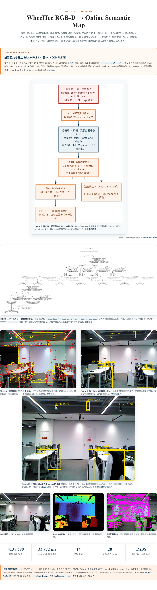

完整页面实测：[桌面](docs/images/updates/2026-09-27-rabbit-robotnav-v6/desktop.png) · [手机](docs/images/updates/2026-09-27-rabbit-robotnav-v6/mobile.png) · [准入图细节](docs/images/updates/2026-09-27-rabbit-robotnav-v6/gate.png)。静止 Trial 0 [原始诊断和两张原图](https://github.com/lijinghai/history-aware-mp3d-vln/tree/9c0406add2aec1a26946a22582fe179d2e13e225/docs/evidence/chassis/wheeltec-mecanum/phase1c3-projection-contract-trial0-2026-09-24)可回溯；没有 RViz 实际渲染截图、多视角 ID 或运动建图通过证据。

### 2026-09-24 - Rabbit-RobotNav 五场景图像与相机 TF 准入更新 v5

对照两份飞书[实验台账](https://fcn2t7zlog3v.feishu.cn/wiki/QkqMw3ElIi5VzUkA0FqcQfuEnHg)、[论文框架](https://fcn2t7zlog3v.feishu.cn/wiki/OuK8w5wBGiOkwhkkAQxcRO1Un5e)，以及 `history-aware-mp3d-vln` 的已推送 `real-robot-integration` 提交 [`14300fa`](https://github.com/lijinghai/history-aware-mp3d-vln/tree/14300fa1f3bd76325f045d64b8b6a1179fc6bfc0)，更新 [`/RabbitRobotNav/`](https://lijinghai.github.io/RabbitRobotNav/) 的证据层级和图片。修改前页面缺少 G3 提前停止原图，也没有 9 月 24 日相机 TF 修复后的真实树；修改后展示五场景受控异常、双父节点检出与定点修复、最新真机 TF 截图，并明确剩余 Depth CameraInfo 风险。保持原有白底、RabbitRobot 橙与深蓝学术项目风格，不改网站其他页面。

| 范围 | 实施与证据边界 |
| --- | --- |
| MP3D 图片 | 从飞书实验台账补入 G3 提前停止原图，连同 G1/G2/G4/G5 展示；五场景、五条 episode、34 个稀疏参考航点的 3/4 检出是模块级案例，不能换算为闭环 SR/SPL |
| 统计更正 | 保留论文框架中对旧 `80/90` 消融的审计结论：数据只重复一个六帧 episode，不作跨样本泛化证据 |
| 真机状态 | 早期完整相机子树审计发现同消息双 parent；最新 `14300fa` 中驱动抑制冗余 TF 边，机器人五个相机 child 单 parent，服务器 `camera_color_frame` 唯一 parent 共 119 条，故 TF 子树 PASS；Depth CameraInfo `K` 仍重复四个 NaN，整体 PRECHECK UNCERTAIN，不放行 Trial 0 或 mapper |
| 真实图片 | 用研究仓库 `after_frames.png` 替换较早的局部通过 TF 图，注明 `view_frames` 不能单独证明无双 parent，仍需逐条审计；9 月 23 日真实 RGB/Depth/检测图保留但标明是历史静止 smoke |
| Axton 图 | `mermaid-visualizer` 维护研究思维图、系统流及相机门禁 `.mmd`，本地渲染为三个静态 SVG，网页无需 Mermaid 在线运行时 |
| 关键文件 | `RabbitRobotNav/index.html`、`style.css`、三份 `.mmd` 和对应 SVG、`assets/g3-premature-stop.png`、`assets/wheeltec-tf-phase1c3.png`；根 README 与本目录实测截图 |
| 本地验证 | Chrome 直接打开页面文件，1440×900 桌面与 390×844 手机均解码 19/19 张图片；页面脚本错误 0、文档宽度分别为 1440/390（无横向溢出）；三份 Mermaid CLI 渲染成功。只验证网页，不重跑 ROS 2 或 MP3D 实验；公开 Pages 生效需以推送后远端核对为准 |

浏览器实测的当前准入提示：

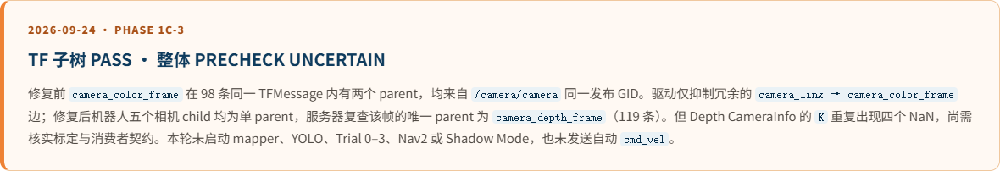

最新真机原始 TF 图：

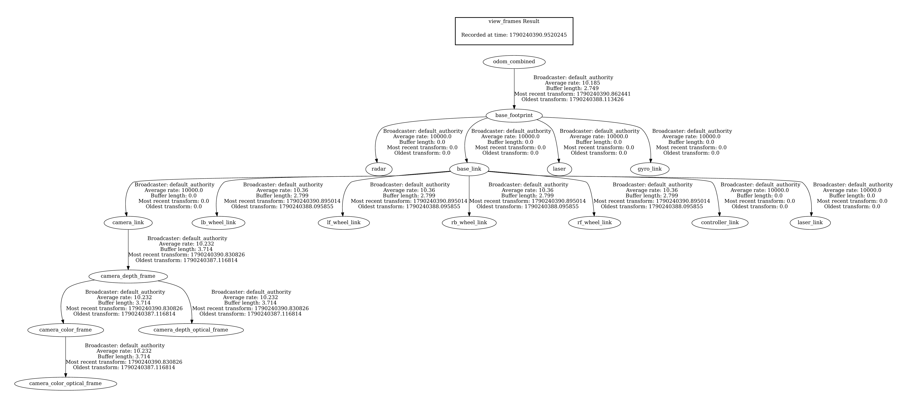

完整页面截图见 [桌面](docs/images/updates/2026-09-24-rabbit-robotnav-v5/desktop.png) 与 [手机](docs/images/updates/2026-09-24-rabbit-robotnav-v5/mobile.png)，[可维护门禁图](RabbitRobotNav/camera-tf-gate.mmd) 与[浏览器渲染图](docs/images/updates/2026-09-24-rabbit-robotnav-v5/tf-diagram.png)用于追溯解释，不替代原始审计。

### 2026-09-23 - Rabbit-RobotNav 最新源码证据与真机图片 v4

对照 `history-aware-mp3d-vln` 的 `real-robot-integration` 分支提交 `77ddcfe072b096f547c38c1e52e230705ff9e2dd`，将 [`/RabbitRobotNav/`](https://lijinghai.github.io/RabbitRobotNav/) 从旧版五场景回放概览更新为分层的论文证据页面。目标架构图继续作为概念图；MP3D 导航 A/B、单 episode 受控故障与 WheelTec 麦轮只读实机采样分别陈列，避免将静止语义地图 smoke 写成自主纠偏闭环。

| 范围 | 本次改动和边界 |
| --- | --- |
| 真实图片 | 从源码仓库复制未加工的在线 RGB 检测框、RGB 原图、Depth 伪彩色及注册边缘叠加图；图注标明椅子附近 `plant` 误检、多视角 ID 未验证 |
| 仿真图片 | 增加 11 场景、110 episode 配对 A/B 指标图和 MP3D 稀疏参考路线纠错时间线；明确 SR 持平、SPL/nDTW 未改善，以及时间线不是连续里程计 |
| 统计纠偏 | 旧版 `80/90` 消融来自单个 6 帧 episode 重复，不再作为跨样本结论或主页主图；formal 仍需独立多 episode、多 scene 与 action-aligned 数据 |
| 真机代码进度 | 新 ROS 2 只读链路经同步、YOLO-World、有效深度、Color CameraInfo、图像时间戳 TF 写入 `odom_combined` 地图；152 帧接收、137 帧处理、14 个对象节点，综合状态 `UNCERTAIN`，未启用 Nav2/`cmd_vel` |
| Axton 可维护图 | 用 `mermaid-visualizer` 更新论文思维图与系统数据流 `.mmd`，静态 SVG 经本机 Chrome 渲染发布；橙 `#EE8234` 与深蓝 `#0E3B5D` 品牌配色沿用 |
| 实际验证 | 本地 HTTP 200；Chrome 桌面 1440px 与手机 390px 均加载 16/16 张图片、无页面脚本错误、无横向溢出；本次仅验证网页展示，不重新执行源码 ROS 2/论文测试 |

实机检测画面与页面实测：

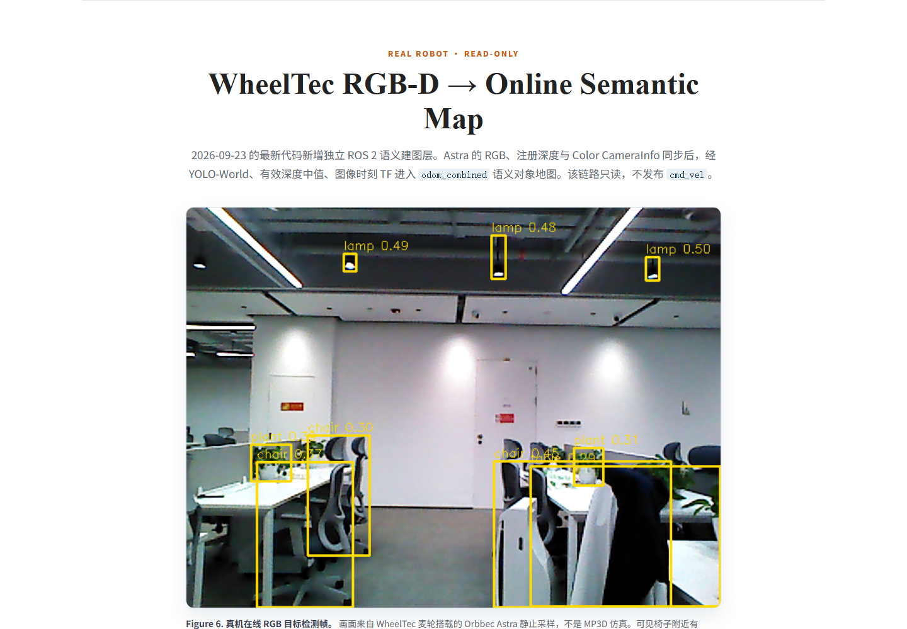

完整桌面和手机长图分别见 [desktop.png](docs/images/updates/2026-09-23-rabbit-robotnav-v4/desktop.png) 与 [mobile.png](docs/images/updates/2026-09-23-rabbit-robotnav-v4/mobile.png)。真机原始证据、指标解释及后续验证门槛见[源码麦轮档案](https://github.com/lijinghai/history-aware-mp3d-vln/blob/77ddcfe/docs/chassis/wheeltec-mecanum.md)。

### 2026-09-23 - Rabbit-RobotNav 静态研究图与橙蓝品牌主题 v3

修复 [`/RabbitRobotNav/`](https://lijinghai.github.io/RabbitRobotNav/) 中 Mermaid 在线模块加载缓慢或失败时直接暴露 `.mmd` 源文本的问题。研究思维图与系统数据流现在由 Axton `mermaid-visualizer` 工作流预渲染为仓库内静态 SVG，页面不再依赖 jsDelivr 才能显示图；同时接入 RabbitRobot 品牌标识，并依据原图实测主色 `#EE8234` 与 `#0E3B5D`，统一标题、按钮、章节标识、图框、标签与页脚。论文主问题、阶段性指标和结论边界均未改变。

| 内容 | 实际改动与证据 |
| --- | --- |
| 格式故障修复 | 删除运行时 `app.js` 与外部 Mermaid CDN 请求；`index.html` 直接引用 `research-mindmap.svg`、`system-flow.svg`，网络受限时也不会显示原始源码 |
| 品牌主题 | 新增用户提供的 `rabbitrobot-brand.jpg`；`style.css` 以品牌橙、深海军蓝和白色重做标题、按钮、状态标签、章节强调、图框和页脚 |
| 可维护研究图 | 保留 `research-mindmap.mmd` 与 `system-flow.mmd` 作为可编辑图源，新增 `mermaid-config.json` 固化品牌配色；SVG 是与页面一起发布的稳定展示产物 |
| 阶段性证据 | 保留 5 场景、29/34 历史覆盖、3/4 可评价偏差检出、0/34 正常回放误报和 112/112 回归测试；G2 的 2.44 m 位姿跳变漏检继续作为负结果公开 |
| 实际验证 | 本地 HTTP 200；桌面端与 `412px` 手机端均加载 10/10 图片、2/2 静态研究图；`pre.mermaid=0`、外部 Mermaid 请求为 0、控制台与页面错误为 0、横向溢出为 0 |

1440 px Chrome 完整页面实测：

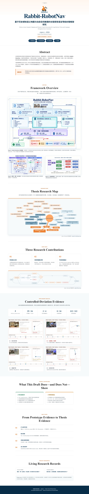

Pixel 7 移动端首屏实测：

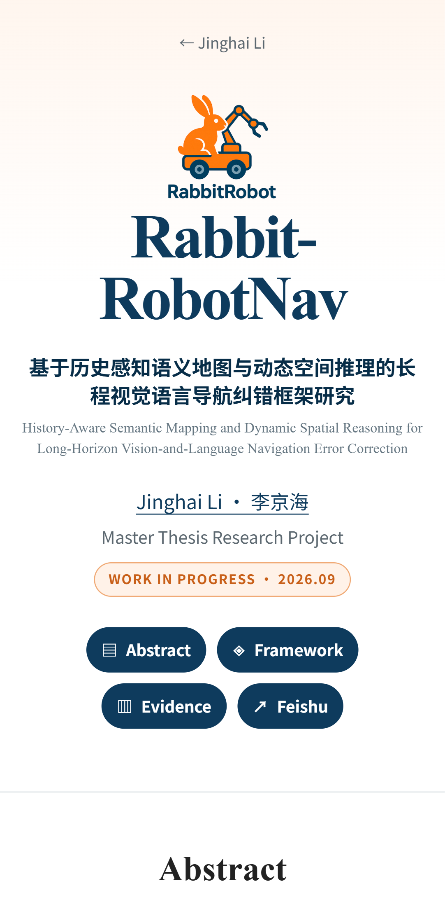

### 2026-09 - 强化 DAS Ego × UMI 实机研究叙事

本次将 `Selected Work` 最前面的当前设备项目 `DAS Ego + UMI` 收束为更克制的研究档案表达：Ego 建立第一视角观测与时空上下文，UMI 记录双手末端轨迹、夹持变化与接触事件，MCAP 负责可复盘的数据组织，最终连接 VLA 示教与策略评估。页面明确区分已完成的真实实操和正在推进的动作单元整理。项目时间统一标为 `2026.09`；页面不直接放置外部手册地址。

| 内容 | 实际改动与证据 |
| --- | --- |
| 首页入口 | `index.html` 在 OmniHand 前新增 `我的设备现在是 DAS Ego × UMI` 卡片，链接到独立详情页 |
| 视频处理 | `ego_umi_2026_demo_4k.mp4`（约 `90MB`），保持 `3840×2160 / 60fps`，去除 `-90°` 显示旋转并以高码率 H.264 输出横屏；桌面原始 `144MB` 文件不改动 |
| 真实画面 | `ego_umi_2026_cover_4k.png`、`ego_umi_2026_04_4k.png`、`ego_umi_2026_08_4k.png`、`ego_umi_2026_14_4k.png` 均为 `3840×2160` 原始尺寸无损 PNG |
| 技术叙事 | 依据 GenRobot.AI DAS Ego 与 DAS / UMI 产品资料，归纳 6 路 RGB、约 270° 视场、6 轴 IMU、UMI 触觉/末端状态、MCAP 落盘和 VLA 示教方向；页面不放置外部手册地址 |
| 详情页面 | `RabbitRobot/projects/rabbitrobot-ego-umi.html` 新增设备资料图文区，包含结构、佩戴、配对、坐标、回放 5 张截图，并与本人实操证据分层 |
| 验证结果 | 本地浏览器确认首页与详情页均解码 `3840×2160 / 60fps` 横屏视频；4 行规格、4 张 `3840×2160` 无损 PNG 证据帧均正常；桌面与 `390×844` 手机端无横向溢出；页面官方手册地址检查为 0 |

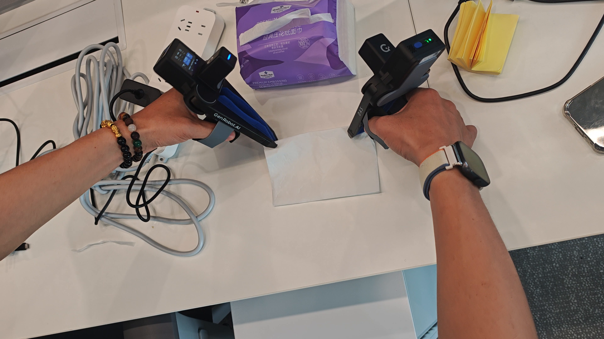

官方资料依据：GenRobot.AI DAS Ego 产品手册与 DAS / UMI 产品资料；页面保留归纳后的设备事实，不把规格冒充为个人实验结果。

主页 `Selected Work` 实际效果：

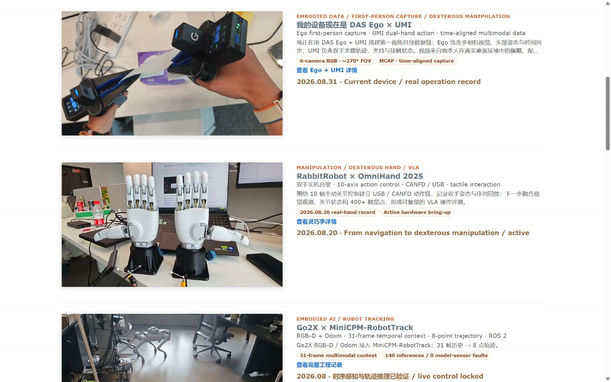

详情页首屏实际效果：

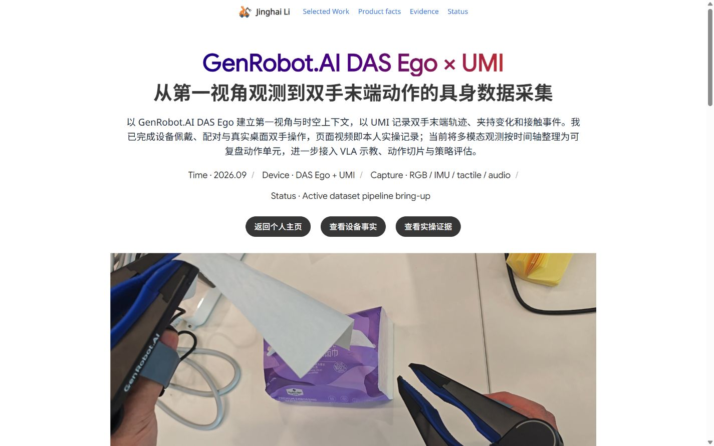

详情页设备资料与实操对照区：

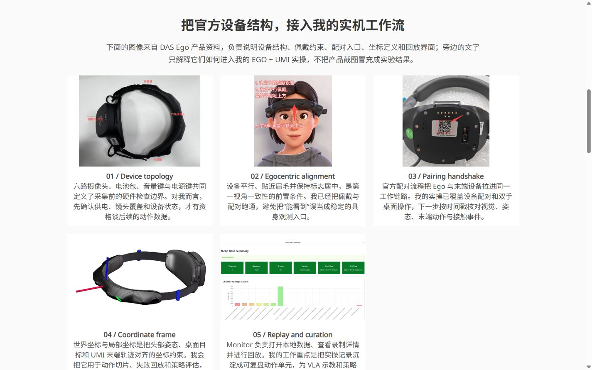

390×844 手机端实际效果：

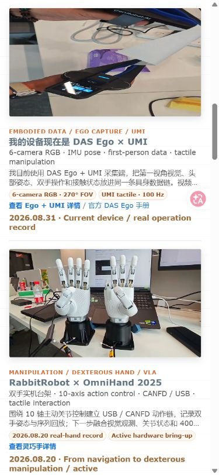

### 2026-08-31 - 首页聚焦 ROS 2 Web 控制台

本次只调整首页项目列表中原来的 AMR2 覆盖规划卡片，将其收束为 `ljh_robot_ros2_web` ROS 2 Web 控制台：使用源码仓库 README 中的真实界面截图，补充连接、地图图层、导航、重定位、设备状态与日志能力。其他项目卡片、详情页、页面结构和既有功能均保持不变。

| 内容 | 实际改动与证据 |
| --- | --- |
| 首页入口 | `index.html` 对应卡片改为 `RabbitRobot ROS 2 Web 控制台`，链接现有详情页与源码仓库 |
| 技术叙事 | React 19、TypeScript、Three.js、rosbridge WebSocket、ROS 2、Nav2 / SLAM 可视化 |
| 真实截图 | `RabbitRobot/images/rabbitrobot/ros2_web_home.png`，与 `ljh_robot_ros2_web` README 主界面素材一致 |
| 用户可见功能 | 2D/3D 地图、图层配置、激光/点云/TF/路径、单点/多点导航、重定位、手动控制、任务和日志 |
| 来源版本 | `lijinghai/ljh_robot_ros2_web` main，核对提交 `8749857` |
| 验证结果 | 本地浏览器确认首页 HTTP 200、目标卡片文案和链接存在、桌面与 `390px` 手机端无横向溢出；其他项目入口数量与顺序不变 |

数据链路：浏览器 UI ↔ rosbridge WebSocket ↔ ROS 2 / Nav2 / SLAM；输出地图、激光、点云、TF、路径与设备状态，输入图层、导航、重定位、手动控制和日志操作。

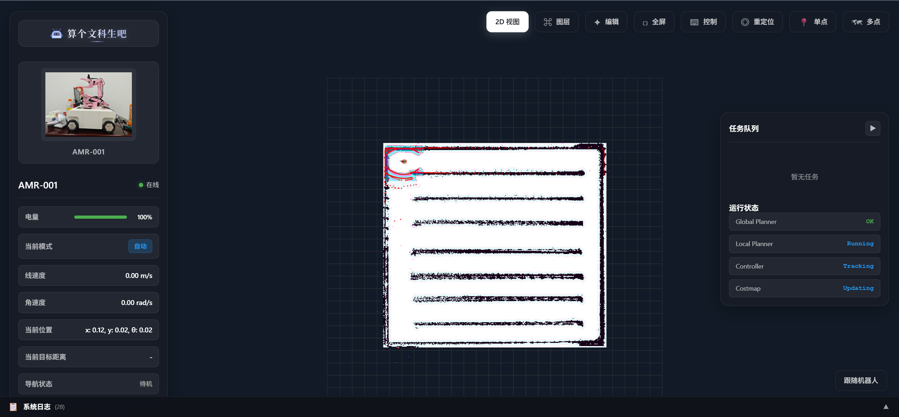

### 2026-08-27 - 修复 GitGuardian 检测到的 W&B 密钥泄露

本次修复公开机械臂教程中的 Weights & Biases API Key 暴露问题，不改变 W&B 实验跟踪、登录命令或页面内容结构。文档继续指导用户通过环境变量配置自己的密钥，但仓库不再保存任何真实凭据；同时清理 Git 历史中的同一明文，避免 GitGuardian 继续从旧提交命中。

| 内容 | 实际改动与证据 |
| --- | --- |
| 泄露源 | `projects/readme-source/rabbitrobot-arm.txt` 与 `RabbitRobot/projects/readme-source/rabbitrobot-arm.txt` 的示例行 |
| 修复方式 | 将真实值替换为 `export WANDB_API_KEY="<your-wandb-api-key>"`，保留环境变量和 `wandb login` 流程 |
| 历史处理 | 重写 `main` 历史并强制推送，移除同一明文在公开提交中的可检索内容 |
| 扫描结果 | 当前工作树与清理后的 Git 历史均不再包含原始密钥；保留的 `WANDB_API_KEY` 仅为变量名和安全占位符 |
| 功能影响 | 页面、项目说明、W&B 配置步骤和其他研究内容保持不变 |
| 关键文件 | `projects/readme-source/rabbitrobot-arm.txt`、`RabbitRobot/projects/readme-source/rabbitrobot-arm.txt`、`README.md` |

安全边界：该 API Key 已经公开，必须在 W&B 控制台立即撤销并重新生成；本仓库只负责删除公开副本，无法代替账户侧轮换。

`main` 历史清理链路：

`公开文档示例` → `占位符` → `历史重写` → `强制推送` → `GitGuardian 不再命中`

### 2026-08-20 - 首页三项机器人动效高清化

本次保持主页原有研究档案式布局和项目顺序不变，将 OmniHand、Go2X 机器狗与 RabbitRobot AMR2 三张首页 GIF 动效升级为带静态封面的高清循环 MP4。画面统一到 `960×540`，通过 Lanczos 放大、色阶收敛、轻量饱和度与锐度校正减弱原素材的灰雾感；同时使用静音、自动播放、循环和 `playsinline`，兼顾桌面与手机端浏览。

| 内容 | 实际改动与证据 |
| --- | --- |
| OmniHand | `omnihand_2025_home_hd.mp4`，`960×540`、15 fps、约 `4.37 MB` |
| Go2X 机器狗 | `robotdog_vln_demo_hd.mp4`，`960×540`、12 fps、约 `2.09 MB` |
| RabbitRobot AMR2 | `amr2_turning_loop_hd.mp4`，`960×540`、24 fps、约 `0.18 MB` |
| 加载成本 | 三张原 GIF 合计约 `12.74 MB`，三张高清 MP4 合计约 `6.64 MB`，减少约 `47.9%` |
| 页面实现 | 首页使用 `poster + autoplay + muted + loop + playsinline + preload=metadata`；保留卡片点击进入详情页，并对 `prefers-reduced-motion` 用户暂停自动播放 |
| 真实验证 | 本地浏览器在桌面端和 `390×844` 手机端确认三段视频均 `readyState=4`、`paused=false`、`muted=true`、视频尺寸 `960×540`；横向溢出为 false，控制台 error/warning 为 0 |
| 关键文件 | `index.html`、`RabbitRobot/videos/*_hd.mp4`、`docs/images/updates/2026-08-20-home-hd/` |

桌面端首页项目动效：

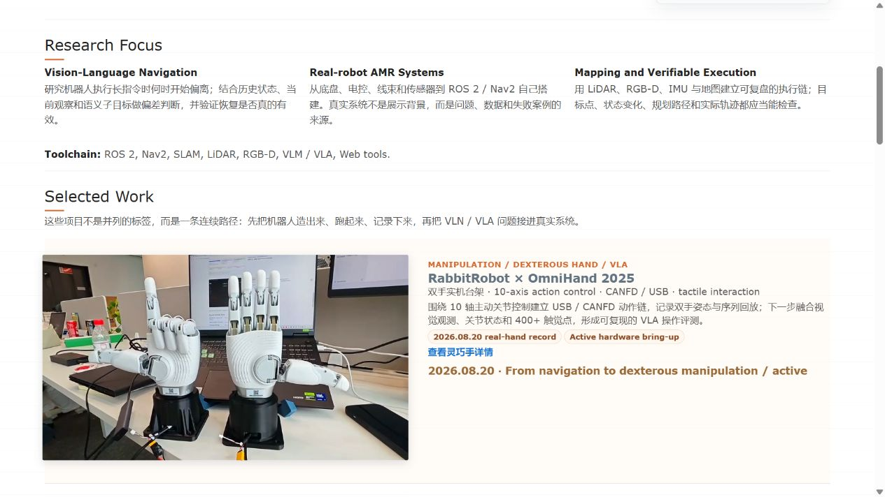

390×844 手机端项目动效：

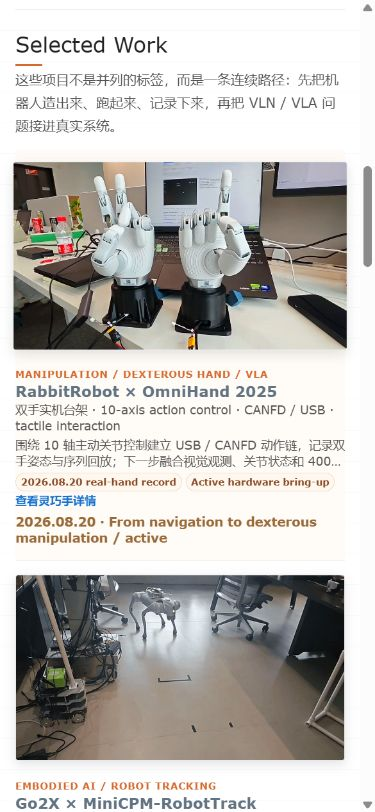

### 2026-08-20 - OmniHand 产品参数区说明精简

本次移除 OmniHand 详情页 `Product Facts` 标题下方的说明性句子，保留四行产品参数表和后续研究内容，让页面从标题直接进入可核对的结构、触觉、动作配置与通信事实。

| 内容 | 修改后状态 |
| --- | --- |
| 删除范围 | 仅删除 `以下硬件参数来自智元 OmniHand 灵动款 2025 产品使用说明书……` 这一段说明 |
| 保留内容 | `Product Facts` 标题、4 行参数表、控制链和操作研究线全部保留 |
| 页面验证 | 本地浏览器确认目标句不存在、表格仍有 4 行、横向溢出为 false、控制台 error/warning 为空 |

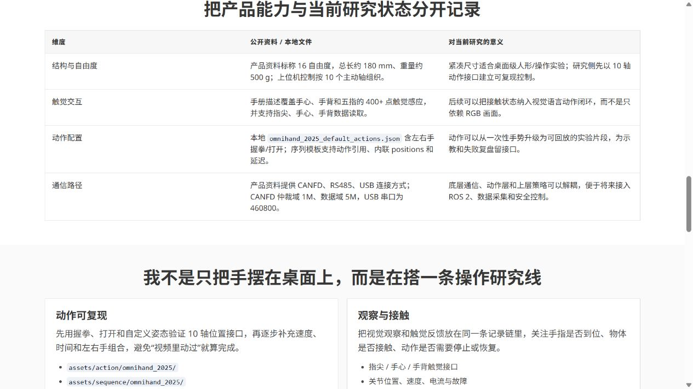

### 2026-08-20 - OmniHand 首页技术文案强化

本次将首页 OmniHand 卡片的过程描述改为更明确的系统技术叙述：从 10 轴主动关节控制、USB / CANFD 动作链，到姿态序列回放、视觉观测、关节状态和 400+ 触觉点，突出当前研究如何从硬件 bring-up 走向可复现的 VLA 操作评测；没有把尚未完成的闭环评测写成既成结果。

| 内容 | 修改后状态 |
| --- | --- |
| 首页项目说明 | `围绕 10 轴主动关节控制建立 USB / CANFD 动作链，记录双手姿态与序列回放；下一步融合视觉观测、关节状态和 400+ 触觉点，形成可复现的 VLA 操作评测。` |
| 响应式显示 | 桌面端显示两行技术说明；手机端仅对 OmniHand 恢复两行，其余项目仍保持紧凑卡片 |
| 验证结果 | 本地浏览器确认文案、项目顺序和 390px 布局，横向溢出为 false，控制台 error/warning 为空 |

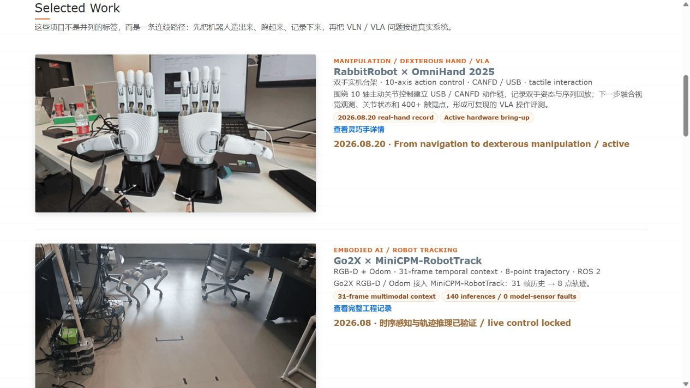

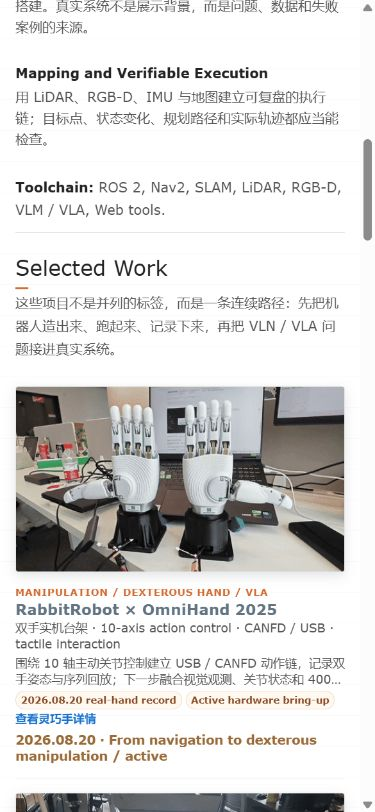

### 2026-08-20 - OmniHand 新视频 GIF 与详情页原视频播放

本次接入用户提供的 `飞书20260820-132116.mp4`：主页继续使用轻量 GIF 展示双手动作，OmniHand 详情页改为嵌入原始 MP4，加载后静音自动播放、循环播放并保留控件，兼顾首屏展示和完整动作查看。

| 内容 | 实际改动与证据 |
| --- | --- |
| 视频素材 | `RabbitRobot/videos/omnihand_2025_demo.mp4`，原始 `1280×720`、约 `13.63s`、H.264/AAC |
| 首页 GIF | `RabbitRobot/images/rabbitrobot/omnihand_2025_demo.gif`，由新视频生成 `480×270`、4 fps、约 `3.83 MB` 动态封面 |
| 详情页播放 | `<video autoplay muted loop playsinline controls preload="metadata">`，使用静态 poster，手机端保持 16:9 比例 |
| 真实验证 | 本地浏览器确认 `readyState=4`、`paused=false`、`muted=true`、`loop=true`；桌面/390px 手机端无横向溢出，控制台无 error/warning |

首页 GIF 效果：

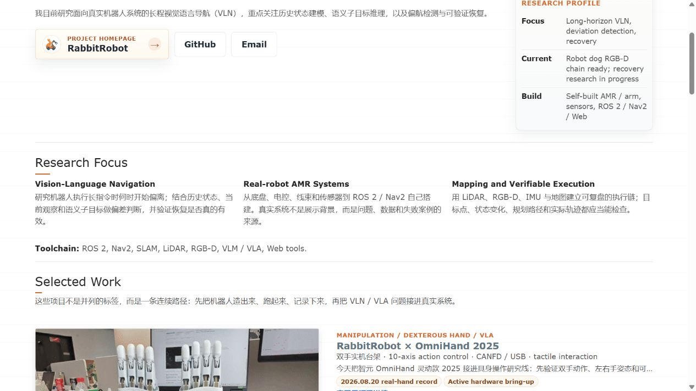

详情页原视频桌面端：

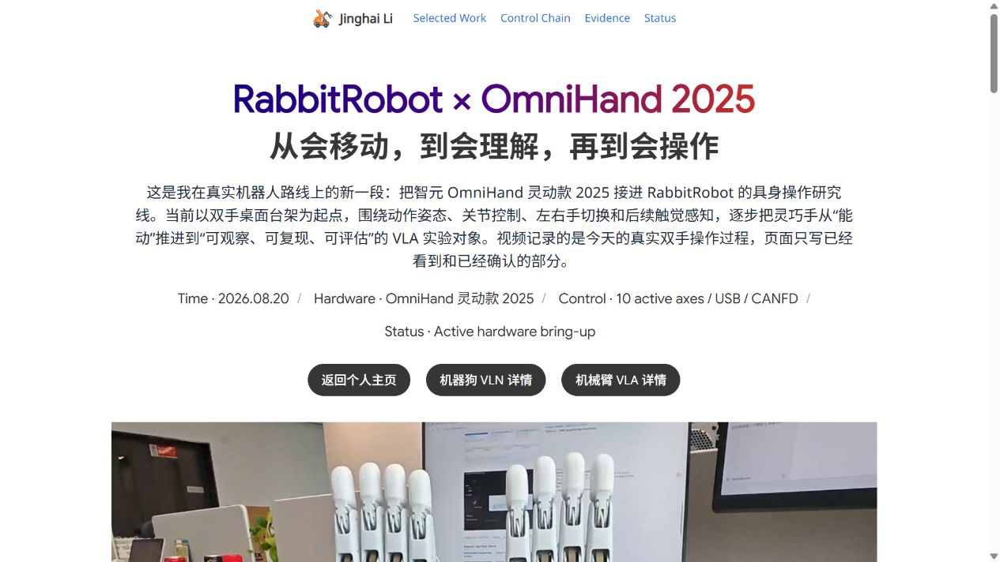

详情页原视频手机端：

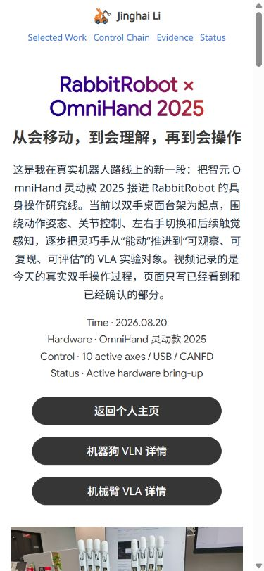

### 2026-08-20 - Selected Work 研究路线顺序调整

本次按研究叙事调整主页项目顺序：将当前正在推进的 `RabbitRobot × OmniHand 2025` 放到 `Go2X × MiniCPM-RobotTrack` 之前，让访问者先看到最新的灵巧操作方向，再回看机器狗的 VLN / 时序推理验证；其余项目内容、详情页和视觉系统保持不变。

| 内容 | 修改后状态 |
| --- | --- |
| 首屏项目顺序 | `OmniHand 2025` → `Go2X × MiniCPM-RobotTrack` → `RabbitRobot Platform` → `EDULITE A3` |
| 修改范围 | 仅调整 `index.html` 中两个 `Selected Work` 项目的 DOM 顺序 |
| 响应式验证 | 桌面端 1280px、手机端 390×844 均无横向溢出，前四项顺序通过 DOM 检查 |
| 控制台验证 | 浏览器 error / warning 均为空 |

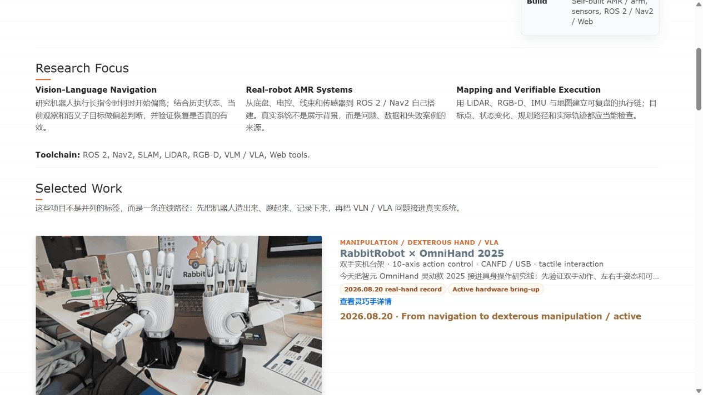

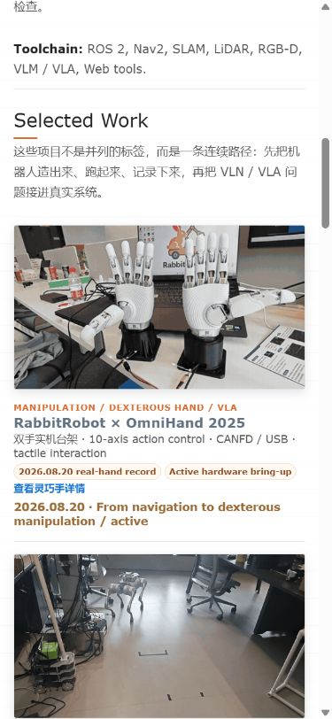

### 2026-08-20 - OmniHand 2025 双手灵巧操作研究线

本次在主页 `Selected Work` 中新增 `RabbitRobot × OmniHand 2025`，并新增对应详情页。页面使用 2026.08.20 真实双手操作视频生成封面 GIF，同时根据 OmniHand 灵动款 2025 产品手册和本地动作配置，区分产品能力、当前实机 bring-up 证据与尚未完成的 VLA 闭环，保持主页从 VLN / AMR 向具身操作延伸的路线。

```mermaid
flowchart LR
  A[双手 OmniHand 2025 实机视频] --> B[握拳 / 打开动作与 10 轴序列]
  B --> C[关节控制与动作回放]
  C --> D[触觉 + 视觉观察]
  D --> E[VLA 桌面操作评估]
```

| 内容 | 实际改动与证据 |
| --- | --- |
| 首页卡片 | `index.html` 将灵巧手项目置于机器狗之前，显示 2026.08.20、10 轴动作控制、CANFD / USB 与 Active 状态 |
| 详情页 | 新增 `RabbitRobot/projects/rabbitrobot-omnihand-2025.html`，包含产品事实、控制链、视觉证据、研究定位和诚实状态表 |
| 动态素材 | `RabbitRobot/images/rabbitrobot/omnihand_2025_demo.gif` 由用户提供的 13.63 秒、1280×720 新实拍视频压缩生成；原始视频保存在 `RabbitRobot/videos/omnihand_2025_demo.mp4`，静态封面为 `omnihand_2025_cover.jpg` |
| 技术事实 | 产品手册核对 16 自由度、约 180 mm、约 500 g、400+ 触觉点、CANFD / RS485 / USB；动作配置核对左右手握拳/打开和 10 轴序列模板 |
| 页面验证 | 本地浏览器实际打开主页与详情页；桌面端、390×844 手机端均无横向溢出；控制台 error/warning 均为空；本地图片/GIF/CSS 引用存在 |

主页 Selected Work 实际效果：

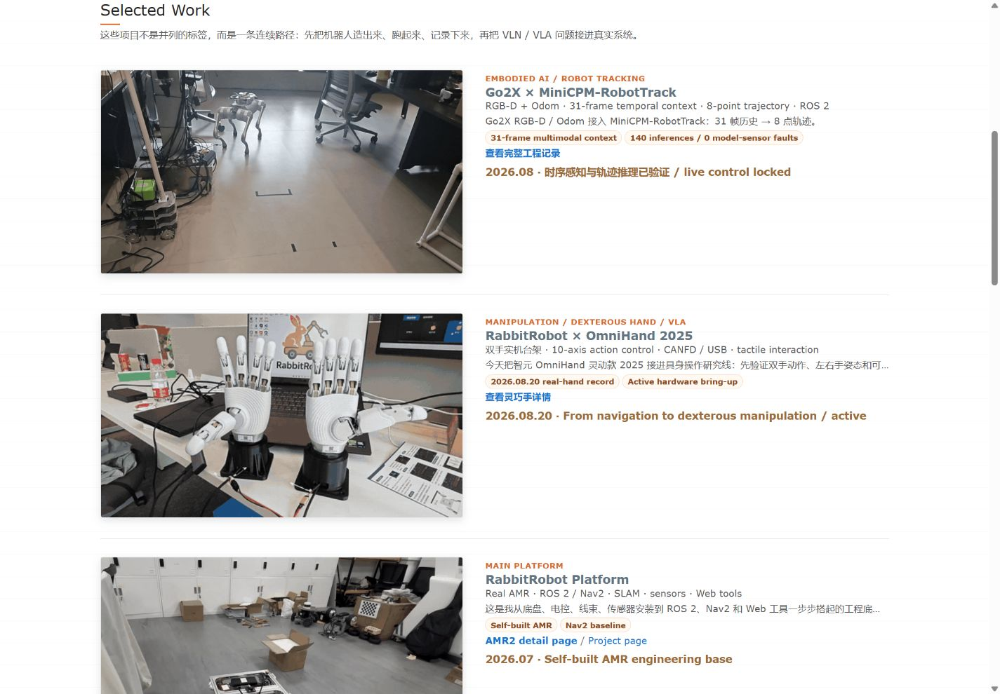

灵巧手详情页桌面端：

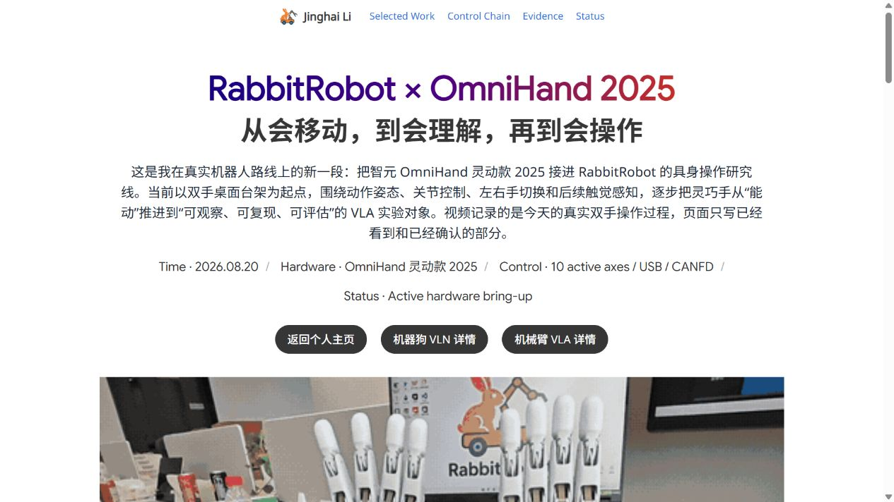

灵巧手详情页手机端：

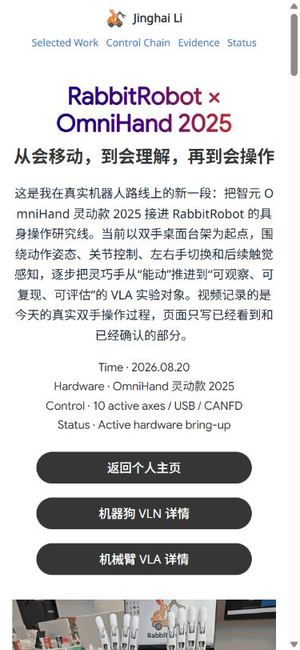

### 2026-08-17 - Go2X × MiniCPM-RobotTrack 项目强化

本次只修改主页 `Selected Work` 中的第一张机器狗卡片，以及对应的机器狗详情页。页面延续原有白底、蓝橙链接和渐变标题风格，将叙事中心从一般的 RGB-D 接入提升为 `Go2X × MiniCPM-RobotTrack`：突出时序多模态输入、机器人适配器、跨机服务化、8 点轨迹推理和安全控制边界；同时移除私有 Go2X 仓库的公开入口，其他项目卡片与详情页不变。

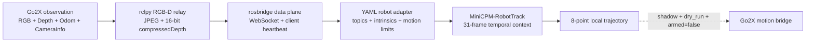
```mermaid
flowchart LR
  SENSOR["Go2X observation<br/>RGB + Depth + Odom + CameraInfo"] --> RELAY["rclpy RGB-D relay<br/>JPEG + 16-bit compressedDepth"]
  RELAY --> BRIDGE["rosbridge data plane<br/>WebSocket + client heartbeat"]
  BRIDGE --> ADAPTER["YAML robot adapter<br/>topics + intrinsics + motion limits"]
  ADAPTER --> MODEL["MiniCPM-RobotTrack<br/>31-frame temporal context"]
  MODEL --> TRAJ["8-point local trajectory"]
  TRAJ -. "shadow + dry_run + armed=false" .-> MOTION["Go2X motion bridge"]
```

| 内容 | 实际改动与证据 |
| --- | --- |
| 首页第一卡片 | 主标题改为 `Go2X × MiniCPM-RobotTrack`，直接展示 RGB-D + Odom、31 帧时序上下文、8 点轨迹和 140 次推理结果 |
| 模型技术栈 | 增加 MiniCPM-RobotTrack 核心架构：多模态输入、时序上下文、YAML 机器人适配器、轨迹接口与控制安全门 |
| 数据工程 | 写明 RGB 的 JPEG / INTER_AREA 路径，以及 16UC1 compressedDepth 的 PNG 解析、最近邻缩放和几何语义保持 |
| 跨机服务化 | 展示 rclpy relay、rosbridge WebSocket、客户端心跳、QoS depth=1、PID / 日志 / 进程组生命周期管理 |
| 真实结果 | RGB 9.67 Hz、深度 4.84 Hz、Odom 19.67 Hz；18 秒 140 次推理；8 点轨迹；0 模型错误、0 传感器故障 |
| 安全边界 | 明确 Official Shadow、dry-run、`armed=false`，没有把尚未完成的实机自主跟随或长程 VLN 恢复写成既成结果 |
| 公开边界 | 首页首卡与详情页不再链接私有 Go2X 仓库，只公开经过整理的工程说明、技术证据和项目状态 |
| 新增素材 | Gemini 335 RGB、对齐深度、MiniCPM 中继帧，以及桌面 / 手机端页面实测截图 |
| 关键文件 | `index.html`、`RabbitRobot/projects/rabbitrobot-robotdog-vln.html`、`RabbitRobot/images/rabbitrobot/go2x_*` |
| 页面验证 | 桌面端与 390×844 手机端均无横向溢出、坏图或浏览器警告；所有本地引用存在 |

首页第一张机器狗卡片：

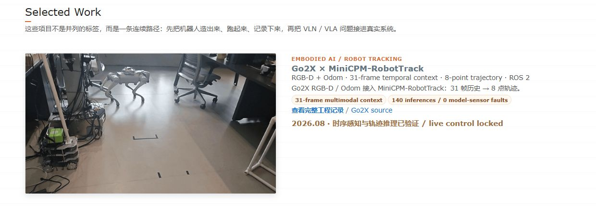

机器狗详情页桌面端与手机端：

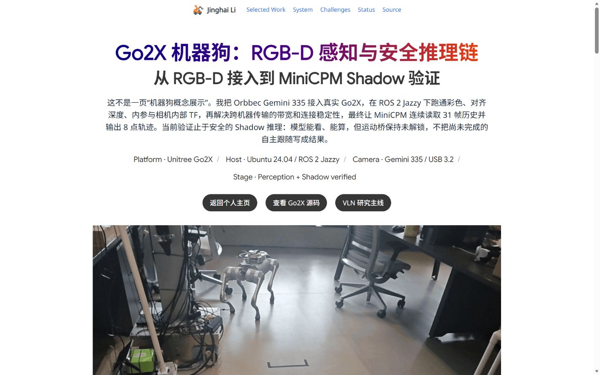

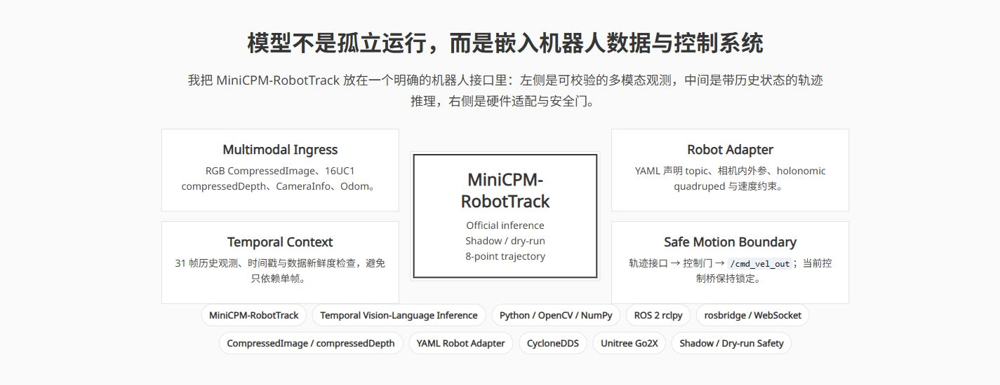

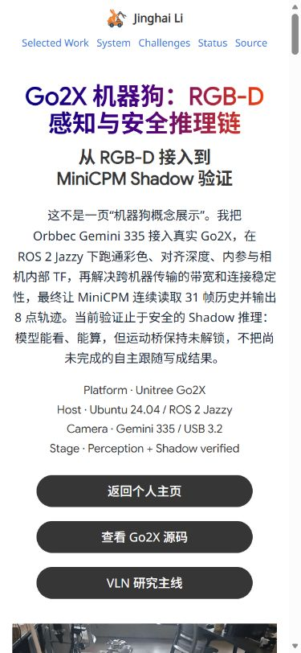

### 2026-08-17 - 主页内容重写

本次更新只调整主页文字，不改视觉风格、布局、配色、图片和入口结构。重点去掉模板化自述，改为从自建机器人出发，清楚说明长程 VLN 偏航检测、历史状态、语义子目标与可验证恢复这条研究线。

| 内容 | 说明 |
| --- | --- |
| 首页自述 | 写清从底盘、电控、传感器和 ROS 2 / Nav2 工程走向真实机器人 VLN 的个人路径 |
| 研究重点 | 首屏以一句简洁中文说明真实机器人长程 VLN 方向，突出历史状态建模、语义子目标推理、偏航检测与可验证恢复 |
| 项目顺序 | 保持机器狗、RabbitRobot AMR、EDULITE A3、2025 工程档案、AMR2 覆盖规划的原顺序 |
| 项目状态 | 区分已完成的 Gemini 335 RGB-D 链路、工程基线与仍在推进的恢复研究 |
| 关键文件 | `index.html` |
| 验证方式 | `git diff --check`、本地引用检查、桌面与 390×844 手机端浏览器测试 |
| 验证结果 | 19 个本地引用全部存在；两种视口均无横向溢出、坏图或浏览器警告 |

桌面端实际效果：

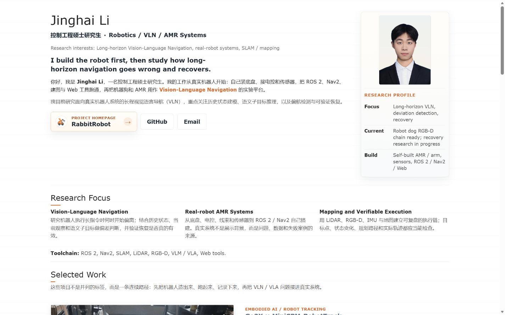

手机端实际效果：

