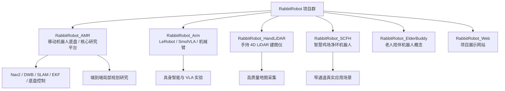

<div align="center">


# RabbitRobot

**面向端到端规划研究的 ROS2 机器人项目群**

[github.com/lijinghai/RabbitRobot](https://github.com/lijinghai/RabbitRobot)


</div>

---

## 项目定位

RabbitRobot 是一个以 **ROS2 移动机器人** 为核心、逐步扩展到 **手持建图、具身智能机械臂、场景化服务机器人与端到端规划研究** 的个人机器人项目群。

这个仓库不是单一 demo，而是一个长期积累的机器人研发工作区：里面包含真实硬件调试记录、ROS2 代码、SLAM / Nav2 / 感知实验、SolidWorks 结构设计、Obsidian 技术笔记、产品场景调研和展示网站。

当前最重要的研究主线是：

> **在真实移动机器人平台上，研究窄通道、低附着、复杂场景下的端到端局部规划与传统 Nav2 规划方法的对比。**

具体落点包括：

- 用 AMR 小车采集真实 `scan / odom / cmd_vel / goal` 数据；
- 以 Nav2、DWB、Pure Pursuit、MPC 等传统方法作为专家或 baseline；
- 训练端到端局部 planner，从 LiDAR / costmap / goal 直接输出 `cmd_vel` 或未来轨迹；
- 在鸡场窄通道、室内走廊等真实场景中做闭环验证。

---

## 项目全景



---

## 目录结构

```text
RabbitRobot/
├── RabbitRobot_AMR/          # 移动机器人底盘，项目核心
├── RabbitRobot_Arm/          # 具身智能机械臂，LeRobot / SmolVLA 实验
├── RabbitRobot_HandLiDAR/    # 手持雷达建图仪，LiDAR + 视觉融合建图
├── RabbitRobot_SCFH/         # 智慧鸡场净环机器人，窄通道应用场景
├── RabbitRobot_ElderBuddy/   # 老人陪伴机器人概念设计与调研
├── RabbitRobot_Web/          # 项目宣传网站
├── README.assets/            # README 图片资源
├── 素材/                     # 外部资料与素材，默认不纳入核心维护
├── README.md                 # 项目主页
├── 修改建议.md               # 当前 AMR 控制链路和导航问题分析
├── RabbitRobot.xmind         # 项目脑图
└── RabbitRobot_架构图.excalidraw
```

---

## 核心项目：RabbitRobot_AMR

[RabbitRobot_AMR/](RabbitRobot_AMR/) 是整个仓库的主线项目，目标是构建一个可以持续迭代的 ROS2 自主移动机器人平台。

### 迭代版本

| 版本 | 时间 | 定位 | 主要内容 |
|---|---:|---|---|
| V1.0 | 2025.06 - 2025.09 | 四驱原型车 | 树莓派 5、思岚 A1、宇树 L1、DABAI DCW2、Cartographer、Nav2、视觉感知 |
| V2.0 | 2025.10 | 四驱升级车 | Jetson Orin Nano Super、C50C、MID360、VLP-16、FAST-LIO2、Point-LIO2、Autoware |
| V3.0 | 2026.03 | 平衡车方向 | Hoverboard FOC、STM32、ST-Link、IMU 接入 |
| V4.0 | 2026.03+ | 全向轮方向 | SolidWorks 建模与全向移动底盘探索 |

### 已覆盖能力

- ROS2 Humble / Jazzy 工程实践；
- 2D LiDAR 与 4D LiDAR 建图；
- Cartographer、FAST-LIO2、Point-LIO2、RTAB-Map；
- Nav2 自主导航、DWB 局部规划、costmap 配置；
- 编码器里程计、IMU、EKF 融合；
- STM32 / 串口 / 轮毂电机底盘控制；
- YOLOv5、OpenCV、KCF 等视觉感知实验；
- UWB、语音控制、自动回充等功能探索；
- SolidWorks 机械结构设计与 Git LFS 管理。

### 当前重点问题

AMR 当前最值得聚焦的问题是 **窄通道内稳定直线行驶与局部规划振荡**。

已有分析见：[修改建议.md](修改建议.md)

当前实际控制链路大致为：

```text
Nav2 / DWB
  -> /cmd_vel
  -> ljh_robot_node
  -> 串口
  -> STM32
  -> 轮毂电机
  -> odom + imu/data_raw
  -> EKF
  -> FAST-LIO / ICP 定位
```

短期应优先处理：

- 实测并校准轮距、轮径、里程计比例系数；
- 修正 URDF、TF、footprint 与真实车体尺寸；
- 排查 IMU yaw 在金属环境中的漂移；
- 关闭非全向底盘中的横向速度自由度；
- 建立 `scan + goal + odom + cmd_vel` 数据采集流程，为端到端局部规划做数据闭环。

---

## 端到端规划研究路线

本仓库后续的研究方向建议围绕 AMR 展开：

### 1. Baseline：传统规划稳定化

先把传统系统作为可靠对照组：

- Nav2 + DWB；
- Pure Pursuit；
- Stanley；
- MPC；
- 简化 2D 栅格 / 走廊环境仿真。

目标不是替代传统方法，而是明确传统方法在窄通道、低附着、传感器噪声下的失败边界。

### 2. 数据闭环

建议优先记录以下 ROS2 topic：

```text
/scan
/odom
/tf
/cmd_vel
/goal_pose
/local_costmap/costmap
```

第一阶段模型可以很简单：

```text
输入: 2D LiDAR scan + 相对目标点 + 当前速度
输出: cmd_vel.linear.x + cmd_vel.angular.z
```

### 3. 模仿学习

以 Nav2、遥控、人类示范或 MPC 作为专家：

- Behavior Cloning；
- DAgger；
- offline imitation learning；
- trajectory prediction；
- closed-loop evaluation。

### 4. 真实场景验证

重点指标：

- 成功率；
- 碰撞率；
- 横向偏差；
- 轨迹平滑度；
- 恢复能力；
- 对地面打滑、传感器噪声、窄通道宽度变化的鲁棒性。

---

## RabbitRobot_HandLiDAR

[RabbitRobot_HandLiDAR/](RabbitRobot_HandLiDAR/) 是手持雷达建图仪项目，用来解决移动底盘建图质量受车体运动、地面打滑和传感器安装限制影响的问题。

主要内容：

- 宇树 L1 4D LiDAR；
- Intel RealSense D435；
- Jetson Orin Nano Super；
- MPU6050 IMU；
- FAST-LIO2；
- RTAB-Map；
- SolidWorks 结构设计；
- 从组装到建图的完整文档。

核心文档在：[RabbitRobot_HandLiDAR/文档/](RabbitRobot_HandLiDAR/文档/)

这个子项目对 AMR 的价值是：先用手持设备采集更稳定、更高质量的地图，再给移动机器人导航和端到端规划实验使用。

---

## RabbitRobot_Arm

[RabbitRobot_Arm/](RabbitRobot_Arm/) 是具身智能机械臂方向的探索，主要围绕 HuggingFace LeRobot、SmolVLA 和 ACT 展开。

主要内容：

- RoArm-M2-S；
- SO100 / SO101 机械臂方向；
- LeRobot 数据采集与训练；
- SmolVLA 视觉-语言-动作模型；
- ACT 行为克隆算法；
- Orbbec Gemini2 深度相机；
- Foxglove、MoveIt2、ROS2 Jazzy；
- `ljhLerobot-mcp` MCP 实验项目。

当前这个方向更适合作为具身智能能力储备，和 AMR 主线的关系是：未来可扩展到移动操作机器人，例如“移动底盘 + 机械臂 + 端到端任务规划”。

---

## RabbitRobot_SCFH

[RabbitRobot_SCFH/](RabbitRobot_SCFH/) 是智慧鸡场净环机器人项目，SCFH 表示 Single-Corridor Farming House。

这是 AMR 最有价值的真实落地场景之一：

- 环境狭长；
- 通道宽度有限；
- 地面可能有水、饲料、粪污导致低附着；
- 金属结构可能干扰 IMU / 磁力计；
- Nav2 DWB 容易出现振荡和蛇形运动；
- 场景边界清晰，适合做端到端局部规划研究。

项目资料包括：

- 需求分析；
- 竞品资料：PUDU MT1、新松星卫来；
- 项目计划书；
- 采购表与物资表。

核心文档：[RabbitRobot_SCFH/开发手册/0.需求分析.md](RabbitRobot_SCFH/开发手册/0.需求分析.md)

---

## RabbitRobot_ElderBuddy

[RabbitRobot_ElderBuddy/](RabbitRobot_ElderBuddy/) 是老人陪伴机器人概念设计项目，面向独居老人陪伴、视频通话、物品运送、跌倒检测、吃药提醒等需求。

这个方向目前更偏产品调研与概念设计，后续如果继续推进，建议复用 AMR 底盘能力，把重点放在：

- 低成本移动底盘；
- 室内导航与避障；
- 人机交互；
- 语音和视频能力；
- 主动服务行为设计。

---

## RabbitRobot_Web

[RabbitRobot_Web/](RabbitRobot_Web/) 是项目展示网站，当前主要使用原生 HTML、CSS、JavaScript 编写。

主要内容：

- 项目介绍；
- 实物图片；
- 技术文档入口；
- B 站、CSDN、小红书、微信公众号等展示入口。

网站源码：[RabbitRobot_Web/宣传web/](RabbitRobot_Web/宣传web/)

---

## 技术栈

| 方向 | 技术 |
|---|---|
| 操作系统 | Ubuntu 22.04 / Ubuntu 24.04 |
| 机器人框架 | ROS2 Humble / ROS2 Jazzy |
| 主控平台 | 树莓派 5、Jetson Orin Nano Super、RDKS100 |
| 底盘控制 | STM32、C50C、FOC、串口通信、轮毂电机 |
| SLAM | Cartographer、FAST-LIO2、Point-LIO2、RTAB-Map |
| 导航规划 | Nav2、DWB、Pure Pursuit、Autoware.universe |
| 传感器 | 思岚 A1、宇树 L1、MID360、VLP-16、D435、DABAI DCW2、Gemini2、MPU6050 |
| 感知与 AI | YOLOv5、OpenCV、KCF、LeRobot、SmolVLA、ACT |
| 工程工具 | colcon、CMake、Docker、Foxglove、MoveIt2、Git LFS、Obsidian |
| 结构设计 | SolidWorks `.sldprt` / `.sldasm` |

---

## 文档索引

### AMR 开发手册

- [V1.0 造车小手册](<RabbitRobot_AMR/AMR_V1.0(2025.6--2025.9四驱1.0)/造车小手册/0.RabbitRobot.md>)
- [V2.0 开发手册](<RabbitRobot_AMR/AMR_V2.0(2025.10四驱2.0)/!RabbitRobot_Car(V2.0)开发手册/0.RabbitRobot_AMR2.0.md>)
- [V3.0 平衡车接入 ROS2](<RabbitRobot_AMR/AMR_V3.0(2026.3.13平衡车)/!RabbitRobot_Car(V3.0)开发手册/11.平衡车接入ROS2.md>)
- [导航问题分析与修改建议](修改建议.md)

### 手持建图仪

- [基于多传感器感知融合 SLAM 手持雷达建图仪](RabbitRobot_HandLiDAR/文档/1.基于多传感器感知融合SLAM手持雷达建图仪.md)
- [设备配置与组装](RabbitRobot_HandLiDAR/文档/2.设备配置与组装.md)
- [Intel RealSense D435 SDK 搭建](RabbitRobot_HandLiDAR/文档/3.Intel RealSense D435 SDK搭建.md)
- [Jetson 上 MPU6050 接入 ROS2](RabbitRobot_HandLiDAR/文档/4.Jetson上MPU6050接入ROS2.md)
- [RTAB-Map 融合 LiDAR 与双目相机的建图导航](RabbitRobot_HandLiDAR/文档/5.RTAB-Map 融合 LiDAR 与双目相机的建图导航.md)

### 机械臂

- [RabbitRobot_Arm 手记](RabbitRobot_Arm/手记/10.RabbitRobot_Arm.md)
- [LeRobot 本地代码](RabbitRobot_Arm/code/ljh_lerobot/)
- [ljhLerobot-mcp](RabbitRobot_Arm/code/ljhLerobot-mcp/)

### 场景与产品

- [SCFH 需求分析](RabbitRobot_SCFH/开发手册/0.需求分析.md)
- [ElderBuddy README](RabbitRobot_ElderBuddy/README.md)
- [宣传网站源码](RabbitRobot_Web/宣传web/)

---

## 仓库使用说明

这个仓库同时承担三种角色：

1. **工程代码仓库**：保存 ROS2、Python、前端和实验代码；
2. **Obsidian 知识库**：根目录包含 `.obsidian`，可以直接用 Obsidian 打开整个项目；
3. **项目资产库**：保存图片、PDF、SolidWorks 模型、调研文档和展示材料。

建议打开方式：

```text
Obsidian Vault: G:\System\Desktop\RabbitRobot
```

建议后续逐步清理：

- 将第三方 SDK 和个人实验代码分区管理；
- 将 `.idea`、`.venv`、`.cache`、`outputs` 等环境文件从版本库移除；
- 为 AMR 主线补充统一的构建、启动和数据采集说明；
- 建立端到端规划实验目录，例如 `experiments/e2e_planning/`。

---

## 当前优先级

短期最值得做的事情：

1. **把 AMR V2 / SCFH 作为主研究平台收敛**；
2. **修正 URDF、TF、里程计、EKF 和 DWB 参数**；
3. **建立 rosbag 数据采集规范**；
4. **训练第一个 `(scan, goal) -> cmd_vel` 行为克隆模型**；
5. **用 Nav2 / DWB 作为 baseline 做闭环对比**。

中长期目标：

- 完成窄通道端到端局部规划系统；
- 在真实 AMR 上完成闭环验证；
- 形成可复现实验、论文、开源教程和项目展示闭环。

---

## 项目关键词

`ROS2` · `AMR` · `Nav2` · `SLAM` · `FAST-LIO2` · `Point-LIO2` · `RTAB-Map` · `LiDAR` · `End-to-End Planning` · `Imitation Learning` · `LeRobot` · `SmolVLA` · `SolidWorks` · `Obsidian`

---

## 备注

RabbitRobot 是一个持续演进中的研究型工程仓库。它的重点不是一次性完成一个封闭产品，而是通过真实硬件、真实场景和真实问题，逐步建立端到端规划研究所需要的数据、平台、baseline 和实验闭环。
