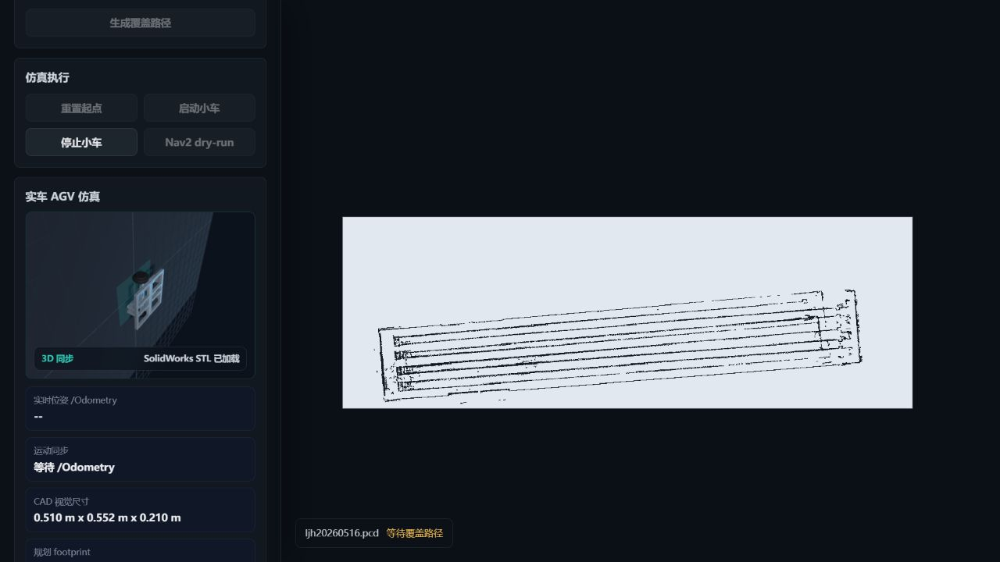
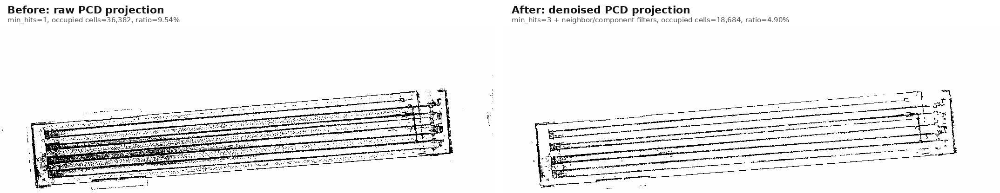
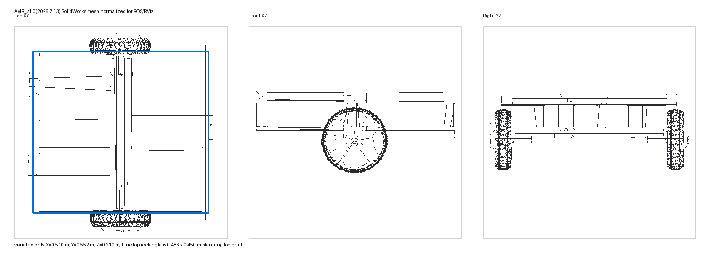

# RabbitRobot_AMR2 Engineering Brief

RabbitRobot_AMR2 是我的 ROS 2 真车 AMR 工程平台。它不是单独的仿真 demo，而是把真实 PCD 地图、真实 SolidWorks 底盘、覆盖路径规划、Web 3D 控制台、Nav2 和 DS20270C 轮毂底盘安全链放在一起验证。

## 项目速读

- **项目定位：** 真实 AMR / AGV 平台，用于导航、覆盖作业、VLN/VLR 和机器人系统工程验证。
- **核心链路：** `PCD map -> Coverage planner -> RViz/Web visualization -> Nav2 bridge -> velocity_smoother -> collision_monitor -> DS20270C`。
- **工程能力：** ROS 2 消息/服务、RViz 插件、Web 控制台、Three.js STL 展示、PCD 地图处理、底盘 CAN 驱动和测试闭环。
- **安全边界：** 覆盖算法只生成路径，不直接控制底盘。真实运动必须经过 Nav2、速度平滑、碰撞监控和现场安全门。

## 关键画面

| Web 3D 覆盖控制台 | RViz 多边形覆盖路径 |
| --- | --- |
|  |  |

| PCD 地图降噪 | SolidWorks 底盘 mesh |
| --- | --- |
|  |  |

## 已实现模块

| 模块 | 能力 |
| --- | --- |
| `ljh_robot_coverage` | 根据 polygon、holes、`/map` 和车体 footprint 生成覆盖路径，输出 `/coverage_path` 和带 yaw 的 coverage waypoint。 |
| `ljh_rviz2` | 提供 `Coverage Rect` 和 `Coverage Poly` 交互工具，支持在 RViz 中画区域并触发路径生成。 |
| `ljh_robot_sim` | 离车仿真，发布 fake `/scan`、`/Odometry`、footprint 和地图边界，加载真实 AMR 底盘 mesh。 |
| `ljh_robot_web` | Web 控制台、覆盖地图、3D AGV 同步、地图导入/编辑和 rosbridge 自动启动。 |
| `coverage_nav2_client` | 把覆盖路径转换为 Nav2 `FollowWaypoints` 或 `NavigateToPose`，默认 dry-run。 |
| `ljh_robot_ds20270c_can_driver` | DS20270C CAN 差速驱动，订阅 `/cmd_vel_smooth`，发送 `0x602` 控制帧，提供参数审查和运行诊断。 |

## 验证记录

```text
npm run build                                      PASS
Web 3D WebGL / mobile 390px check                 PASS
rosbridge autostart and ws://127.0.0.1:9090        PASS
6-package colcon build                             PASS
check_ljh_sim_coverage_services.sh                 PASS
check_ds20270c_agv_driver.sh dry-run               PASS
```

真实底盘运动需要现场架空轮子、急停可用、人在旁边，并显式运行受保护 bench test。公开展示页只放可公开截图和工程摘要，不包含原始 PCD、内部日志或现场私有配置。
