# ljh_amr2_hubwheel_drive

扫地机路径覆盖版本的 ROS2 Humble 工作空间。

当前分支 `feature/coverage-path` 面向 `ljh_amr2` 轮毂伺服 AMR 的清扫/覆盖场景：先在 WSL Ubuntu 22.04 里基于真实 `ljh20260516.pcd` 点云转出的 2D 地图跑通 RViz-only 覆盖仿真，再把覆盖路径结果接入真实 Nav2 执行链路。

## 当前功能

- `ljh_robot_coverage`：根据外轮廓 polygon、可选障碍孔洞 holes、实时 `/map` 占据栅格和 `ljh_amr2` 车体尺寸生成覆盖路径。
- `ljh_robot_msg`：新增覆盖路径消息和 `ComputeCoveragePath` 服务。
- `ljh_robot_sim`：新增离车 RViz 仿真包，默认加载 `ljh20260516.pcd` 转出的 2D occupancy map，并发布 fake `/scan`、`/Odometry`、footprint 和地图边界 marker。
- RViz 支持用 `Coverage Rect` 鼠标拖拽矩形区域，也支持用 `Coverage Poly` 鼠标点多边形区域，完成后直接生成覆盖路径；`Publish Point` 作为传统点选备用流程保留。
- 覆盖规划默认先把你画的区域裁剪到 `/map` 已知 free cells，再按 `0.486 m x 0.450 m` 车体 footprint 加安全边距处理；unknown/off-map 区域不会参与规划，路径发布前会校验每个 waypoint 和连接段都在可通行区域内。
- 保持真车安全链路，不让覆盖节点直接控制底盘速度。
- 顶层新增 `AGENTS.md`、`.clang-format`、`.clang-tidy`、`colcon.meta`、`run/`，后续代码规范参考 `teluo_ws`。

路径覆盖算法现在包含这些功能：

| 功能 | 当前状态 | 怎么用 |
| --- | --- | --- |
| 鼠标拖矩形自动覆盖 | 已支持 | RViz 选择 `Coverage Rect`，按住左键拖矩形，松开后自动调用 `/coverage/compute_path` |
| 鼠标画多边形自动覆盖 | 已支持 | RViz 选择 `Coverage Poly`，左键点顶点，右键或回车完成一圈并自动调用 `/coverage/compute_path` |
| 直接传区域自动覆盖 | 已支持 | 调 `/coverage/compute_path`，把 `polygon` 点列表传进去 |
| 地图已知 free-space 裁剪 | 已支持 | 默认订阅 `/map`，只在已知 free cells 内规划；unknown、灰色未知区、地图外区域会被裁掉 |
| 地图占据栅格避障 | 已支持 | 把黑色占据格按车体尺寸膨胀后从覆盖区域里扣除 |
| 小车尺寸安全膨胀 | 已支持 | 默认 `0.486 m x 0.450 m`，自动计算约 `0.38 m` 的中心点 clearance |
| 障碍物/孔洞避让 | 已支持 | 外轮廓保存后继续点孔洞，或在服务请求里传 `holes` |
| 小孔洞跨越/绕行合并 | 已支持 | 算法自动判断，小孔不会强制分块 |
| 大孔洞分块覆盖 | 已支持 | 超过 `big_hole_threshold` 的孔洞会触发分块和块间连接 |
| 凹多边形区域覆盖 | 已支持 | 算法会尝试把凹区域拆成子块再覆盖 |
| 自动扫描方向 | 已支持 | `sweep_angle: -1.0` 时自动选择覆盖行数较少的方向 |
| 手动指定扫描方向 | 已支持 | 修改 `coverage_params.yaml` 里的 `sweep_angle` |
| 边界安全内收 | 已支持 | `wall_margin` 控制靠墙/靠笼边/靠障碍物的安全距离 |
| 往返覆盖线连接 | 已支持 | 相邻覆盖线先尝试安全圆弧，越界时改用区域内直连/A*，失败则不发布假路径 |
| 多块安全处理 | 已支持 | 地图或孔洞切成多个互不连通块时，先发布最大连续可行驶块，避免画穿障碍的假连接 |
| RViz 可视化调试 | 已支持 | 看 `/coverage_path`、`/coverage/polygon_marker`、`/coverage/block_marker` |
| 输出带 yaw 路径 | 已支持 | `/coverage/coverage_path` 输出每个 waypoint 的 `x/y/yaw` |
| RViz 仿真自动走覆盖路径 | 已支持 | 生成 `/coverage_path` 后调用 `/coverage_sim/start_path_following`，只驱动 RViz 假车 |
| 自动下发底盘执行 | 未接入 | 后续要通过 Nav2/执行器接入，不能直接绕过安全链路 |

## 整体架构

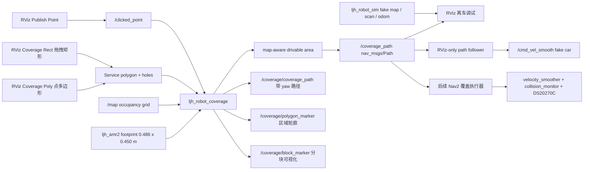

真车速度链路必须继续保持：

```text
Nav2 / 后续覆盖路径执行器
  -> /cmd_vel_nav
  -> velocity_smoother
  -> /cmd_vel_raw
  -> collision_monitor
  -> /cmd_vel_smooth
  -> DS20270C CAN chassis
```

不要让 `ljh_robot_coverage` 直接发布到底盘驱动节点，也不要绕过 `velocity_smoother` 和 `collision_monitor`。

## 最新 PCD 地图覆盖操作图文

下面这套流程已经替换掉旧仿真截图，全部基于当前默认地图：

```text
地图文件: src/ljh_robot_sim/maps/ljh20260516_pcd_2d/map.yaml
点云来源: C:\Users\ljhco\Desktop\ljh\code\路径覆盖\ljh20260516.pcd
地图尺寸: 1065 x 358
地图分辨率: 0.10 m/cell
PCD 转图参数: z_filter=1.50~3.00 m, inflate_radius=0.08 m
本次示例清扫区域: (0.0,18.0) -> (12.0,18.0) -> (12.0,22.0) -> (0.0,22.0)
本次覆盖结果: Coverage path generated: 12 waypoints; map-aware clearance=0.38m, known_free_cells=4961/5456, occupied_cells=0/6864, free_components=1, selected_area=36.38m2
大框裁剪验证: (-4.0,-5.0) -> (24.0,-5.0) -> (24.0,26.0) -> (-4.0,26.0) 生成 128 waypoints，所有采样点通过 known-free clearance 校验
```

当前 `ljh20260516.pcd` 转出来的完整 2D 地图如下，后面的区域和路径截图都叠加在这张地图上：

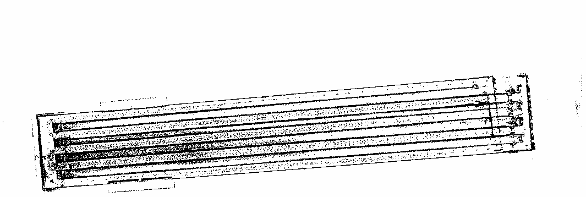

### 1. 编译覆盖仿真包

先编译消息、覆盖算法和 RViz-only 仿真包：

```bash
cd ~/win-22.04/ljh_amr2_hubwheel_drive
source /opt/ros/humble/setup.bash
colcon build --symlink-install --packages-select ljh_robot_msg ljh_robot_coverage ljh_rviz2 ljh_robot_sim
source install/setup.bash
```

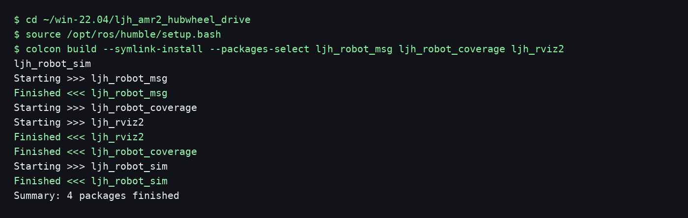

### 2. 启动最新 PCD 地图仿真

启动后 RViz 会加载 `ljh20260516_pcd_2d` 地图，同时启动 `/coverage/*` 服务和 RViz-only 路径跟随器。默认还会把蓝色示例区域自动送入 `/coverage/compute_path`，并在扣掉地图占据格和车体安全膨胀后生成一条真实 `/coverage_path`，所以不用先手动画区域也能直接测试路径跟随：

```bash
ros2 launch ljh_robot_sim ljh_amr2_rviz_sim.launch.py
```

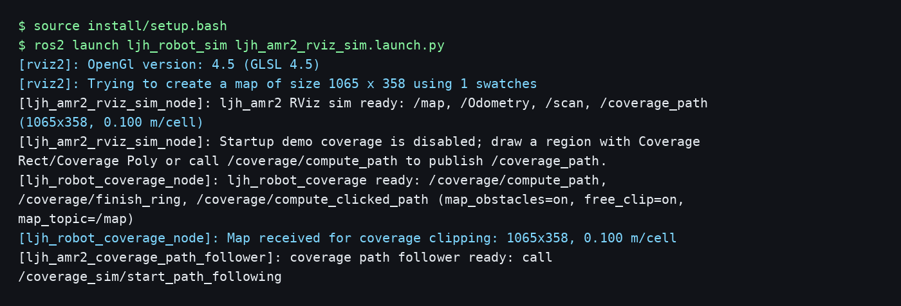

RViz 里看到的地图应该是这张 PCD 投影地图，红色点是屏幕里的 fake car：

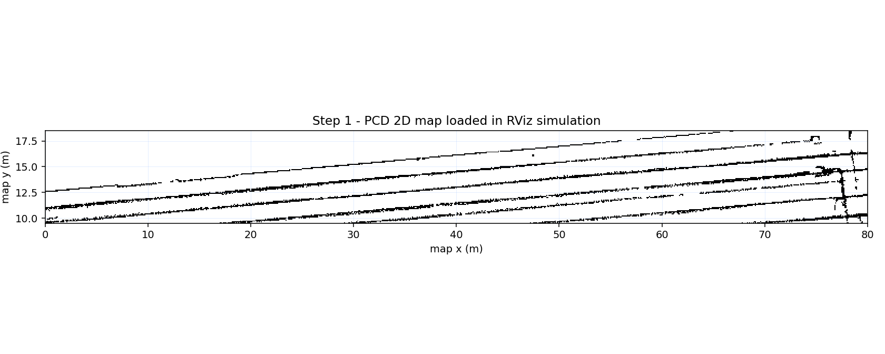

### 3. 在地图上画要覆盖的区域

在 RViz 顶部工具栏选择 `Coverage Rect`，按住鼠标左键在地图上拖出一个矩形区域，松开鼠标后会自动调用 `/coverage/compute_path` 并生成 `/coverage_path`。按住 `Shift` 再松开鼠标，可以强制画正方形。

注意：如果只看到蓝色框但 `/coverage_path` 没输出，通常表示那只是默认示例区域或地图边界 marker，还没有真正触发 `Coverage Rect` 的鼠标松开事件。正常触发后，启动终端会打印 `Coverage rectangle request...`，随后出现 `Coverage path generated: ... waypoints`。

非矩形区域选 `Coverage Poly`：左键依次点外轮廓顶点，右键或回车完成这一圈后会自动调用 `/coverage/compute_path` 并生成 `/coverage_path`。第一圈是外轮廓，后续继续画的圈会作为障碍孔洞。`Ctrl+Z` 撤销当前圈最后一个点，`Esc` 清空。

`Publish Point` 仍然作为传统点选流程保留。示例矩形点位是 `(0.0,18.0)`、`(12.0,18.0)`、`(12.0,22.0)`、`(0.0,22.0)`。

如果你现在不想手点，也可以用命令模拟 RViz 点选：

```bash
ros2 service call /coverage/clear_polygon std_srvs/srv/Trigger

ros2 topic pub --once /clicked_point geometry_msgs/msg/PointStamped \
"{header: {frame_id: map}, point: {x: 0.0, y: 18.0, z: 0.0}}"
ros2 topic pub --once /clicked_point geometry_msgs/msg/PointStamped \
"{header: {frame_id: map}, point: {x: 12.0, y: 18.0, z: 0.0}}"
ros2 topic pub --once /clicked_point geometry_msgs/msg/PointStamped \
"{header: {frame_id: map}, point: {x: 12.0, y: 22.0, z: 0.0}}"
ros2 topic pub --once /clicked_point geometry_msgs/msg/PointStamped \
"{header: {frame_id: map}, point: {x: 0.0, y: 22.0, z: 0.0}}"
```

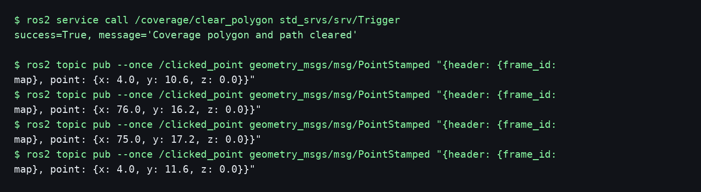

蓝色框就是这次在 PCD 地图上圈出来的覆盖区域：

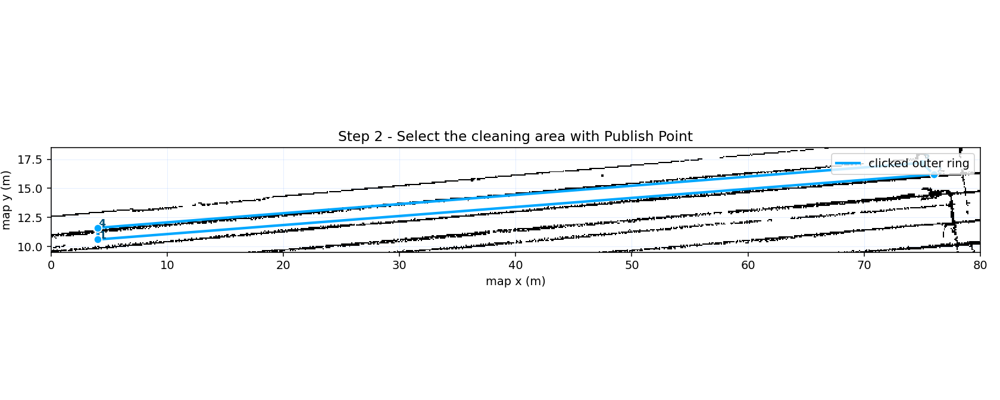

这张图是本次绘制区域的截图：蓝色外框是要覆盖的区域，4 个蓝色点是区域顶点。

### 4. 生成覆盖路径

外轮廓点完后，先保存当前环，再根据点选区域计算覆盖路径：

```bash
ros2 service call /coverage/finish_ring std_srvs/srv/Trigger
ros2 service call /coverage/compute_clicked_path std_srvs/srv/Trigger
```

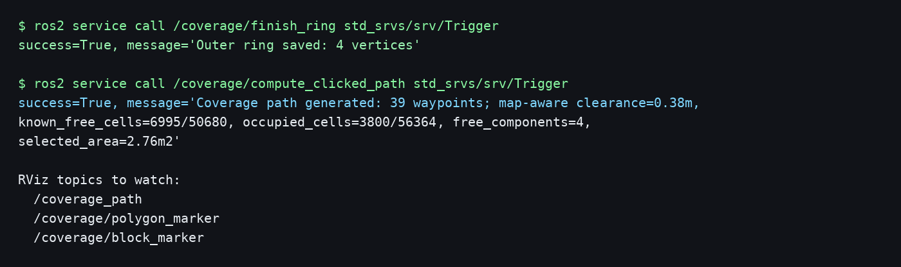

生成成功后，RViz 订阅 `/coverage_path` 就能看到绿色往返覆盖路径；`/coverage/polygon_marker` 显示实际参与规划的地图裁剪后区域，`/coverage/block_marker` 显示算法分块调试信息。浅绿色区域是从你画的蓝色区域里扣掉地图障碍、再按小车 footprint 膨胀后剩下的可通行覆盖区域：

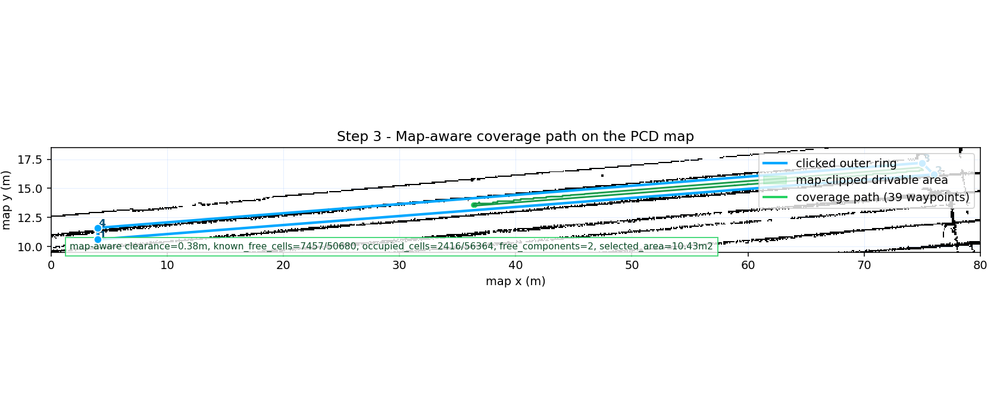

这张图是本次生成路径的截图：蓝色外框是刚才绘制的区域，浅绿色面是 map-aware 可通行区域，绿色线是算法生成的 `/coverage_path`，一共 12 个 waypoint。服务返回里会带 `map-aware clearance=0.38m`、`known_free_cells=...`、占据格数量和有效区域面积，说明路径不是按蓝框等比例随意画线，而是先结合地图和小车尺寸裁剪过。

如果你画的区域很大，甚至包含地图外、未知区或多个被障碍切断的块，`ljh_robot_coverage` 会先裁剪到已知 free-space，并只发布最大连续可行驶块，避免生成穿障碍的假连接。下面这张图展示了大蓝框请求和实际裁剪后的覆盖路径关系：

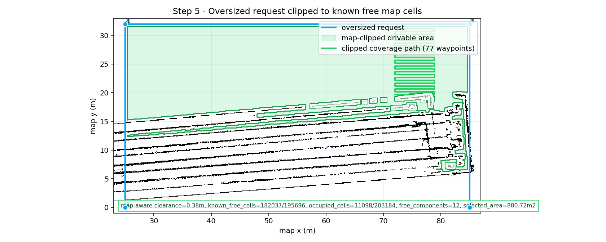

### 5. 让屏幕里的车沿路径走

启动后默认已经有一条示例 `/coverage_path`；如果你重新画了区域，就会刷新成新区域的路径。然后启动 RViz-only 路径跟随。这个跟随器只驱动仿真 fake car，不会控制真实 CAN 底盘：

```bash
ros2 topic echo /coverage_path --once
ros2 service call /coverage_sim/start_path_following std_srvs/srv/Trigger
ros2 topic echo /cmd_vel_smooth --once
ros2 service call /coverage_sim/stop_path_following std_srvs/srv/Trigger
```

`/coverage_path` 会保留并周期重发最后一次规划结果，所以 `ros2 topic echo /coverage_path --once` 不应该再一直卡住。

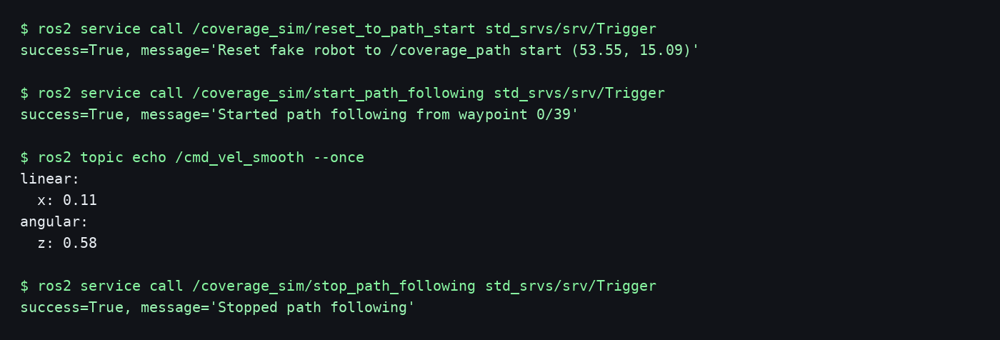

跟随过程中，fake car 会沿着 `/coverage_path` 上的 waypoint 依次移动：

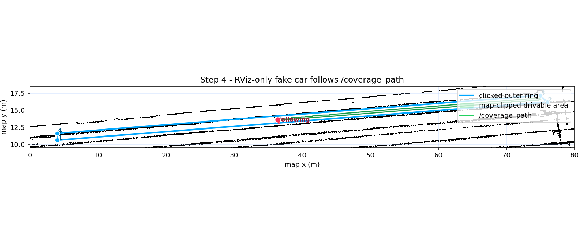

如果看到 `/cmd_vel_smooth` 有速度但 RViz 里的 fake car 不动，通常是 PCD 地图里的黑色占用像素正好挡在车头前。当前默认 launch 已经关闭 fake car 的地图硬碰撞，PCD 地图仍然用于显示、fake scan 和覆盖路径 map-aware 裁剪；如果要专门测试地图占用对运动的阻挡，可以这样启动：

```bash
ros2 launch ljh_robot_sim ljh_amr2_rviz_sim.launch.py enforce_map_collision:=true
```

## 第一次拿到项目怎么运行

这份工程不要理解成只能在 x86 上跑。源码目标环境是 Ubuntu 22.04 + ROS2 Humble，推荐按目标机器原生编译：

| 场景 | 架构 | 推荐用途 |
| --- | --- | --- |
| WSL Ubuntu 22.04 | x86_64/amd64 | 离车开发、README 验证、覆盖算法和 RViz-only 仿真 |
| Ubuntu 22.04 物理机 | x86_64/amd64 | 带显示器的开发/调试/实车旁站 |
| 实车控制器 | ARM64/aarch64 或 x86_64/amd64 | 真实 MID360、IMU、CAN 底盘、Nav2 执行 |

不要把一个架构编出来的 `build/`、`install/`、`log/` 复制到另一个架构上用。换机器后重新编译。

### 1. 准备系统

系统要求：

- Ubuntu 22.04。
- ROS2 Humble。
- 开发机建议装 Desktop 版，方便跑 RViz。
- 实车控制器可以装 ros-base，再在开发机远程看 RViz。
- ARM64 机器也按 Humble 原生包和本地源码编译，不需要 x86 交叉编译。

基础工具：

```bash
sudo apt-get update
sudo apt-get install -y git python3-colcon-common-extensions python3-vcstool
```

### 2. 获取源码

新机器第一次拉代码：

```bash
git clone git@github.com:lijinghai/ljh_amr2_hubwheel_drive.git
cd ljh_amr2_hubwheel_drive
git switch feature/coverage-path
```

如果你在当前 Windows/WSL 目录里工作：

```bash
cd ~/win-22.04/ljh_amr2_hubwheel_drive
git switch feature/coverage-path
```

当前工程已经把需要的主代码放在本仓库里。`C:\Users\ljhco\Desktop\ljh\code\路径覆盖` 下的 `coverpath`、`Fields2Cover`、`fields2cover_astrat_ros2`、`map_overlay`、`Wheelchair-robot` 是参考资料，不是第一次运行必须 `vcs import` 的依赖。

确认分支：

```bash
git status --short --branch
```

应该看到当前分支是 `feature/coverage-path`。`main` 保持稳定版本，不在 `main` 上做路径覆盖开发。

### 3. 检查依赖

每个终端先加载 ROS2：

```bash
source /opt/ros/humble/setup.bash
```

只检查，不安装：

```bash
./build.sh --check --no-install
```

允许脚本自动安装缺失 apt 依赖：

```bash
./build.sh
```

说明：

- `build.sh` 不写死 x86，apt 依赖会按当前 Ubuntu 架构安装。
- Livox SDK2、ROS2 包、Python 包都在本机当前架构下构建/安装。
- 如果 ARM64 上个别第三方包没有 apt 二进制，需要按该包官方方式在 ARM64 本地编译。

### 4. 先跑离车覆盖仿真

第一次接手项目时，先编译最小闭环：消息、覆盖算法、RViz-only 仿真。

```bash
colcon build --symlink-install --packages-select \
  ljh_robot_msg \
  ljh_robot_coverage \
  ljh_rviz2 \
  ljh_robot_sim
source install/setup.bash
```

先做无界面冒烟测试，适合 WSL、SSH、ARM64 无显示器环境：

```bash
ros2 launch ljh_robot_sim ljh_amr2_rviz_sim.launch.py use_rviz:=false
```

这条仿真 launch 默认加载 `src/ljh_robot_sim/maps/ljh20260516_pcd_2d/map.yaml`。这份 2D 地图由 `ljh20260516.pcd` 转换而来，不再使用 `C:\Users\ljhco\Desktop\ljh\code\路径覆盖\maps` 里那份有问题的旧 map。

这条仿真 launch 默认会同时启动 `ljh_robot_coverage_node`，所以 `/coverage/finish_ring`、`/coverage/compute_clicked_path` 等服务会直接可用。只想看 PCD 地图/假雷达、不启动覆盖节点时，可以加 `start_coverage:=false`。

再开一个终端调用服务：

```bash
cd <你的 ljh_amr2_hubwheel_drive 路径>
source /opt/ros/humble/setup.bash
source install/setup.bash
ros2 service call /coverage/compute_path ljh_robot_msg/srv/ComputeCoveragePath \
"{polygon: [{x: 0.0, y: -1.0}, {x: 6.0, y: -1.0}, {x: 6.0, y: 1.0}, {x: 0.0, y: 1.0}], holes: []}"
```

返回 `success=True` 且 `Coverage path generated: ... waypoints`，说明覆盖规划核心跑通。

### 5. 有显示器时打开 RViz

在 x86 开发机、WSLg 或带桌面的 Ubuntu 上：

```bash
colcon build --symlink-install --packages-select ljh_robot_msg ljh_robot_coverage ljh_rviz2 ljh_robot_sim
source install/setup.bash
ros2 launch ljh_robot_sim ljh_amr2_rviz_sim.launch.py
```

如果 RViz 报 `OpenGL 1.5 is not supported`，通常是旧 install 文件或终端/X server 让 RViz 走到了间接 GLX。先重新执行上面的 `colcon build` 和 `source install/setup.bash`。当前 launch 已经对 RViz 子进程强制设置 `xcb + Mesa/llvmpipe` 软件 OpenGL，并在启动 RViz 前清掉 `LIBGL_ALWAYS_INDIRECT`，避免终端里残留的旧变量把 OpenGL 降到 1.5。

如果 RViz 弹出 `Tool 'Coverage Polygon' unavailable` 或 `ljh_rviz2/CoveragePolygon could not be loaded`，说明当前 RViz 进程没有加载到 `ljh_rviz2` 的 pluginlib 索引。先关闭已经打开的 RViz，再做一次自定义工具包的干净重建：

```bash
cd ~/win-22.04/ljh_amr2_hubwheel_drive
git pull
source /opt/ros/humble/setup.bash
rm -rf build/ljh_rviz2 install/ljh_rviz2 build/ljh_robot_sim install/ljh_robot_sim
colcon build --symlink-install --packages-select ljh_robot_msg ljh_robot_coverage ljh_rviz2 ljh_robot_sim
source install/setup.bash
test -f install/ljh_rviz2/share/ament_index/resource_index/rviz_common__pluginlib__plugin/ljh_rviz2
cat install/ljh_rviz2/share/ament_index/resource_index/rviz_common__pluginlib__plugin/ljh_rviz2
ros2 launch ljh_robot_sim ljh_amr2_rviz_sim.launch.py
```

最后一条 `cat` 应该输出 `share/ljh_rviz2/plugins_description.xml`。注意：RViz 已经打开后不会自动刷新新插件，所以必须关掉旧窗口后再 launch。

当前 launch 已经会在启动 RViz 子进程时主动注入同一工作区的 `install/ljh_rviz2` 到 `AMENT_PREFIX_PATH`、`CMAKE_PREFIX_PATH` 和 `LD_LIBRARY_PATH`。启动日志里应能看到 `ljh_amr2 RViz launch injects ljh_rviz2 plugin prefix: .../install/ljh_rviz2`。如果没有这行，说明你运行的还是旧 launch，重新 `git pull`、`colcon build`、`source install/setup.bash` 后再启动。

ARM64 实车控制器如果没有桌面，不建议在车上直接跑 RViz；可以让车上发布 ROS2 话题，在开发机远程 RViz 查看。

### 6. 实车运行前检查

确认离车仿真和覆盖服务通过后，再碰真车链路：

```bash
./setup_mid360_eth.sh --check
./nav.sh --check
./nav.sh --safe-base --duration 45 --no-terminal --no-rviz
```

`--safe-base` 不发送真实 CAN 控制，适合第一次检查启动链路。真实低速运行前再确认急停、CAN、雷达、IMU、地图和人员看护都准备好。

### 7. 可选 run 目录

项目根目录用于构建，`run/` 目录用于运行 overlay，风格参考 `teluo_ws/run`：

```bash
cd run
direnv allow
ros2 launch ljh_robot_coverage coverage.launch.py
```

不用 `direnv` 也没关系，手动 `source install/setup.bash` 即可。

## 启动 RViz 离车仿真

第一个终端：

```bash
cd ~/win-22.04/ljh_amr2_hubwheel_drive
source /opt/ros/humble/setup.bash
colcon build --symlink-install --packages-select ljh_robot_msg ljh_robot_coverage ljh_rviz2 ljh_robot_sim
source install/setup.bash
ros2 launch ljh_robot_sim ljh_amr2_rviz_sim.launch.py
```

这条命令本次已经测到 `OpenGl version: 4.5` 和 `ljh_amr2 RViz sim ready`。本 launch 会给 RViz 子进程固定设置 `LIBGL_ALWAYS_SOFTWARE=1`、`MESA_LOADER_DRIVER_OVERRIDE=llvmpipe`、`QT_QPA_PLATFORM=xcb`，并清掉 `LIBGL_ALWAYS_INDIRECT`。如果你看到旧的 `OpenGL 1.5` 报错，先确认当前分支是 `feature/coverage-path`，并重新编译/source。

这个 launch 还会默认启动 `ljh_robot_coverage_node`，因此 RViz 顶部的 `Coverage Rect` 可以直接拖矩形并调用 `/coverage/compute_path`，`Coverage Poly` 可以直接点多边形并调用 `/coverage/compute_path`。`Publish Point` 点到 `/clicked_point` 的传统流程也仍然可用。如果你看到 `waiting for service to become available...`，说明当前运行的是旧代码或覆盖节点没有启动；重新 `git pull`、编译、source 后再开 launch。

如果点击 `Coverage Poly` 时弹出 `Tool 'Coverage Polygon' unavailable`，不是画法问题，而是当前终端的 install 环境没有注册 `ljh_rviz2` 插件。关闭 RViz 后执行上面“干净重建”命令，确认 pluginlib 索引文件存在，再重新打开 RViz。

本 launch 也会主动把 `ljh_rviz2` 插件前缀注入给 RViz 子进程，所以正常日志里应该出现 `ljh_amr2 RViz launch injects ljh_rviz2 plugin prefix`。看到这行后，`Coverage Rect` 和 `Coverage Poly` 都应该能直接点击使用。

如果只想做无界面冒烟测试：

```bash
ros2 launch ljh_robot_sim ljh_amr2_rviz_sim.launch.py use_rviz:=false
```

只启动仿真，不启动覆盖算法：

```bash
ros2 launch ljh_robot_sim ljh_amr2_rviz_sim.launch.py start_coverage:=false
```

`ljh_robot_sim` 会发布：

| 话题 | 作用 |
| --- | --- |
| `/map` | 由 `ljh20260516.pcd` 转出的 2D occupancy grid |
| `/Odometry` | fake 里程计 |
| `/scan` | fake MID360 风格 LaserScan |
| `/coverage_path` | 覆盖算法输出路径；默认启动会为蓝色示例区域自动生成一条 |
| `/coverage_sim/demo_area_marker` | 默认清扫区域 |
| `/coverage_sim/world_markers` | PCD 地图边界和可选调试 marker |
| `/local_costmap/published_footprint` | 真实车体 footprint |
| `/global_costmap/published_footprint` | 真实车体 footprint |

移动假车：

```bash
ros2 topic pub --once /cmd_vel_smooth geometry_msgs/msg/Twist \
"{linear: {x: 0.12}, angular: {z: 0.0}}"
```

让 RViz 假车自动沿当前 `/coverage_path` 走：

```bash
ros2 service call /coverage_sim/start_path_following std_srvs/srv/Trigger
```

停止跟随：

```bash
ros2 service call /coverage_sim/stop_path_following std_srvs/srv/Trigger
```

注意：这是 `ljh_robot_sim` 里的 RViz-only 仿真跟随器，只让屏幕里的假车动。真车自动执行仍然要走后续 Nav2 覆盖执行器和安全链路。

## 覆盖路径节点

默认情况下，`ros2 launch ljh_robot_sim ljh_amr2_rviz_sim.launch.py` 已经一起启动覆盖路径节点。下面这条命令只在你想单独调试算法、不启动仿真 RViz 时使用：

```bash
cd ~/win-22.04/ljh_amr2_hubwheel_drive
source /opt/ros/humble/setup.bash
source install/setup.bash
ros2 launch ljh_robot_coverage coverage.launch.py
```

服务：

| 服务 | 类型 | 作用 |
| --- | --- | --- |
| `/coverage/compute_path` | `ljh_robot_msg/srv/ComputeCoveragePath` | 直接传 polygon/holes 计算路径 |
| `/coverage/finish_ring` | `std_srvs/srv/Trigger` | RViz 点选时完成当前环 |
| `/coverage/clear_polygon` | `std_srvs/srv/Trigger` | 清空当前点选区域 |
| `/coverage/compute_clicked_path` | `std_srvs/srv/Trigger` | 根据 RViz 点选区域计算路径 |
| `/coverage_sim/start_path_following` | `std_srvs/srv/Trigger` | RViz-only 假车开始沿 `/coverage_path` 行走 |
| `/coverage_sim/stop_path_following` | `std_srvs/srv/Trigger` | RViz-only 假车停止路径跟随 |

输出：

| 话题 | 类型 | 作用 |
| --- | --- | --- |
| `/coverage_path` | `nav_msgs/Path` | RViz 和后续执行器可用的标准路径 |
| `/coverage/coverage_path` | `ljh_robot_msg/CoveragePath` | 带 yaw 的覆盖路径 |
| `/coverage/polygon_marker` | `visualization_msgs/Marker` | 外轮廓和孔洞可视化 |
| `/coverage/block_marker` | `visualization_msgs/Marker` | 分块结果可视化 |

## RViz 画清扫区域

这是你说的“鼠标画一个区域，然后自己覆盖”的功能。

矩形区域推荐用 `Coverage Rect`：

1. 启动 `ljh_robot_sim` 和 `ljh_robot_coverage`。
2. RViz 顶部工具栏选择 `Coverage Rect`。
3. 在地图上按住鼠标左键拖一个矩形。
4. 松开鼠标后，工具会自动调用 `/coverage/compute_path`。
5. RViz 里看 `/coverage_path`，绿色线就是覆盖路径。
6. 调用 `/coverage_sim/start_path_following`，让 RViz 里的假车沿覆盖路径走。

按住 `Shift` 再松开鼠标，可以强制生成正方形。右键或 `Esc` 可以清掉当前矩形显示。

多边形区域推荐用 `Coverage Poly`：

1. RViz 顶部工具栏选择 `Coverage Poly`。
2. 鼠标左键沿清扫边界依次点顶点。
3. 右键或回车完成这一圈。
4. 工具会自动调用 `/coverage/compute_path`，并刷新 `/coverage_path`。
5. 第一圈是外轮廓；如果继续点第二圈、第三圈，它们会作为障碍孔洞参与计算。
6. `Ctrl+Z` 撤销当前圈最后一个点，`Esc` 清空所有已画区域。

下面是当前 PCD 地图上五边形区域生成覆盖路径的截图式验证图：

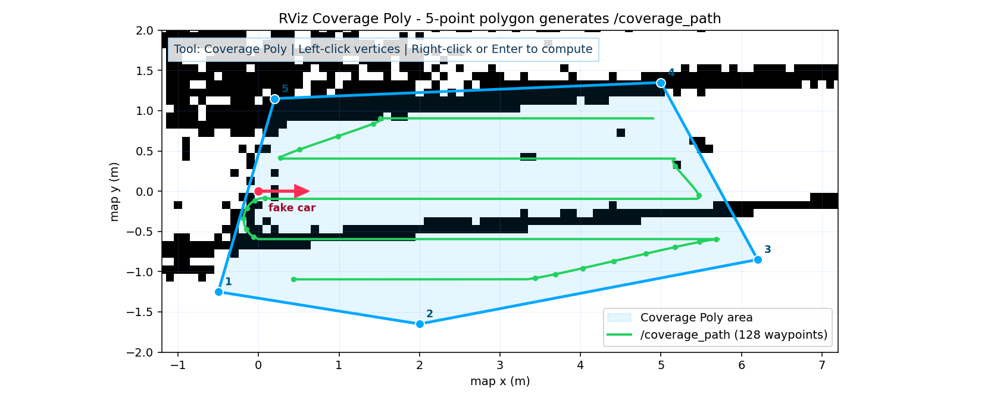

`Publish Point` 作为传统点选流程保留，规则是：

- 第一个圈是外轮廓，也就是要清扫的区域。
- 第二个圈、第三个圈以后都是障碍物或不能清扫的孔洞。
- 每个圈至少点 3 个点。
- 点的顺时针/逆时针顺序不用你手动处理，节点会自动规整外轮廓和孔洞方向。

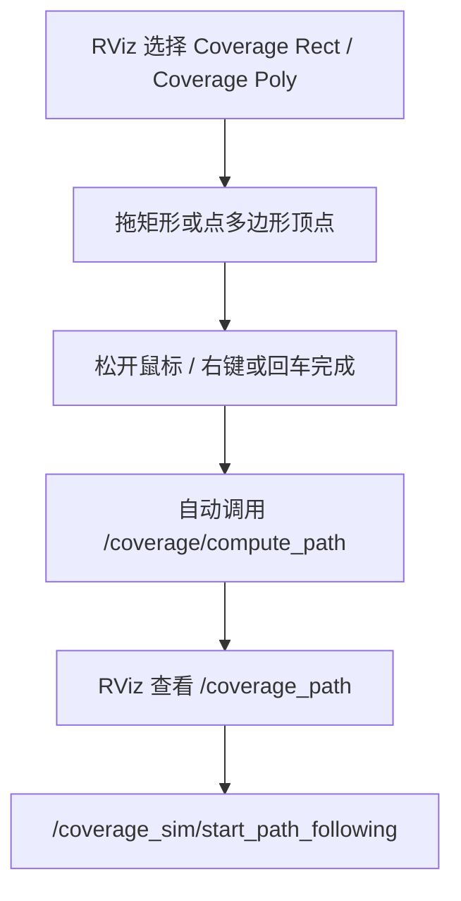

多边形/孔洞点选操作命令：

```bash
# 点完外轮廓后
ros2 service call /coverage/finish_ring std_srvs/srv/Trigger

# 如果有障碍物孔洞，点完孔洞后再调用一次
ros2 service call /coverage/finish_ring std_srvs/srv/Trigger

# 计算覆盖路径
ros2 service call /coverage/compute_clicked_path std_srvs/srv/Trigger

# 点错后清空重来
ros2 service call /coverage/clear_polygon std_srvs/srv/Trigger
```

## 直接调用服务

不通过 RViz 点选，也可以直接传当前 PCD 地图上的 polygon：

```bash
ros2 service call /coverage/compute_path ljh_robot_msg/srv/ComputeCoveragePath \
"{polygon: [{x: 0.0, y: -1.0}, {x: 6.0, y: -1.0}, {x: 6.0, y: 1.0}, {x: 0.0, y: 1.0}], holes: []}"
```

当前 PCD 地图示例区域：

```bash
ros2 service call /coverage/compute_path ljh_robot_msg/srv/ComputeCoveragePath \
"{polygon: [{x: 0.0, y: -1.0}, {x: 6.0, y: -1.0}, {x: 6.0, y: 1.0}, {x: 0.0, y: 1.0}], holes: []}"
```

直接服务方式适合后续从 Web 端、任务系统或自动生成的清扫区域里调用。服务返回：

```text
success      是否规划成功
message      例如 Coverage path generated: 12 waypoints; map-aware clearance=0.38m, known_free_cells=4961/5456, occupied_cells=0/6864, free_components=1, selected_area=36.38m2
path         ljh_robot_msg/CoveragePath，里面每个点带 x/y/yaw
```

同时节点还会发布标准 RViz 路径：

```text
/coverage_path
```

所以直接调用服务后，RViz 里也能马上看到结果。

默认 `use_map_obstacles: true`，所以单独启动 `ljh_robot_coverage` 而没有 `/map` 时，服务会提示先启动地图/仿真；纯几何调试才建议在 `coverage_params.yaml` 里临时关掉 `use_map_obstacles`。

## 算法处理流程

当前覆盖算法大致按下面流程处理：

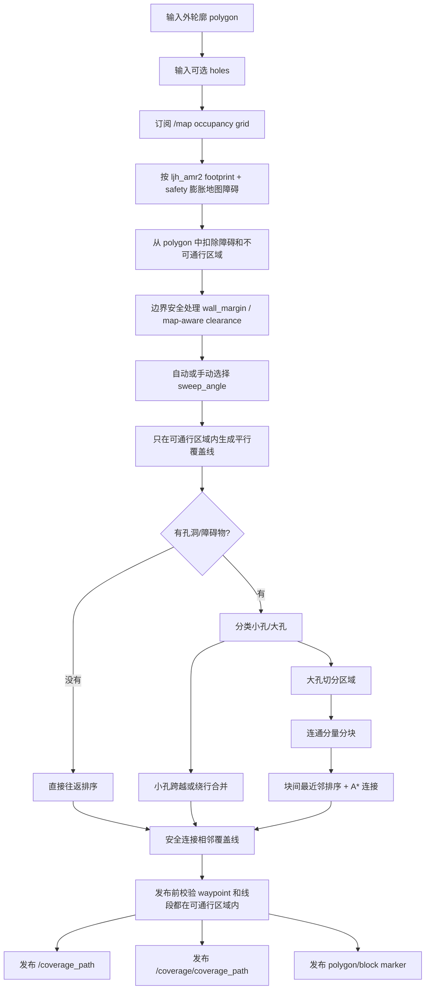

关键点：

- 默认 `use_map_obstacles: true`，覆盖节点会订阅 `/map`，把占据格按 `ljh_amr2` 车体尺寸和安全边距膨胀后从你画的区域里扣掉。
- 当前仿真车体是 `0.486 m x 0.450 m`，默认 map-aware clearance 约 `0.38 m`。
- `wall_margin` 会让路径离边界和人工 holes 留出安全距离；地图障碍优先按 footprint clearance 处理。
- `sweep_width` 决定相邻覆盖线间距，通常按刷盘/喷洒有效宽度设置。
- `sweep_angle=-1.0` 时算法会在多个角度里选行数更少的方向。
- 小孔洞不会强制把区域切碎，尽量保持连续覆盖。
- 大孔洞会触发分块，分块之间用 A* 在原区域内连接。
- 相邻覆盖线连接会先验证半圆/贝塞尔是否仍在可通行区内；如果越界，就改用区域内直连或 A*，再失败就不发布误导性路径。
- 如果地图障碍把你画的区域切成多个互不连通的 free component，当前先规划最大的连续可行驶块，避免 `/coverage_path` 用一根假线穿过障碍把多个孤岛硬连起来。
- 输出的 `/coverage_path` 是 `nav_msgs/Path`，方便 RViz 和后续 Nav2 执行器复用。
- 输出的 `/coverage/coverage_path` 带 yaw，后续做覆盖执行器时更好用。

## 仿真车型信息

| 项目 | 当前值 |
| --- | --- |
| 机器人 | `ljh_amr2` 轮毂伺服 AMR |
| 底盘 | DS20270C 双轮轮毂伺服差速底盘 |
| 车体尺寸 | `0.486 m x 0.450 m` |
| footprint | `[[0.243, 0.225], [0.243, -0.225], [-0.243, -0.225], [-0.243, 0.225]]` |
| 激光雷达 | Livox MID360 |
| 仿真 TF | `map -> odom -> base_footprint -> base_link -> base_scan` |
| 速度输入 | `/cmd_vel_smooth` |

## 覆盖路径参数

参数文件：

```text
src/ljh_robot_coverage/config/coverage_params.yaml
```

常用参数：

| 参数 | 默认值 | 说明 |
| --- | ---: | --- |
| `sweep_width` | `0.5` | 单次清扫宽度 |
| `wall_margin` | `0.3` | 靠墙、笼边、障碍边界安全距离 |
| `turn_radius` | `0.3` | 相邻覆盖线连接转弯半径 |
| `sweep_angle` | `-1.0` | `-1.0` 表示自动选择扫描方向 |
| `arc_resolution_deg` | `5.0` | 弧线采样分辨率 |
| `big_hole_threshold` | `5.0` | 大孔洞分块阈值 |
| `block_shrink_ratio` | `0.1` | 分块后内收比例 |
| `output_frame` | `map` | 输出坐标系 |
| `use_map_obstacles` | `true` | 是否订阅 `/map` 并按地图占据格裁剪覆盖区域 |
| `map_topic` | `/map` | 用于地图裁剪的 OccupancyGrid 话题 |
| `map_occupied_threshold` | `50` | 大于等于该值的栅格视为障碍 |
| `map_unknown_is_obstacle` | `false` | 是否把 unknown 栅格当障碍 |
| `robot_length` | `0.486` | ljh_amr2 车体长度 |
| `robot_width` | `0.450` | ljh_amr2 车体宽度 |
| `robot_safety_margin` | `0.05` | footprint 外额外安全边距 |
| `map_clearance_override` | `-1.0` | 小于 0 时自动取 `max(wall_margin, footprint_radius + safety)` |
| `minimum_free_component_area` | `0.6` | 地图裁剪后保留的最小连续可行驶区域面积 |
| `map_polygon_simplify_tolerance` | `0.02` | 地图裁剪边界简化容差，降低 PCD 栅格锯齿 |

## 真车常用命令

```bash
# 启动导航
./nav.sh

# 只检查导航环境
./nav.sh --check

# 安全干跑，不发 CAN
./nav.sh --safe-base --duration 45 --no-terminal --no-rviz

# 建图
./mapping.sh

# 保存 PCD 和 2D 地图
./save_pcd.sh
./save_2dmap.sh
```

## 开发规范

后续代码规范参考：

```text
C:\Users\ljhco\Desktop\ljh\WSL\24.04\teluo\teluo_ws
```

参考的是 `teluo_ws` 的工程组织方式，不直接照搬 ROS 版本：

- `teluo_ws` 是 Ubuntu 24.04 + ROS2 Jazzy + gcc-14。
- 当前项目是 Ubuntu 22.04 + ROS2 Humble。
- 新增规范文件、构建入口、运行目录按 `teluo_ws` 风格组织，具体编译器和 ROS 命令按当前项目来。
- 新增运行说明不能只写 x86/WSL，要同时说明 amd64 开发机、ARM64 实车控制器和无显示器/headless 场景。

根目录规范文件：

| 文件 | 作用 |
| --- | --- |
| `AGENTS.md` | Coding Agent 行事准则 |
| `.clang-format` | C++ 格式化规则 |
| `.clang-tidy` | C++ 静态检查规则 |
| `colcon.meta` | colcon 构建补充配置 |
| `run/` | 本地运行 overlay 目录 |

后续每完成一个功能，都要同步更新本 README：

- 写清楚功能做什么。
- 写清楚怎么启动、怎么操作。
- 尽量补图、流程图或实际运行图。
- 写清楚测试命令和测试结果。
- 测试通过后再提交到 `feature/coverage-path` 并推送 GitHub。

## 本次测试记录

测试环境：

```text
2026-07-26
Ubuntu 22.04 WSL
ROS2 Humble
uname -m: x86_64
branch: feature/coverage-path
```

已验证：

```text
colcon build --symlink-install --packages-select ljh_robot_msg ljh_robot_coverage ljh_rviz2 ljh_robot_sim    PASS
python3 -m ljh_robot_coverage.test_planner                                      PASS
python3 src/ljh_robot_sim/tools/render_pcd_coverage_readme_assets.py            PASS, regenerated map-aware README images
./run/check_ljh_sim_coverage_services.sh                                        PASS, PCD_MAP_LOAD_PASS, /map + /scan + /coverage_path topics ready
./run/check_ljh_sim_coverage_services.sh oversized map clip                     PASS, 128 waypoints, known-free clearance samples=6384
./run/check_ljh_sim_coverage_services.sh clicked-point workflow                 PASS, 4 vertices -> 12 map-aware waypoints
./run/check_ljh_sim_coverage_services.sh map clearance validator                PASS, MAP_AWARE_PATH_KNOWN_FREE_CLEARANCE_PASS waypoints=12 samples=1401 clearance=0.381m
./run/check_ljh_sim_coverage_services.sh follow test                            PASS, /coverage_sim/start_path_following returns success and publishes nonzero /cmd_vel_smooth
./run/check_ljh_sim_coverage_services.sh odometry move test                     PASS, motion_collision=off, fake car moved 0.402 m
ros2 launch ljh_robot_sim ljh_amr2_rviz_sim.launch.py                           PASS, RViz OpenGl 4.5, PCD map loaded, map-aware default path generated
ljh_robot_coverage map-aware service response                                   PASS, map-aware clearance=0.38m, known_free_cells=4961/5456, occupied_cells=0/6864, free_components=1, selected_area=36.38m2
ljh_robot_sim default coverage auto-compute                                     PASS, startup computes a map-aware default /coverage_path after receiving /map
```

注意：

- 本轮实际验证环境是 x86_64 WSL；README 已补充 ARM64/aarch64 实车控制器运行路径，但 ARM64 机器需要在目标机上按同样步骤原生编译验证。
- WSL 当前 `clang-format` 未安装，需要格式化 C++ 时先 `sudo apt install clang-format clang-tidy`。
- WSL/Windows 共享盘构建时可能出现 clock skew warning，通常是文件时间戳问题，不是本次代码错误。
- WSL 可能打印 `localhost`/NAT 相关提示，只要 ROS2 构建、launch 和服务调用结果正常，就不影响本项目验证结论。
- `./build.sh --check --no-install` 会检查完整真车工程 apt 依赖；覆盖仿真最小闭环以本节 `colcon build --packages-select ljh_robot_msg ljh_robot_coverage ljh_rviz2 ljh_robot_sim` 为准。
